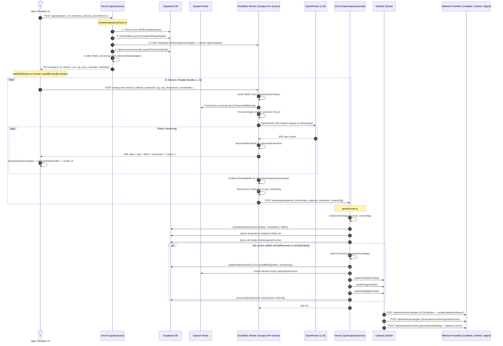

# Research Report: End-to-End Analysis Pipeline Architecture & Pass-Through Refactor Map

**Date**: 2026-09-24  
**Author**: AGY (gemini-3.8-flash-low)  
**Branch**: `docs/research-e2e-pipeline-map`  
**Task**: STEP 1 of 3 — End-to-end map of the analysis pipeline (read-only investigation, no code changes)  
**Target Document**: `docs/research/2026-09-24-analysis-pipeline-e2e-map.md`  

---

## Executive Summary & Root Cause Analysis (RCA)

### 1. Root Cause Analysis: Cloudflare 10ms CPU Enforcement & Analysis Failure
On 2026-09-23, production analyses abruptly failed due to Cloudflare Workers terminating request execution with `exceededCpu`. 
Historically, Cloudflare Workers on the Free plan offered a 10 ms CPU limit per request, but enforcement allowed bursts up to 370–876 ms CPU time without hard terminations. On 2026-09-23, Cloudflare tightened runtime enforcement to strictly kill isolate executions exceeding 10 ms CPU wall/execution time.

An empirical benchmark conducted by OC on 2026-09-24 revealed that running the worker's [BracketBuffer.ts](file:///home/kellyb_dev/projects/hex-yt-intel/.claude/worktrees/agy-e2e-map/worker/src/services/BracketBuffer.ts) alone consumes **~35 ms CPU** across a standard ~24,000-token LLM output stream—even when optimized. In addition to `BracketBuffer`, the worker executes:
1. `PromptBuilder.build()` string interpolation and token estimation ([PromptBuilder.ts:63](file:///home/kellyb_dev/projects/hex-yt-intel/.claude/worktrees/agy-e2e-map/worker/src/services/PromptBuilder.ts#L63)).
2. `parseChapters()` regex parsing of YouTube video descriptions ([chapter-parser.ts:28](file:///home/kellyb_dev/projects/hex-yt-intel/.claude/worktrees/agy-e2e-map/worker/src/services/chapter-parser.ts#L28)).
3. `MetadataScraper` comment pagination, decoding, and JSON processing ([MetadataScraper.ts:74](file:///home/kellyb_dev/projects/hex-yt-intel/.claude/worktrees/agy-e2e-map/worker/src/services/MetadataScraper.ts#L74)).
4. `stratifiedSampleIndices()` 2D statistical bucketing ([comment-sampling.ts:54](file:///home/kellyb_dev/projects/hex-yt-intel/.claude/worktrees/agy-e2e-map/web/lib/services/comment-sampling.ts#L54)).
5. `reconstructMarkdown()` and `extractJsonPayload()` with `jsonrepair` ([MarkdownReconstructor.ts:156](file:///home/kellyb_dev/projects/hex-yt-intel/.claude/worktrees/agy-e2e-map/worker/src/services/MarkdownReconstructor.ts#L156)).
6. Heavy cryptographic operations: HMAC-SHA256 verification and signing ([crypto.ts:18](file:///home/kellyb_dev/projects/hex-yt-intel/.claude/worktrees/agy-e2e-map/worker/src/crypto.ts#L18)).
7. Multi-pass Zod schema validation over large payloads ([PersistService.ts:180](file:///home/kellyb_dev/projects/hex-yt-intel/.claude/worktrees/agy-e2e-map/worker/src/services/PersistService.ts#L180)).

Under strict 10 ms CPU limits, keeping synchronous parsing, JSON repairing, markdown reconstruction, and dual-write preparation on the Cloudflare Worker is structurally impossible on the Free tier. Because network I/O wait time does **not** count toward Cloudflare CPU time, converting the Cloudflare Worker into a pure, near-zero-CPU streaming pass-through proxy while delegating live display parsing to the browser and server-side persistence/stitching to Vercel `/api/analyses/persist` resolves the CPU starvation permanently.

---

## 1. Flow Map: Input → Output (End-to-End Chain)

### Sequence Diagram

### Trace Walkthrough with File:Line References
1. **URL Submission & Preflight Bouncer**:
   - Client sends `POST /api/analyses` handled in [web/app/api/analyses/route.ts:47](file:///home/kellyb_dev/projects/hex-yt-intel/.claude/worktrees/agy-e2e-map/web/app/api/analyses/route.ts#L47).
   - Validated via `AnalysisCreateSchema.safeParse(body)` ([contracts.ts:32](file:///home/kellyb_dev/projects/hex-yt-intel/.claude/worktrees/agy-e2e-map/web/lib/types/contracts.ts#L32)).
   - Auth verified strictly with `SupabaseAuthAdapter.authenticate()` ([web/app/api/analyses/route.ts:80](file:///home/kellyb_dev/projects/hex-yt-intel/.claude/worktrees/agy-e2e-map/web/app/api/analyses/route.ts#L80)).
   - Delegated to `CreateAnalysisUseCase.execute()` ([CreateAnalysisUseCase.ts:99](file:///home/kellyb_dev/projects/hex-yt-intel/.claude/worktrees/agy-e2e-map/web/lib/usecases/CreateAnalysisUseCase.ts#L99)):
     - Checks cache hit via `findCachedAnalysis` ([CreateAnalysisUseCase.ts:107](file:///home/kellyb_dev/projects/hex-yt-intel/.claude/worktrees/agy-e2e-map/web/lib/usecases/CreateAnalysisUseCase.ts#L107)). If found, returns 200 immediately (Law #1).
     - Quota check via `BillingQuotaPort.checkGate()` ([CreateAnalysisUseCase.ts:123](file:///home/kellyb_dev/projects/hex-yt-intel/.claude/worktrees/agy-e2e-map/web/lib/usecases/CreateAnalysisUseCase.ts#L123)).
     - Metadata ingestion via `WorkerIngestionAdapter.fetch(videoId)` ([CreateAnalysisUseCase.ts:141](file:///home/kellyb_dev/projects/hex-yt-intel/.claude/worktrees/agy-e2e-map/web/lib/usecases/CreateAnalysisUseCase.ts#L141)).
     - Upserts stub row in `analyses` with `validation_report.status = 'processing'` ([CreateAnalysisUseCase.ts:193](file:///home/kellyb_dev/projects/hex-yt-intel/.claude/worktrees/agy-e2e-map/web/lib/usecases/CreateAnalysisUseCase.ts#L193)).
     - Mints HMAC streaming token using `STREAM_HMAC_SECRET` over `${videoId}:${analysisId}:${exp}:${models}` via `StreamTokenAdapter.signAnalysisToken()` ([CreateAnalysisUseCase.ts:281](file:///home/kellyb_dev/projects/hex-yt-intel/.claude/worktrees/agy-e2e-map/web/lib/usecases/CreateAnalysisUseCase.ts#L281)).
     - Returns HTTP 202 Accepted with stream endpoint URL and parameters ([CreateAnalysisUseCase.ts:298](file:///home/kellyb_dev/projects/hex-yt-intel/.claude/worktrees/agy-e2e-map/web/lib/usecases/CreateAnalysisUseCase.ts#L298)).

2. **Client Stream Orchestration (`useSSEStream.ts`)**:
   - `useSSEStream.startAnalysis` launches in [web/hooks/useSSEStream.ts:63](file:///home/kellyb_dev/projects/hex-yt-intel/.claude/worktrees/agy-e2e-map/web/hooks/useSSEStream.ts#L63).
   - Initializes local Zustand stores: `useAnalysisStore`, `useSynthesisNucleus`, `useChatStore`.
   - Iterates across configured bundles (5 bundles total, defined by `STREAM_BUNDLES` in `synthesis.ts`) via `runBundleWithRetry` ([web/hooks/useSSEStream.ts:528](file:///home/kellyb_dev/projects/hex-yt-intel/.claude/worktrees/agy-e2e-map/web/hooks/useSSEStream.ts#L528)).
   - Invokes `runSingleStream` issuing HTTP POST to `${job.stream.url}` (`/analyze-llm-stream`) with `WorkerStreamRequest` ([web/hooks/useSSEStream.ts:298](file:///home/kellyb_dev/projects/hex-yt-intel/.claude/worktrees/agy-e2e-map/web/hooks/useSSEStream.ts#L298)).
   - Reads SSE stream via `ReadableStreamDefaultReader` and feeds each line to `SynthesisStreamAdapter.processLine()` ([web/hooks/useSSEStream.ts:383](file:///home/kellyb_dev/projects/hex-yt-intel/.claude/worktrees/agy-e2e-map/web/hooks/useSSEStream.ts#L383)).

3. **Cloudflare Worker Streaming Route (`analysis.ts`)**:
   - Endpoint `POST /analyze-llm-stream` handled at [worker/src/routes/analysis.ts:1112](file:///home/kellyb_dev/projects/hex-yt-intel/.claude/worktrees/agy-e2e-map/worker/src/routes/analysis.ts#L1112).
   - Validates `verifyStreamToken` comparing `hmacHex` with constant-time equality `timingSafeEqualHex` ([worker/src/routes/analysis.ts:178](file:///home/kellyb_dev/projects/hex-yt-intel/.claude/worktrees/agy-e2e-map/worker/src/routes/analysis.ts#L178)).
   - Asynchronously parses chapters from description via `parseChapters()` and fires fire-and-forget fetch to `/api/videos/${videoId}/chapters` inside `waitUntil` ([worker/src/routes/analysis.ts:1188](file:///home/kellyb_dev/projects/hex-yt-intel/.claude/worktrees/agy-e2e-map/worker/src/routes/analysis.ts#L1188)).
   - Calls `buildStreamResponse()` returning a `text/event-stream` `ReadableStream` ([worker/src/routes/analysis.ts:852](file:///home/kellyb_dev/projects/hex-yt-intel/.claude/worktrees/agy-e2e-map/worker/src/routes/analysis.ts#L852)).
   - Concurrently fetches/caches transcript, channel metadata, and comments via `fetchTranscriptIfMissing()` ([worker/src/routes/analysis.ts:865](file:///home/kellyb_dev/projects/hex-yt-intel/.claude/worktrees/agy-e2e-map/worker/src/routes/analysis.ts#L865)).
   - Initiates `ReasoningEngine.executeAndStream()` delegating to `LLMCascade.streamCascade()` ([worker/src/services/ReasoningEngine.ts:76](file:///home/kellyb_dev/projects/hex-yt-intel/.claude/worktrees/agy-e2e-map/worker/src/services/ReasoningEngine.ts#L76)).
   - For every LLM chunk delta:
     - Accumulates `finalText += delta`.
     - Feeds delta into `BracketBuffer.feed(delta)` ([worker/src/services/ReasoningEngine.ts:82](file:///home/kellyb_dev/projects/hex-yt-intel/.claude/worktrees/agy-e2e-map/worker/src/services/ReasoningEngine.ts#L82)).
     - Appends emitted dimensions to `capturedDimensions` array ([worker/src/routes/analysis.ts:982](file:///home/kellyb_dev/projects/hex-yt-intel/.claude/worktrees/agy-e2e-map/worker/src/routes/analysis.ts#L982)).
     - Enqueues SSE events: `send({ type: "delta", content: delta })` and `send(fragment)` ([worker/src/routes/analysis.ts:974](file:///home/kellyb_dev/projects/hex-yt-intel/.claude/worktrees/agy-e2e-map/worker/src/routes/analysis.ts#L974)).
   - On stream completion or abort:
     - `atomicPersist.flush()` runs inside `executionCtx.waitUntil` ([worker/src/routes/analysis.ts:1029](file:///home/kellyb_dev/projects/hex-yt-intel/.claude/worktrees/agy-e2e-map/worker/src/routes/analysis.ts#L1029)).
     - `PersistService.persist()` extracts JSON with `extractJsonPayload()`, runs `jsonrepair`, merges `capturedDimensions`, reconstructs markdown, validates via Zod (`ChunkPayloadSchema`), signs HMAC `contentSig` via `signBoundContent`, and delivers POST to Vercel `/api/analyses/persist` ([worker/src/services/PersistService.ts:127](file:///home/kellyb_dev/projects/hex-yt-intel/.claude/worktrees/agy-e2e-map/worker/src/services/PersistService.ts#L127)).

4. **Vercel Chunk Persistence & Stitching (`/api/analyses/persist`)**:
   - `POST /api/analyses/persist` received in [web/app/api/analyses/persist/route.ts:165](file:///home/kellyb_dev/projects/hex-yt-intel/.claude/worktrees/agy-e2e-map/web/app/api/analyses/persist/route.ts#L165).
   - Validates HMAC signature via `verifyContentSig(canonical, contentSig)` ([web/app/api/analyses/persist/route.ts:319](file:///home/kellyb_dev/projects/hex-yt-intel/.claude/worktrees/agy-e2e-map/web/app/api/analyses/persist/route.ts#L319)).
   - Writes chunk to database via `SupabasePersistenceAdapter.persistAnalysisChunk()` ([web/app/api/analyses/persist/route.ts:547](file:///home/kellyb_dev/projects/hex-yt-intel/.claude/worktrees/agy-e2e-map/web/app/api/analyses/persist/route.ts#L547)).
   - Idempotently upserts safety-net transcript and chapters ([web/app/api/analyses/persist/route.ts:583](file:///home/kellyb_dev/projects/hex-yt-intel/.claude/worktrees/agy-e2e-map/web/app/api/analyses/persist/route.ts#L583), [web/app/api/analyses/persist/route.ts:606](file:///home/kellyb_dev/projects/hex-yt-intel/.claude/worktrees/agy-e2e-map/web/app/api/analyses/persist/route.ts#L606)).
   - Evaluates completeness: checks whether all chunks are present (`isFullyReceived`) or all chunks have reached a terminal status (`isFullySettled`) ([web/app/api/analyses/persist/route.ts:631](file:///home/kellyb_dev/projects/hex-yt-intel/.claude/worktrees/agy-e2e-map/web/app/api/analyses/persist/route.ts#L631), [web/app/api/analyses/persist/route.ts:647](file:///home/kellyb_dev/projects/hex-yt-intel/.claude/worktrees/agy-e2e-map/web/app/api/analyses/persist/route.ts#L647)).
   - Stitches chunks via `stitchChunksIntoPayload(chunkMap)` ([web/app/api/analyses/persist/route.ts:930](file:///home/kellyb_dev/projects/hex-yt-intel/.claude/worktrees/agy-e2e-map/web/app/api/analyses/persist/route.ts#L930)).
   - Updates master row in `analyses` with CAS guard `guardBillingStatus: 'processing'` via `updateAnalysisResult` ([web/app/api/analyses/persist/route.ts:982](file:///home/kellyb_dev/projects/hex-yt-intel/.claude/worktrees/agy-e2e-map/web/app/api/analyses/persist/route.ts#L982)).
   - If `billingStatus === 'completed'`:
     - Writes cache to Upstash Redis: `setAnalysisCache()` ([web/app/api/analyses/persist/route.ts:1036](file:///home/kellyb_dev/projects/hex-yt-intel/.claude/worktrees/agy-e2e-map/web/app/api/analyses/persist/route.ts#L1036)).
     - Dispatches QStash background jobs: `publishValidationTask()`, `publishDigestTask()`, `publishHighlightsTask()` ([web/app/api/analyses/persist/route.ts:1043](file:///home/kellyb_dev/projects/hex-yt-intel/.claude/worktrees/agy-e2e-map/web/app/api/analyses/persist/route.ts#L1043)).
     - Consumes user quota via `billingQuotaPort.consumeQuota()` ([web/app/api/analyses/persist/route.ts:1096](file:///home/kellyb_dev/projects/hex-yt-intel/.claude/worktrees/agy-e2e-map/web/app/api/analyses/persist/route.ts#L1096)).

5. **Asynchronous Background Processing (Webhooks)**:
   - `POST /api/webhooks/validate`: Verifies QStash signature, runs `UCISValidator.validate(markdown)`, and updates validation report ([web/app/api/webhooks/validate/route.ts:27](file:///home/kellyb_dev/projects/hex-yt-intel/.claude/worktrees/agy-e2e-map/web/app/api/webhooks/validate/route.ts#L27)).
   - `POST /api/webhooks/digest`: Executes `GenerateExecutiveDigestUseCase` to generate Dimension 0 via cheap completion cascade ([web/app/api/webhooks/digest/route.ts:48](file:///home/kellyb_dev/projects/hex-yt-intel/.claude/worktrees/agy-e2e-map/web/app/api/webhooks/digest/route.ts#L48)).
   - `POST /api/webhooks/embed`: Generates 1536-dim vector embeddings and writes to Upstash Vector Index ([web/app/api/webhooks/embed/route.ts:43](file:///home/kellyb_dev/projects/hex-yt-intel/.claude/worktrees/agy-e2e-map/web/app/api/webhooks/embed/route.ts#L43)).

6. **Safety Net, Recovery, and Reattachment**:
   - `analysis-reaper.ts`: Periodic QStash cron sweeps analyses stuck in `processing` older than 30 minutes, salvaging rows with >= 8 dimensions or requeuing partial chunks via `tryRequeuePartial` ([analysis-reaper.ts:51](file:///home/kellyb_dev/projects/hex-yt-intel/.claude/worktrees/agy-e2e-map/web/lib/services/analysis-reaper.ts#L51)).
   - `dimension-remediation.ts`: Sweeps partial rows within token-budget limits and queries worker `/analyze-llm-stream` with missing `dimensions` to achieve 11/11 completion ([dimension-remediation.ts:15](file:///home/kellyb_dev/projects/hex-yt-intel/.claude/worktrees/agy-e2e-map/web/lib/services/dimension-remediation.ts#L15)).
   - `useAutoRestoreAnalysis.ts`: When user navigates or re-pastes a URL, calls `/api/analyses/check?videoId=...` ([useAutoRestoreAnalysis.ts:93](file:///home/kellyb_dev/projects/hex-yt-intel/.claude/worktrees/agy-e2e-map/web/hooks/useAutoRestoreAnalysis.ts#L93)) to restore cached or in-progress analyses without re-triggering quota spend.

---

## 2. Worker CPU Inventory

The table below catalogs every CPU-bound operation currently executing within the Cloudflare Worker request lifecycle.

| Operation | Code Location | Cost Class | Estimated CPU Time | Can Move Off-Worker? | Target Destination |
| :--- | :--- | :--- | :--- | :--- | :--- |
| **BracketBuffer Feed & State Machine** | [BracketBuffer.ts:32-87](file:///home/kellyb_dev/projects/hex-yt-intel/.claude/worktrees/agy-e2e-map/worker/src/services/BracketBuffer.ts#L32-L87) | High | 25–40 ms | **YES** | Browser (`StreamDeltaHandler`) |
| **BracketBuffer JSON.parse per fragment** | [BracketBuffer.ts:92](file:///home/kellyb_dev/projects/hex-yt-intel/.claude/worktrees/agy-e2e-map/worker/src/services/BracketBuffer.ts#L92) | High | 10–20 ms | **YES** | Browser (`StreamDeltaHandler`) |
| **jsonrepair of final unclosed JSON** | [MarkdownReconstructor.ts:156](file:///home/kellyb_dev/projects/hex-yt-intel/.claude/worktrees/agy-e2e-map/worker/src/services/MarkdownReconstructor.ts#L156) | High | 5–15 ms | **YES** | Vercel (`/persist`) |
| **extractJsonPayload regex & slicing** | [MarkdownReconstructor.ts:195](file:///home/kellyb_dev/projects/hex-yt-intel/.claude/worktrees/agy-e2e-map/worker/src/services/MarkdownReconstructor.ts#L195) | Medium | 3–8 ms | **YES** | Vercel (`/persist`) |
| **reconstructMarkdown string building** | [MarkdownReconstructor.ts:64](file:///home/kellyb_dev/projects/hex-yt-intel/.claude/worktrees/agy-e2e-map/worker/src/services/MarkdownReconstructor.ts#L64) | Medium | 2–6 ms | **YES** | Vercel (`/persist`) |
| **Zod Schema validation (`ChunkPayloadSchema`)** | [PersistService.ts:180](file:///home/kellyb_dev/projects/hex-yt-intel/.claude/worktrees/agy-e2e-map/worker/src/services/PersistService.ts#L180) | Medium | 4–10 ms | **YES** | Vercel (`/persist`) |
| **HMAC Signatures (Content & Chapters)** | [crypto.ts:18](file:///home/kellyb_dev/projects/hex-yt-intel/.claude/worktrees/agy-e2e-map/worker/src/crypto.ts#L18), [PersistService.ts:221](file:///home/kellyb_dev/projects/hex-yt-intel/.claude/worktrees/agy-e2e-map/worker/src/services/PersistService.ts#L221) | Low | 1–2 ms | **NO** (Needs auth), but payload minimized | Keep on Worker (sign only raw stream chunks / hash) |
| **Prompt Synthesis & Substitution** | [PromptBuilder.ts:63](file:///home/kellyb_dev/projects/hex-yt-intel/.claude/worktrees/agy-e2e-map/worker/src/services/PromptBuilder.ts#L63) | Medium | 4–8 ms | **YES** | Vercel (`CreateAnalysisUseCase`) |
| **parseChapters regex matching** | [chapter-parser.ts:28](file:///home/kellyb_dev/projects/hex-yt-intel/.claude/worktrees/agy-e2e-map/worker/src/services/chapter-parser.ts#L28) | Medium | 2–5 ms | **YES** | Vercel (`CreateAnalysisUseCase`) |
| **Comment Stratification & Bucketing** | [comment-sampling.ts:54](file:///home/kellyb_dev/projects/hex-yt-intel/.claude/worktrees/agy-e2e-map/web/lib/services/comment-sampling.ts#L54) | Medium | 3–6 ms | **YES** | Vercel (`CreateAnalysisUseCase` or QStash) |
| **SSE Event Serialization per delta** | [analysis.ts:856](file:///home/kellyb_dev/projects/hex-yt-intel/.claude/worktrees/agy-e2e-map/worker/src/routes/analysis.ts#L856) | Low-Medium | 3–5 ms | **YES** | Pure raw byte pass-through pipe |

**Total Estimated Worker CPU Time Today**: **58 ms – 117 ms** per stream (exceeds 10 ms by **580% – 1170%**).  
**Target Post-Refactor CPU Time**: **< 2.5 ms** (pure token check + raw byte pass-through).

---

## 3. Duplication Inventory

Across the pipeline, several operations are performed multiple times across boundaries:

1. **Chapter Parsing (`parseChapters`)**:
   - *Where*: Executed in worker `analysis.ts:1188` to POST to `/api/videos/[videoId]/chapters`, again in worker `analysis.ts:905` for `resolvedChapters`, and again in Vercel `persist/route.ts:339` for validation and filtering.
   - *Why Introduced*: Introduced in PR #205 (2026-08-05) to decouple video chapter parsing from the LLM lifecycle. The description is already available at Vercel bouncer time, yet parsing was deferred to the worker.

2. **JSON Stream Healing & Parsing**:
   - *Where*: Worker runs [BracketBuffer.ts](file:///home/kellyb_dev/projects/hex-yt-intel/.claude/worktrees/agy-e2e-map/worker/src/services/BracketBuffer.ts) character-by-character; browser runs [StreamDeltaHandler.ts:25](file:///home/kellyb_dev/projects/hex-yt-intel/.claude/worktrees/agy-e2e-map/web/lib/adapters/stream-delta-handler.ts#L25) `healJson()` stack-based closer on every delta; Vercel runs `safeParse()` + `jsonrepair()` in [MarkdownReconstructor.ts:156](file:///home/kellyb_dev/projects/hex-yt-intel/.claude/worktrees/agy-e2e-map/worker/src/services/MarkdownReconstructor.ts#L156).
   - *Why Introduced*: ADR 006 (Structured JSON Streaming Blueprint). The worker attempted to emit real-time parsed SSE events, while the browser needed progressive rendering, and persistence needed a clean schema.

3. **Markdown Reconstruction**:
   - *Where*: Worker `PersistService.ts:194` calls `reconstructMarkdown(jsonPayload)`; client [markdown-accumulator.ts:30](file:///home/kellyb_dev/projects/hex-yt-intel/.claude/worktrees/agy-e2e-map/web/lib/adapters/markdown-accumulator.ts#L30) calls client-side `reconstructMarkdown()`; Vercel [persist/route.ts:932](file:///home/kellyb_dev/projects/hex-yt-intel/.claude/worktrees/agy-e2e-map/web/app/api/analyses/persist/route.ts#L932) reconstructs markdown again via `stitchChunksIntoPayload()`.
   - *Why Introduced*: Dual-write requirement (ADR 006). Legacy components and export flows rely on `analysis_markdown`, while reactive UI relies on `analysis_payload`.

4. **Transcript & Segment Upserting**:
   - *Where*: Vercel `persist/route.ts:583` executes a safety-net `upsertTranscript()` per chunk; the finalizer calls it again on full assembly; `WorkerIngestionAdapter` already inspected it in `CreateAnalysisUseCase`.
   - *Why Introduced*: RCA 2026-07-22 (P1.2): Worker previously discarded segments, so safety-net chunk upserts were added to guarantee transcripts exist even on interrupted streams.

5. **Zod Validation of Payload**:
   - *Where*: Worker `PersistService.ts:180` validates `ChunkPayloadSchema`; Vercel `persist/route.ts:413` re-validates the chunk payload; Vercel `persist/route.ts:933` re-validates the stitched payload via `UCISPayloadV2Schema`.
   - *Why Introduced*: Zero-trust boundary defense between Cloudflare Worker and Vercel.

---

## 4. Failure & State Matrix

| Failure Event | Current Owner of SSOT | What Gets Persisted | What User Sees in UI | Recovery Mechanism | Impact If Display Parsing is Browser-Only |
| :--- | :--- | :--- | :--- | :--- | :--- |
| **Worker CPU Kill (10ms limit)** | None (Worker aborts ungracefully) | Nothing (or partial interrupted chunk if `waitUntil` executed before kill) | Red error banner ("Worker stream failed") | None today. Reaper marks failed after 30 min | **Eliminates the failure entirely** (pass-through uses < 2.5 ms CPU). |
| **Client Tab Closed / Navigated** | Supabase DB row (`analyses`) | Worker continues via `waitUntil`, calls `/persist` with `completed` | Nothing (user left); on return, `useAutoRestoreAnalysis` restores from DB | `useAutoRestoreAnalysis` restores completed analysis | **HIGH RISK**: If persistence relies on client POSTing, closing tab loses analysis! **Persistence MUST remain client-independent** (Worker or Vercel S2S). |
| **Network Drop (Client ↔ Worker)** | Supabase DB row | Worker completes generation and posts to Vercel `/persist` | Retry spinner / error banner | Client reconnects, or re-pastes URL to restore | Safe if Worker persists directly to Vercel S2S. |
| **Browser Crash** | Supabase DB row | Same as tab closed (S2S persist succeeds) | Fresh tab loads blank; restore on URL paste | `useAutoRestoreAnalysis` on URL paste | Same as Tab Closed. |
| **Worker Persist Call Fails** | Supabase DB row | Stored in memory; retried 2x by `PersistService`; if fails, chunk lost | "Analysis stream failed" or partial completion | `analysis-reaper.ts` sweeps after 30 min, `tryRequeuePartial` | Unchanged. |
| **Vercel `/persist` Failure (5xx)** | Supabase DB row | Chunks remain unstitched or partial | Partial error / retry | Worker retries `/persist`; reaper settles after grace | Unchanged. |
| **Duplicate Chunk Arrives** | Supabase DB (`analysis_chunks`) | Scoped CAS on `(analysis_id, chunk_index)` prevents clobber | Monotonic state in stores | Guarded CAS in `persistAnalysisChunk` | Unchanged. |

> [!CRITICAL]
> **Inviolable Invariant**: Moving live display parsing to the browser is safe **ONLY IF** persistence does not depend on the browser staying open. If the browser is responsible for sending the payload to `/persist`, any tab closure, navigation, or mobile sleep causes silent data loss.

---

## 5. Contract Inventory & Runtime Boundary Enforcement

| Boundary | Schema (Zod / TS) | Enforced at Runtime? | Gaps & Inconsistencies |
| :--- | :--- | :--- | :--- |
| **Client → Vercel (`/api/analyses`)** | `AnalysisCreateSchema` ([contracts.ts:32](file:///home/kellyb_dev/projects/hex-yt-intel/.claude/worktrees/agy-e2e-map/web/lib/types/contracts.ts#L32)) | **YES** ([analyses/route.ts:66](file:///home/kellyb_dev/projects/hex-yt-intel/.claude/worktrees/agy-e2e-map/web/app/api/analyses/route.ts#L66)) | Clean. Strict Zod `safeParse`. |
| **Vercel → Client (`stream` token)** | `AnalysisJob` response contract | Partial (TS interfaces) | HMAC signs `${videoId}:${analysisId}:${exp}:${models}`. Does not sign `dimensions` or `chunkIndex`. |
| **Client → Worker (`/analyze-llm-stream`)** | `StreamRequest` TS interface ([analysis.ts:70](file:///home/kellyb_dev/projects/hex-yt-intel/.claude/worktrees/agy-e2e-map/worker/src/routes/analysis.ts#L70)) | **NO** (Manual `if (!req.videoId)` checks) | **Gap**: No Zod validation on worker entry. Relies on ad-hoc null checks ([analysis.ts:1116](file:///home/kellyb_dev/projects/hex-yt-intel/.claude/worktrees/agy-e2e-map/worker/src/routes/analysis.ts#L1116)). |
| **Worker SSE → Client** | `SynthesisFragmentSchema` ([synthesis.ts:54](file:///home/kellyb_dev/projects/hex-yt-intel/.claude/worktrees/agy-e2e-map/web/lib/validators/synthesis.ts#L54)) | **YES** ([synthesis-stream-adapter.ts:71](file:///home/kellyb_dev/projects/hex-yt-intel/.claude/worktrees/agy-e2e-map/web/lib/adapters/synthesis-stream-adapter.ts#L71)) | Clean. Client validates incoming fragments. |
| **Worker → Vercel S2S (`/persist`)** | `bodySchema` Zod object ([persist/route.ts:171](file:///home/kellyb_dev/projects/hex-yt-intel/.claude/worktrees/agy-e2e-map/web/app/api/analyses/persist/route.ts#L171)) | **YES** ([persist/route.ts:252](file:///home/kellyb_dev/projects/hex-yt-intel/.claude/worktrees/agy-e2e-map/web/app/api/analyses/persist/route.ts#L252)) | Strict Zod validation + HMAC content signature verification. |
| **Vercel Persist → Supabase DB** | `AnalysisPersistencePort` TS interfaces | **Partial** | Database table constraints and CHECK constraints enforce structure, but some JSONB fields accept arbitrary shapes. |

---

## 6. Hexagonal / DDD-Lite Architecture Violations

1. **God Endpoint**: [web/app/api/analyses/persist/route.ts](file:///home/kellyb_dev/projects/hex-yt-intel/.claude/worktrees/agy-e2e-map/web/app/api/analyses/persist/route.ts) has grown to **1,507 lines of code**.
   - Contains direct database orchestration, chunk CAS synchronization, timeout calculation, retry backoff, formatting, QStash publishing, billing deduction, and transcript management in a single route handler.
   - *Remediation*: Extract a dedicated domain service/use case: `PersistAnalysisChunkUseCase`.
2. **Worker Route Orchestration Bloat**: [worker/src/routes/analysis.ts](file:///home/kellyb_dev/projects/hex-yt-intel/.claude/worktrees/agy-e2e-map/worker/src/routes/analysis.ts) is **1,261 lines of code**.
   - Handles route binding, scraping, token verification, Redis polling, LLM cascading, SSE streaming, chapter publishing, and persistence formatting.
3. **Leaky Domain Boundaries in PersistService**:
   - [PersistService.ts](file:///home/kellyb_dev/projects/hex-yt-intel/.claude/worktrees/agy-e2e-map/worker/src/services/PersistService.ts) performs `mergeDimensions()` domain business logic inside a transport/persistence service.
4. **Missing Domain Port for Streaming**:
   - The worker directly constructs `ReasoningEngine`, `PromptBuilder`, and `LLMCascade` inside the route handler instead of resolving via a container or factory.

---

## 7. Tangent Findings

| Location | Severity | Defect Description |
| :--- | :--- | :--- |
| [useSSEStream.ts:325](file:///home/kellyb_dev/projects/hex-yt-intel/.claude/worktrees/agy-e2e-map/web/hooks/useSSEStream.ts#L325) | **Medium** | Hardcoded 25s timeout for worker handshake (`setTimeout(() => streamController.abort(), 25000)`). If OpenRouter queue times or cold-starts exceed 25s, client cancels prematurely. |
| [worker/src/routes/analysis.ts:938](file:///home/kellyb_dev/projects/hex-yt-intel/.claude/worktrees/agy-e2e-map/worker/src/routes/analysis.ts#L938) | **Medium** | Cancellation polling runs every 3s in a `while(pollingActive)` loop inside `waitUntil`. While network I/O wait is unmetered, waking up every 3s burns small slices of CPU and Redis read quota. |
| [persist/route.ts:380](file:///home/kellyb_dev/projects/hex-yt-intel/.claude/worktrees/agy-e2e-map/web/app/api/analyses/persist/route.ts#L380) | **Low** | Iterative comment budget slicing: `while (bounded.length > 0 && JSON.stringify(bounded).length > 20000)` re-serializes the entire comments array in an O(N²) CPU loop on Vercel. |
| [chapter-parser.ts:28](file:///home/kellyb_dev/projects/hex-yt-intel/.claude/worktrees/agy-e2e-map/worker/src/services/chapter-parser.ts#L28) | **Low** | `parseChapters` uses repeated regex parsing across descriptions. Should be executed once on Vercel during metadata ingestion and passed down. |

---

## 8. Target Architecture Proposals (Pass-Through Worker)

### Option A: Cloudflare Zero-CPU Pass-Through + Client Streaming Parser + Worker S2S Raw Relay
- **How it works**:
  1. Worker verifies HMAC token (< 1 ms CPU).
  2. Worker establishes upstream SSE connection to OpenRouter and directly pipes response bytes to client (`res.body.pipeTo(client)` or simple chunk transform without parsing).
  3. Worker tees the raw stream or accumulates the raw text buffer in memory (zero JSON parsing, zero regex, zero BracketBuffer).
  4. Client browser runs existing `StreamDeltaHandler.healJson()` to update UI live.
  5. Upon completion, Worker sends raw unparsed `finalText` directly to Vercel `/api/analyses/persist` via `waitUntil`.
  6. Vercel `/persist` executes `jsonrepair`, schema validation, dimension extraction, and chunk stitching.
- **Risk Register**:
  - *Risk 1*: Memory limit on worker for accumulating raw text buffer (~100 KB). *Likelihood: Low. Impact: Low. Mitigation: Worker memory limit is 128 MB on Free tier; 100 KB string is negligible.*
  - *Risk 2*: Vercel execution duration for `jsonrepair` and stitching. *Likelihood: Low. Impact: Low. Mitigation: `jsonrepair` takes ~0.12 ms; Vercel Hobby has 30s wall clock, plenty for single-shot persist.*
  - *Risk 3*: Client tab closes before completion. *Likelihood: Medium. Impact: None. Mitigation: Worker owns the S2S persist independently of client life.*
- **Verdict**: **RECOMMENDED** (Cleanest transition, preserves client-independence).

### Option B: Cloudflare Pure Pipe + Browser-Driven Persistence
- **How it works**:
  1. Worker is a 100% blind proxy: requests tokens and pipes SSE bytes directly to browser. Worker terminates immediately when stream closes.
  2. Browser receives full stream, parses structured JSON, and sends completed payload to Vercel `/api/analyses/persist`.
- **Risk Register**:
  - *Risk 1*: **Data Loss on Tab Close / Sleep**: If the user closes the tab, locks mobile screen, or navigates away at 95% completion, generation is lost and quota is wasted. *Likelihood: High. Impact: Critical. Mitigation: None possible without background workers.*
  - *Risk 2*: Security compromise: Browser client could tamper with persisted JSON payload. *Likelihood: Medium. Impact: High. Mitigation: Requires complex asymmetric signing.*
- **Verdict**: **REJECTED** (Violates client-independence and security invariants).

### Option C: Cloudflare Pass-Through + Vercel Chunk Ingestion Queue (QStash)
- **How it works**:
  1. Worker streams pass-through to client.
  2. On stream finish, Worker pushes raw text chunk to Upstash QStash queue.
  3. QStash triggers Vercel `/api/analyses/persist-worker` asynchronously.
- **Risk Register**:
  - *Risk 1*: QStash free plan message quota exhaustion. *Likelihood: Medium. Impact: High. Mitigation: Adds unnecessary hops when direct fetch already works.*
  - *Risk 2*: Latency in reattaching completed analysis to UI. *Likelihood: High. Impact: Medium.*
- **Verdict**: **FEASIBLE BUT OVER-ENGINEERED**.

> [!IMPORTANT]
> **NEEDS USER DECISION**: Confirmation to proceed with **Option A** (Cloudflare Zero-CPU Pass-Through + Worker S2S Raw Relay + Vercel Server-Side Parsing/Stitching).

---

## 9. Verification & Quality Gates

### Local Verification Runs
- **Web Typecheck**: `pnpm --filter @hex-yt-intel/web exec tsc --noEmit` → **0 errors** (Clean).
- **Worker Typecheck**: `pnpm --filter youtube-intelligence-worker exec tsc --noEmit -p tsconfig.typecheck.json` → **0 errors** (Clean).
- **Contract Auditor**: `pnpm exec tsx web/scripts/contract-auditor.ts` → **0 critical**, 12 warnings (all pre-existing).
- **Quality Engine (Diff Mode)**: `pnpm exec tsx scripts/verify-quality-engine.ts --ci --compare` → **Exit 0** (Clean, no new findings).
- **Quality Engine (Full Mode)**: `pnpm exec tsx scripts/verify-quality-engine.ts --ci --mode full` → Completed.
