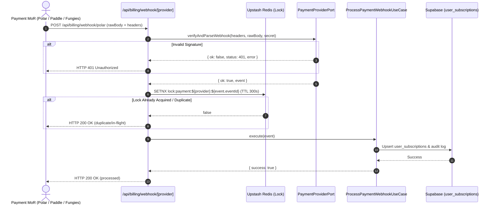

# Research Report: Reusing hex-expan's Multi-Provider Payment Architecture & Operational Lessons for hex-yt-intel

**Date**: 2026-09-24  
**Author**: AGY (Gemini 3.8 Flash Low)  
**Target Project**: `hex-yt-intel` (worktree: `agy-payments-research`, branch: `docs/research-hex-expan-payments`)  
**Reference Project**: `hex-expan` (`/home/kellyb_dev/projects/hex-expan`, read-only)  
**Core Constraint**: Egyptian individual resident, no registered US entity/bank, zero company overhead; FREE tier infrastructure only.

---

## 1. Executive Summary & Context

`hex-yt-intel`'s payment subsystem is currently only partially completed and carries structural liabilities:
1. It relies primarily on Paddle in sandbox mode (`web/lib/paddle.ts:15`), which is pending strict KYC verification.
2. It has two parallel Paddle webhook routes (`web/app/api/billing/webhook/route.ts` vs `web/app/api/webhooks/paddle/route.ts`).
3. Checkout pricing is constrained to Paddle and Stripe in `web/lib/billing-factory.ts` (Stripe is unavailable in Egypt).
4. Founder pre-sale checkout remains unwired (`web/app/founders/page.tsx:18`).

In contrast, the sibling project `hex-expan` (`payments/`) possesses a fully mature, production-proven multi-provider payment engine supporting 6 distinct providers (`polar`, `paddle`, `lemonsqueezy`, `payhip`, `fungies`, `fastspring`). It features automated interleaved provider rotation (`provider_router.ts`), robust webhook normalization (`webhook_core.ts`), distributed Redis idempotency locks (`redis.ts`), an append-only verifiable sales ledger (`ledger.ts`), and dynamic refund-rate automated pricing tier cascades (`pricing_tier_cascade.ts`).

This report provides the full architectural blueprint, evidence-based gap analysis, operational lessons, target design, and defect inventory required to port hex-expan's battle-tested patterns directly into hex-yt-intel.

---

## 2. hex-expan Payment Architecture Deep-Dive

### 2.1 Provider Factory, Router & Selection Cascade
hex-expan decouples checkout routing from provider implementations across three layers:
1. **Dynamic Rail Rotation (`payments/src/provider_router.ts`)**:
   - Implements a deterministic, largest-remainder (merged-beat) interleaving algorithm (`pickAtIndex()`, [provider_router.ts#L99-L114](file:///home/kellyb_dev/projects/hex-expan/payments/src/provider_router.ts#L99-L114)):
     $$\text{Beat}(k) = \frac{k + 0.5}{w_r}, \quad k \in [0, w_r - 1]$$
   - Rails are weighted and scaled via `integerize()` ([provider_router.ts#L73-L80](file:///home/kellyb_dev/projects/hex-expan/payments/src/provider_router.ts#L73-L80)).
   - State is persisted per-product in Upstash Redis (`router:state:<productId>`, [provider_router.ts#L21-L23](file:///home/kellyb_dev/projects/hex-expan/payments/src/provider_router.ts#L21-L23)), tracking `counter`, `updated_at`, and temporary outage windows (`down` map).
   - If a provider fails or trips an error, `skipRail(productId, provider, rails, durationMs)` marks it down for 15 minutes by default ([provider_router.ts#L141-L151](file:///home/kellyb_dev/projects/hex-expan/payments/src/provider_router.ts#L141-L151)), dynamically dropping it from `liveRails()` ([provider_router.ts#L91-L97](file:///home/kellyb_dev/projects/hex-expan/payments/src/provider_router.ts#L91-L97)).
   - Falls back gracefully to local atomic JSON state files (`data/settings/rail_state.json`) if Upstash Redis credentials are unset.
2. **Checkout HTTP Endpoint (`payments/site/api/checkout/[product].ts`)**:
   - Reads per-product configuration from `data/settings/rails.<product>.json` ([checkout/[product].ts#L34-L44](file:///home/kellyb_dev/projects/hex-expan/payments/site/api/checkout/%5Bproduct%5D.ts#L34-L44)).
   - Invokes `nextRail(product, rails)` to select the active provider and returns an HTTP 302 redirect directly to that provider's checkout session URL ([checkout/[product].ts#L48-L72](file:///home/kellyb_dev/projects/hex-expan/payments/site/api/checkout/%5Bproduct%5D.ts#L48-L72)).
   - **Fail-soft Circuit Breaker**: If Redis/router throws, it catches and automatically redirects to the highest-weight rail with a configured `checkout_url` ([checkout/[product].ts#L49-L62](file:///home/kellyb_dev/projects/hex-expan/payments/site/api/checkout/%5Bproduct%5D.ts#L49-L62)).
3. **Automated Pricing Tier Drops (`payments/src/pricing_tier_cascade.ts`)**:
   - Monitors live trailing metrics via `cascade_signals.ts` (`refundRateWindow()`, [cascade_signals.ts#L28-L58](file:///home/kellyb_dev/projects/hex-expan/payments/src/cascade_signals.ts#L28-L58)).
   - If the refund rate exceeds `thresholds.refund_rate_ceiling_pct`, `evaluateCascade()` authorizes a drop to the next price index unless at `floor_tier_index` ([pricing_tier_cascade.ts#L49-L100](file:///home/kellyb_dev/projects/hex-expan/payments/src/pricing_tier_cascade.ts#L49-L100)).
   - `applyCascadeDrop()` advances the index, records the change history with timestamp/reason, and writes the updated configuration back ([pricing_tier_cascade.ts#L107-L124](file:///home/kellyb_dev/projects/hex-expan/payments/src/pricing_tier_cascade.ts#L107-L124)).

### 2.2 Provider Port Contract & Normalization Core
hex-expan establishes a strict, minimal port contract in `payments/src/provider.ts`:
```typescript
// payments/src/provider.ts:39-47
export interface CheckoutProvider {
  name: ProviderName;
  parseWebhook(headers: IncomingHttpHeaders, rawBody: Buffer, secret: string | undefined): ParseResult;
}
```
Key invariants enforced:
- **Raw Buffer Verification**: Signature calculation strictly operates on `rawBody: Buffer` directly from the HTTP stream ([provider.ts#L42-L44](file:///home/kellyb_dev/projects/hex-expan/payments/src/provider.ts#L42-L44)). It never operates on parsed or re-serialized JSON.
- **Canonical Output Event**: Normalized into `SaleEvent` or `RefundEvent` ([provider.ts#L9-L37](file:///home/kellyb_dev/projects/hex-expan/payments/src/provider.ts#L9-L37)):
  - `sale_id`: Provider transaction identifier.
  - `product_id`: Matched internal catalog product ID.
  - `amount_usd`: Finite positive dollar amount.
  - `email_hash`: Constant-time SHA-256 digest (`sha256(email.trim().toLowerCase())`) ([provider.ts#L49-L51](file:///home/kellyb_dev/projects/hex-expan/payments/src/provider.ts#L49-L51)). Raw buyer emails are never stored.
  - `attribution_id`: Optional cross-provider attribution identifier passed through provider metadata bags ([provider.ts#L16-L24](file:///home/kellyb_dev/projects/hex-expan/payments/src/provider.ts#L16-L24)).

### 2.3 Webhook Normalization & Verification Matrix
Every provider adapter in `payments/src/providers/` implements bespoke signature verification:

| Provider | Signature Header / Payload Field | Algorithm & Canonical Signed Format | Failure Code |
| :--- | :--- | :--- | :--- |
| **Polar** | `webhook-signature` | Standard Webhooks spec: HMAC-SHA256 over `${webhook-id}.${webhook-timestamp}.${rawBody}`. Dual-key support: tries base64 secret after `whsec_` and raw UTF-8 string ([polar.ts#L79-L98](file:///home/kellyb_dev/projects/hex-expan/payments/src/providers/polar.ts#L79-L98)). | 401 |
| **Fungies** | `x-fngs-signature` | HMAC-SHA256 hex over `rawBody`, formatted as `sha256_<hex>` ([fungies.ts#L19-L25](file:///home/kellyb_dev/projects/hex-expan/payments/src/providers/fungies.ts#L19-L25)). | 401 |
| **Paddle** | `paddle-signature` | `ts=<epoch>;h1=<hex>`: HMAC-SHA256 hex over `${ts}:${rawBody}` ([paddle.ts#L31-L43](file:///home/kellyb_dev/projects/hex-expan/payments/src/providers/paddle.ts#L31-L43)). | 401 |
| **Lemon Squeezy** | `x-signature` | HMAC-SHA256 hex over `rawBody` ([lemonsqueezy.ts#L31-L34](file:///home/kellyb_dev/projects/hex-expan/payments/src/providers/lemonsqueezy.ts#L31-L34)). | 401 |
| **FastSpring** | `x-fs-signature` | HMAC-SHA256 base64 over `rawBody` ([fastspring.ts#L55-L66](file:///home/kellyb_dev/projects/hex-expan/payments/src/providers/fastspring.ts#L55-L66)). Accepts batch `events: []` ([fastspring.ts#L92-L99](file:///home/kellyb_dev/projects/hex-expan/payments/src/providers/fastspring.ts#L92-L99)). | 401 |
| **Payhip** | Payload body `signature` | In-payload hash verification: constant-time check of `body.signature === sha256(PAYHIP_WEBHOOK_SECRET)` ([payhip.ts#L67-L73](file:///home/kellyb_dev/projects/hex-expan/payments/src/providers/payhip.ts#L67-L73)). | 401 |

### 2.4 Idempotency & Distributed Locking
In `payments/src/webhook_core.ts`, webhook handlers are wrapped with a distributed lock mechanism:
```typescript
// payments/src/webhook_core.ts:84-106
async function withIdempotencyLock(lockKey, duplicateResponse, fn) {
  if (!isRedisConfigured()) return fn();
  const acquired = await expanRedis.setnx(lockKey, "1", WEBHOOK_LOCK_TTL_SECONDS); // 300s TTL
  if (!acquired) return duplicateResponse;
  try {
    const result = await fn();
    if (result.payload.recorded !== true) await expanRedis.del(lockKey); // release on failure/duplicate
    return result;
  } catch (err) {
    await expanRedis.del(lockKey);
    throw err;
  }
}
```
Locks are scoped per-event (`lock:sale:${provider}:${sale_id}` and `lock:refund:${provider}:${sale_id}`). Duplicate deliveries within the lock window return HTTP 200 with `{ ok: true, recorded: false, reason: "duplicate-or-inflight" }` ([webhook_core.ts#L110-L115](file:///home/kellyb_dev/projects/hex-expan/payments/src/webhook_core.ts#L110-L115), [L128-L135](file:///home/kellyb_dev/projects/hex-expan/payments/src/webhook_core.ts#L128-L135)), instantly satisfying retry-aggressive providers without creating duplicate rows.

### 2.5 Settings Registry Architecture
`payments/src/settings_registry.ts` loads central definitions from `data/settings/*.json` ([settings_registry.ts#L16-L30](file:///home/kellyb_dev/projects/hex-expan/payments/src/settings_registry.ts#L16-L30)):
- `global.json`: Shared paths, tool configs, default currency (`USD`), allowed currencies list ([settings_registry.ts#L42-L103](file:///home/kellyb_dev/projects/hex-expan/payments/src/settings_registry.ts#L42-L103)).
- `providers.json`: Schema mapping per provider (`route`, `signature_header`, `sale_events`, `refund_events`, `secret_env`, `field_map`) ([settings_registry.ts#L114-L260](file:///home/kellyb_dev/projects/hex-expan/payments/src/settings_registry.ts#L114-L260)).
- Fallback contract: Every accessor holds complete inline defaults matching committed registry files so scripts remain fully functional standalone or during testing without external file dependencies.

---

## 3. Operational Lessons, Rejections & Traps (with Sourcing)

1. **Dodo Payments Rejection for Egypt Residents**:
   - *Source*: `hex-expan/data/intel/mor_payment_cascade_research_2026-09-14.md:90-95` & `hex-yt-intel/.memory/AGENT_LEDGER.md:1393`.
   - *Finding*: Dodo Payments eligibility is governed strictly by the issuing country of the applicant's government ID. Egypt was moved to the prohibited list as of 2026-03-23. Only grandfathered merchants who onboarded prior to that date are permitted. New individual accounts from Egypt are rejected outright.
   - *Directive*: Do not invest time attempting to onboard new accounts with Dodo Payments.
2. **Paddle Egypt Account Status**:
   - *Source*: `hex-expan/data/intel/mor_payment_cascade_research_2026-09-14.md:84-89` & `hex-yt-intel/.memory/AGENT_LEDGER.md:1393`.
   - *Finding*: Paddle does not prohibit Egypt (Egypt is absent from its sanctions list). However, Paddle mandates rigorous KYC document review for individuals. Live selling cannot proceed until KYC sign-off is completed. Payouts require wire transfer or Payoneer ($100 minimum threshold, possible $15 SWIFT fee).
3. **Fungies.io Activation & Payout Capability**:
   - *Source*: `hex-expan/data/intel/fungies_deep_dive_2026-09-15.md:11-36` & `payments/fungies_activation_answers.md`.
   - *Finding*: Fungies operates as a Merchant of Record on top of Stripe Connect Express. Egypt is verified on its canonical 121-country seller list with direct EGP settlement support (20 EGP minimum payout). Store activation takes $\le$24h via a business details questionnaire.
   - *Trap*: Fungies starts all workspaces deactivated until form approval. Additionally, `items[].customFields` cannot be set directly via raw API on dynamic checkout links; webhook correlation must resolve `product.internalId` or dashboard-configured custom fields ([fungies.ts#L57-L74](file:///home/kellyb_dev/projects/hex-expan/payments/src/providers/fungies.ts#L57-L74)).
4. **Lemon Squeezy (Stripe Acquisition Uncertainty)**:
   - *Source*: `hex-expan/data/intel/mor_payment_cascade_research_2026-09-14.md:46-52`.
   - *Finding*: Lemon Squeezy currently accepts Egyptian individuals via bank payout ($50 min) or PayPal USD. However, because Stripe acquired Lemon Squeezy and is migrating towards "Stripe Managed Payments" (which restricts merchant countries), LS must be treated as a transitional rail with automated fallback.
5. **Payhip Signature Integrity Limitation**:
   - *Source*: `payments/src/providers/payhip.ts:3-10`.
   - *Finding*: Payhip does not supply an HMAC header computed over request body bytes. Instead, its payload contains a `signature` property that equals `sha256(PAYHIP_API_KEY)`.
   - *Trap*: This authenticates the sender's static secret but provides zero cryptographic payload tamper-proofing. Furthermore, Payhip is only an MoR for UK/EU VAT; all other global tax liabilities remain with the seller.
6. **FastSpring Operational Barriers**:
   - *Source*: `hex-expan/data/intel/mor_payment_cascade_research_2026-09-14.md:60-65`.
   - *Finding*: FastSpring provides the only native automated revenue-split functionality ("Split Partner Accounts"), which is ideal for co-creators. However, it requires a sales call for onboarding, carries a 45-day monitoring hold on initial payouts, and imposes a $100 minimum threshold with a 2.5% FX conversion fee.
7. **Polar.sh Stripe Connect Express Trap**:
   - *Source*: `hex-expan/data/intel/mor_payment_cascade_research_2026-09-14.md:73-78` & `payments/src/providers/polar.ts:1-20`.
   - *Finding*: Polar supports Egypt via Stripe Connect Express, but new organizations face a mandatory 7-day initial settlement hold. It also imposes a $2/mo active account fee plus \$0.25 + 0.25% per payout, making it inefficient for tiny transaction volumes.

---

## 4. Gap Analysis: hex-yt-intel vs. hex-expan

| Subsystem / Area | hex-expan Implementation | hex-yt-intel Current State | Recommendation | Effort |
| :--- | :--- | :--- | :--- | :--- |
| **Provider Selection & Routing** | Dynamic multi-provider weighted interleaving router (`provider_router.ts`) backed by Redis/JSON state, auto-skipping downed rails, with HTTP 302 fallback redirect. | Static environment variable `ACTIVE_BILLING_PROVIDER` switching between Paddle and Stripe in `billing-factory.ts:46-56`. | **Adapt**: Import `provider_router.ts` into `web/lib/services/PaymentRouter.ts`. Wire into `api/billing/checkout` to rotate between available MoR providers. | 1.5 days |
| **Provider Port Contract** | Minimal port (`provider.ts:39-47`): takes `(headers, rawBody, secret)` and outputs parsed `SaleEvent` / `RefundEvent`. | Monolithic interface `BillingPort.ts:3-9`: mixes signature verification, raw event parsing, subscription updates, and checkout session creation. | **Adapt**: Decompose `BillingPort` into `CheckoutProviderPort` (webhook parsing/verification) and `CheckoutSessionPort` (session creation). | 1 day |
| **Provider Adapters** | 6 production adapters (`polar`, `fungies`, `paddle`, `lemonsqueezy`, `payhip`, `fastspring`) with verified HMAC logic. | Only `PaddleBillingAdapter.ts` exists. `StripeProvider` is stubbed in `billing-factory.ts` (unusable in Egypt). | **Reuse as-is**: Port Polar and Fungies adapters directly into `web/lib/adapters/`. | 1.5 days |
| **Webhook Endpoint Architecture** | Single consolidated endpoint (`handleWebhookPayload` in `webhook_core.ts`) routing by `/webhook/:provider`. | Dual conflicting routes: `api/billing/webhook/route.ts` (legacy) vs `api/webhooks/paddle/route.ts` (new). | **Adapt**: Delete legacy route; unify under `web/app/api/billing/webhook/[provider]/route.ts`. | 0.5 days |
| **Webhook Idempotency & Concurrency** | Atomic distributed Redis locks via `setnx` with 300s TTL + append-only deduped ledger (`webhook_core.ts:84-106`). | In-memory timestamp check against Supabase `user_subscriptions.updated_at` ([PaddleBillingAdapter.ts#L131-L146](file:///home/kellyb_dev/projects/hex-yt-intel/.claude/worktrees/agy-payments-research/web/lib/adapters/PaddleBillingAdapter.ts#L131-L146)). Vulnerable to TOCTOU. | **Adapt**: Wrap webhook processing in Upstash Redis distributed lock using existing project Redis client. | 0.5 days |
| **Pricing & Catalog SSOT** | Dynamic per-product JSON config + pricing cascade (`pricing_tier_cascade.ts`) reacting to refund rates. | Settings Registry `billing.priceIds` (`pricing.ts`), but PR #325 unification is still in review on `fix/tier-vocabulary-runtime-path`. | **Adapt**: Align with PR #325's `resolveUserTierForPriceId()`. Adopt cascade concepts for automated plan discounts if needed. | 1 day |
| **Founder Pre-sale Checkout** | Live-tested checkout links baked into static HTML with breadcrumb provenance (`bake_checkout.ts`). | `web/app/founders/page.tsx:18` commented out (`// Do NOT wire real checkout/billing here until numbers are final`). | **Adapt**: Wire `/api/billing/checkout` with plan `founder` using Polar or Fungies one-time product links. | 0.5 days |

---

## 5. Proposed Target Design for hex-yt-intel

### 5.1 Decomposed Port Contracts (`web/lib/ports/`)
Replace monolithic `BillingPort.ts` with two domain-specific ports:
```typescript
// web/lib/ports/PaymentProviderPort.ts
export interface WebhookVerificationResult {
  ok: boolean;
  status: number;
  error?: string;
  event?: NormalizedPaymentEvent;
}

export interface PaymentProviderPort {
  readonly providerId: 'paddle' | 'polar' | 'fungies' | 'lemonsqueezy';
  verifyAndParseWebhook(
    headers: Record<string, string | string[] | undefined>,
    rawBody: Buffer,
    secret: string
  ): Promise<WebhookVerificationResult>;
}

// web/lib/ports/CheckoutSessionPort.ts
export interface CheckoutSessionOptions {
  userId: string;
  email: string;
  planTier: PriceTier;
  interval: PriceInterval;
  successUrl: string;
  cancelUrl: string;
}

export interface CheckoutSessionPort {
  createCheckoutSession(options: CheckoutSessionOptions): Promise<{ checkoutUrl: string; sessionId?: string }>;
}
```

### 5.2 Canonical Event Normalization
```typescript
export interface NormalizedPaymentEvent {
  eventId: string;
  eventType: 'subscription.created' | 'subscription.updated' | 'subscription.canceled' | 'transaction.completed' | 'refund.created';
  provider: string;
  userId?: string;
  customerId?: string;
  subscriptionId?: string;
  priceId?: string;
  amountUsd?: number;
  occurredAt: string;
  metadata?: Record<string, unknown>;
}
```

### 5.3 Unified Webhook Route (`web/app/api/billing/webhook/[provider]/route.ts`)


### 5.4 Items Needing User Decision
1. **Primary Active MoR for Pre-Sale / Launch**:
   - *Option A*: **Polar.sh** (Live-verified sandbox, immediate developer velocity, works in Egypt via Stripe Connect Express, but 7-day settlement delay on new orgs).
   - *Option B*: **Fungies.io** (Verified Egypt availability, 24h review, instant Stripe Connect Express settlement, but requires business review sign-off).
   - *Option C*: **Paddle** (Wait for KYC approval; zero code churn for current subscription implementation, but timeline is uncertain).
2. **Founder Pre-Sale Checkout Route**:
   - Should `/founders` checkout route directly to a fixed Polar/Fungies one-time $49/$99 product link, or pass dynamically through `/api/billing/checkout`?
3. **Multi-Rail Deployment Strategy**:
   - Adopt Single MoR with fail-over first, or immediately deploy the weighted round-robin router (`provider_router.ts`) across two MoRs?

---

## 6. Tangents & Defect Inventory in Both Repositories

### 6.1 Defects in `hex-expan`
1. **Payhip Payload Tampering Vulnerability (`payments/src/providers/payhip.ts:71-73`)**:
   - `payhip.ts` compares `sha256(PAYHIP_WEBHOOK_SECRET)` against the incoming body's `signature` field. Because the secret is constant and independent of the payload, any attacker possessing the signature hash can modify amounts or order details without invalidating verification.
2. **TypeScript Compilation Inoperability (`tsconfig.json:3`)**:
   - `pnpm exec tsc --noEmit` fails across `hex-expan` with TS5102 (`baseUrl has been removed`) and TS5090 (`non-relative paths require baseUrl`). Typechecking is currently bypassed or run with raw esbuild.
3. **Missing Catch Block Telemetry in `payments/src/webhook_core.ts:55,59`**:
   - If `loadProductIndex()` fails to parse product configurations or directories, errors are logged solely to `console.error` with no alert or telemetry dispatch.

### 6.2 Defects in `hex-yt-intel`
1. **Dual Conflicting Paddle Webhook Endpoints**:
   - `web/app/api/billing/webhook/route.ts` vs `web/app/api/webhooks/paddle/route.ts`. The legacy route hardcodes `tier: 'pro'` on all subscriptions ([billing/webhook/route.ts#L39](file:///home/kellyb_dev/projects/hex-yt-intel/.claude/worktrees/agy-payments-research/web/app/api/billing/webhook/route.ts#L39)), completely breaking `light` and `max` plans.
2. **Missing Telemetry on Critical Failures (Flagged by `contract-auditor.ts`)**:
   - In `web/lib/adapters/PaddleBillingAdapter.ts:197,203` and `web/lib/usecases/ProcessPaddleWebhookUseCase.ts:8,12,27`, errors and dropped transactions return `{ success: false }` or `{ ok: false }` without triggering `Sentry.captureException` or `console.error`, creating blind operational failure modes.
3. **Vulnerability to Webhook Replay / Concurrency Race in `PaddleBillingAdapter.ts:131-163`**:
   - Checking `existing?.updated_at` via PostgREST before executing an upsert creates a classic Time-Of-Check to Time-Of-Use (TOCTOU) race condition during rapid webhook redeliveries. It lacks the atomic Redis distributed lock present in `hex-expan`.
4. **Environment Hardcoding in `web/lib/paddle.ts:15`**:
   - Paddle environment is hardcoded to `Environment.sandbox` with zero production API key wiring (`PADDLE_API_KEY_LIVE` is never read).

---

## 7. Quality Gates & Skill Verification Summary

### 7.1 Skills Execution & Audit
- **`contract-auditor`**: Executed via `pnpm exec tsx web/scripts/contract-auditor.ts`. Result: 0 critical issues, 12 warnings (identified 6 instances of silent error returns without telemetry in `PaddleBillingAdapter.ts` and `ProcessPaddleWebhookUseCase.ts`, documented in Section 6.2).
- **`qa-intel`**: Executed via `pnpm dlx tsx scripts/verify-quality-engine.ts --ci --compare`. Result: Clean exit code 0 (no TS/TSX mutations on research branch).
- **TypeScript Gate**: Executed `pnpm --filter @hex-yt-intel/web exec tsc --noEmit` and `pnpm --filter youtube-intelligence-worker exec tsc --noEmit -p tsconfig.typecheck.json`. Result: Clean exit code 0 across both workspaces.

### 7.2 Files Changed
- Created: `docs/research/2026-09-24-hex-expan-payments-lessons.md`
- Appended: `.memory/AGENT_LEDGER.md`
