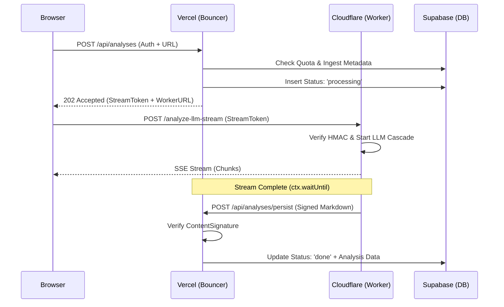

# ADR 005: Hybrid Edge Architecture (v1.4.1)

**Status**: ✅ ACCEPTED
**Date**: 2026-06-01
**Context**: Deep UCIS v5.1 analysis (11-16 dimensions) frequently exceeds Vercel's execution limits (10s/60s). High-concurrency analysis also risks exposing Supabase `service_role` keys if handled client-side or in public workers.

---

## 1. THE ARCHITECTURAL SYMPHONY

This architecture separates high-security auth/billing from high-latency LLM compute using a triple-redundant trust model.

### Layer 1: Vercel (The Bouncer) — ~8 Seconds
*   **Role**: Security Perimeter & Gatekeeper.
*   **Actions**:
    1.  Verifies Supabase Auth (cookie session via `getSupabaseClientWithAuth`; `test-token-` bypass in non-prod).
    2.  Enforces Atomic Monthly Quota (**Upstash Redis Lua** atomic increment — not Postgres).
    3.  Ingests Metadata & Subtitles (Decodo/Worker Proxy).
    4.  Mints HMAC-signed `StreamToken` (bound to `videoId` + `analysisId`, 120s expiry).
    5.  Inserts `status: 'processing'` placeholder row.
*   **Outcome**: Returns 202 Accepted + Worker URL to client.

### Layer 2: Cloudflare (The Streaming Engine) — ~58 Seconds
*   **Role**: Stateless Compute & Real-time Delivery.
*   **Actions**:
    1.  Verifies `StreamToken` HMAC (prevents unauthorized LLM spend).
    2.  Builds the UCIS v5.1 prompt server-side (`getUCISPrompt` bundled by esbuild — IP never reaches the browser).
    3.  Executes the model cascade: `nemotron-3-nano-30b:free` (lead, the only reliably-valid free model, ~58s) → `glm-4.5-air:free` → `gemma-4-26b:free` → `anthropic/claude-haiku-4.5` (paid fallback). Commit-on-first-token: only falls through if a model never emits.
    4.  Streams chunks directly to Browser UI via SSE.
    5.  Computes final `ContentSignature` (HMAC of full markdown).
*   **Outcome**: High-throughput stream with no execution timeouts (CF Workers have no duration limit while the client stays connected).

### Layer 3: S2S /persist (The Closer)
*   **Role**: Secure Data Persistence.
*   **Actions**:
    1.  Worker calls `/api/analyses/persist` via `ctx.waitUntil`.
    2.  Vercel verifies `ContentSignature` (tamper-proofing).
    3.  Vercel writes canonical result to Supabase using `service_role` key.
*   **Outcome**: Persistence is decoupled from the client — if the user navigates away *after* the stream completes, the result is still saved (the worker's `waitUntil` fires server-to-server). **Caveat**: a *mid-stream* close still loses that run — generation is tied to the live connection, and `waitUntil`'s 30s post-disconnect grace cannot finish a ~58s generation. True mid-stream durability would require Cloudflare Workflows/Queues (deferred).

---

## 2. THE UNIFIED DATA FLOW

---

## 3. WHY THE HYBRID WINS

*   **The Quota Fortress**: Quota enforcement remains in Vercel via the Upstash Redis Lua atomic-increment (race-safe), preventing "double-spend". A Supabase JWT proves identity but NOT quota — which is why auth+quota stay on Vercel rather than moving to the edge.
*   **Cryptographic Isolation**: The public worker never touches database keys. It only reads an immutable HMAC signature to verify that Vercel approved the computation.
*   **Asynchronous Persistence**: Server-to-server persistence ensures analyses are saved even if the client disconnects, eliminating "missing analysis" support tickets.
*   **IP Protection**: UCIS prompt logic and framework IP stay inside the worker/server, never reaching the browser.

---

## 4. SECURITY CONSTRAINTS

1.  **HMAC Mandatory**: Every stream must be signed by Vercel (`StreamToken`). Every persistence call must be signed by the Worker (`ContentSignature`). Shared secret: `STREAM_HMAC_SECRET` (worker secret + Vercel env).
2.  **Key Segregation**: `SUPABASE_SERVICE_ROLE_KEY` MUST NOT exist in the Cloudflare Worker environment.
3.  **Token Expiry**: Stream tokens expire 120s after minting (`TOKEN_TTL_MS` in `web/lib/stream-token.ts`).

---

**Implemented**: 2026-06-02 — worker `yt-intel` v1.5.1, web v1.4.0 (commit `5ea4659`).
**Authority**: Gemini Cross-Tool (GCT) authored; verified & corrected against the live implementation by CC.
