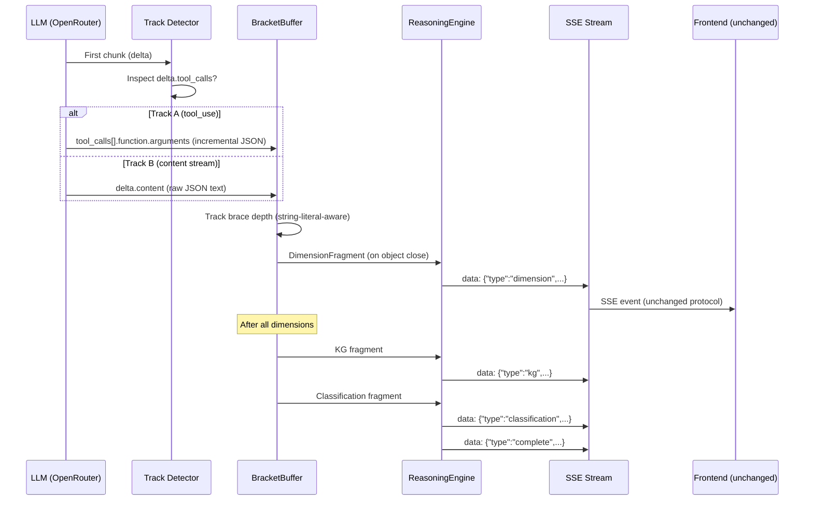

# ADR 006: Structured JSON Streaming (v1.5.0)

**Status**: ✅ ACCEPTED
**Date**: 2026-06-06
**Context**: The UCIS v5.1 analysis pipeline extracts 11 knowledge dimensions by running brittle Regex (`StreamingDimensionParser`, `parse-ucis-dimensions.ts`) over streamed Markdown. This creates parsing ambiguity, KG entity contamination (structural headers extracted as nodes), and blocks commercial pilot readiness.
**Supersedes**: Regex-based `StreamingDimensionParser` + `parse-ucis-dimensions.ts`

---

## 1. THE ARCHITECTURAL PIVOT

This ADR transitions the LLM ingestion pipeline from Markdown+Regex to deterministic Structured JSON Streaming, enforcing a strict Zod-validated schema that eliminates parsing ambiguity and forces the LLM to emit explicit Knowledge Graph nodes/edges.

### Decisions Resolved

| Branch | Decision | Rationale |
|--------|----------|-----------|
| KG Schema | **Structured in JSON payload** | Post-hoc derivation causes latency and extracts structural headers instead of true entities. LLM must emit explicit `nodes[]` and `edges[]`. |
| JSON Validity | **Hybrid dual-track** | tool_use for premium models (Anthropic); programmatic bracket-balancing buffer for fallback models. Zero regex. |
| Persistence | **Dual-write** | Add `analysis_payload JSONB` alongside existing `analysis_markdown TEXT`. Protects PDF export and legacy cache hits. |

---

## 2. THE DUAL-TRACK STREAM ENGINE

### Layer 1: Track Detection (First Chunk Inspection)

*   **Role**: Determines which extraction path the streaming response follows.
*   **Mechanism**: Inspects `choices[0].delta` on the first meaningful OpenRouter chunk.
    - If `delta.tool_calls` is present → **Track A** (Anthropic native tool_use).
    - If only `delta.content` is present → **Track B** (bracket-balancing buffer).
*   **Outcome**: Zero dependency on tool_use passthrough. Falls back gracefully.

### Layer 2A: tool_use Track (Anthropic Models)

*   **Role**: Leverages Claude's native structured output capability.
*   **Actions**:
    1.  Defines a tool called `emit_ucis_analysis` with the full Zod-derived JSON schema.
    2.  OpenRouter returns `choices[0].delta.tool_calls` with structured `arguments`.
    3.  Arguments arrive as incremental JSON strings → fed into the BracketBuffer.
    4.  When the tool call completes, the full JSON is parsed and dimension fragments emitted.
*   **Outcome**: Guaranteed valid JSON from the LLM. Lowest malformation risk.

### Layer 2B: Content Stream Track (Bracket-Balancing Buffer)

*   **Role**: Programmatic JSON extraction for models that output raw JSON in the content stream.
*   **Actions**:
    1.  LLM outputs JSON directly (no markdown wrapping, no code fences).
    2.  Character-by-character bracket tracker detects object boundaries.
    3.  String literal awareness prevents false positives from `{` or `}` inside strings.
    4.  Each complete top-level object (dimension) is emitted as a `DimensionFragment`.
    5.  `repairUnclosedJson()` handles truncated streams by algorithmically closing open brackets.
*   **Outcome**: Zero regex. Purely algorithmic. Same `DimensionFragment[]` output contract as Track A.

### Layer 3: Unified Fragment Emission

*   **Role**: Both tracks converge into the same `StreamHandlers.onFragment()` callback.
*   **Fragment types**: `persona` → `dimension` (1–11) → `kg` → `classification` → `complete`
*   **Outcome**: The frontend protocol (`SynthesisStreamAdapter`, `useSSEStream`, `StreamingGrid`) is unchanged. Only the worker-side emission mechanism changes.

---

## 3. THE UNIFIED DATA FLOW



---

## 4. WHY THE JSON PIVOT WINS

*   **Deterministic Extraction**: `JSON.parse()` + Zod validation replaces fragile regex header matching. No more `### DIMENSION N – TITLE` pattern drift.
*   **Entity Purity**: The LLM emits KG nodes with explicit `entityType` enums (`person`, `concept`, `framework`, `tool`). Structural document headers like "Apex Intelligence" can never contaminate the graph.
*   **Streaming Parity**: The BracketBuffer emits dimension fragments at the same or faster cadence than the regex parser (detects closing `}` immediately vs. waiting for the next `### DIMENSION` header). Frontend staggered CSS animations (`hx-rise`) and flare states are preserved.
*   **Dual-Track Resilience**: If OpenRouter fails to pass through Anthropic tool_use parameters, the bracket buffer track activates automatically. Zero single-point-of-failure on the JSON extraction path.
*   **Backward Compatibility**: Dual-write persistence (`analysis_markdown TEXT` + `analysis_payload JSONB`) ensures PDF export, legacy cache hits, and existing queries continue working during migration.

---

## 5. IMPACT SCOPE

```
CHANGED (Worker):
  ├── dimension-parser.ts           → REPLACED by BracketBuffer + JsonStreamParser
  ├── ReasoningEngine.ts            → dual-track stream handler
  ├── worker.ts /analyze-llm-stream → updated SSE emission + persist()
  └── ValidationService.ts          → ADD validateJSONPayload()

CHANGED (Web):
  ├── prompts/ucis-v5.1.ts          → JSON output instruction block
  ├── validators/synthesis.ts       → expanded Zod schemas (KG nodes/edges/persona)
  ├── parse-ucis-dimensions.ts      → REPLACED by json-payload-rehydrator.ts
  ├── adapters/synthesis-stream-adapter.ts → ADD handlePersona/KG/Classification
  ├── types/synthesis-nucleus.ts    → ADD KGNodeV2, KGEdgeV2, PersonaConfigV2
  └── stores/synthesis-nucleus-store.ts → ADD setPersonaConfig/KnowledgeGraph/Classification

CHANGED (DB):
  └── New migration: add analysis_payload JSONB column + GIN index

UNCHANGED (Frontend protocol — zero modifications):
  ├── StreamingGrid.tsx             → dimension cards, staggered animations
  ├── DimensionDrawer.tsx           → slide-in drawer, ReactMarkdown rendering
  ├── useSSEStream.ts               → SSE fetch + adapter wiring
  └── synthesis-nucleus-store.ts    → addDimension() API unchanged
```

---

## 6. ZOD SCHEMAS & TYPE CONTRACTS

### 6.1 Knowledge Graph Node

```typescript
export const KGNodeSchema = z.object({
  id: z.string().min(1).max(100),           // slug: "first-principles-thinking"
  dimension: z.number().int().min(1).max(11),
  label: z.string().min(1).max(200),        // "First Principles Thinking"
  content: z.string().min(10),              // 1-2 sentence description
  weight: z.number().min(0).max(1),
  polarity: z.number().min(-1).max(1),
  keyTerms: z.array(z.string()).max(10),
  entityType: z.enum([
    'person', 'concept', 'framework', 'tool',
    'organization', 'study', 'trend', 'metric'
  ]),
}).strict();
```

### 6.2 Knowledge Graph Edge

```typescript
export const KGEdgeSchema = z.object({
  source: z.string().min(1),    // must reference a node.id
  target: z.string().min(1),    // must reference a node.id
  strength: z.number().min(0).max(1),
  kind: z.enum(['similar', 'related', 'tangent', 'contrarian']),
  rationale: z.string().min(5).max(500).optional(),
}).strict();
```

### 6.3 Persona Configuration

```typescript
export const PersonaConfigSchema = z.object({
  primary: z.object({
    id: z.enum(['creator', 'critic', 'analyst', 'educator', 'philosopher']),
    label: z.string(),
    weight: z.number().min(0).max(1),
  }),
  secondary: z.object({ id: z.enum([...]), label: z.string(), weight: z.number() }).optional(),
  tertiary: z.object({ id: z.enum([...]), label: z.string(), weight: z.number() }).optional(),
  cognitiveLenses: z.array(z.string()).min(1).max(8),
  selectionRationale: z.string().min(10).max(500),
}).strict();
```

### 6.4 Complete Payload (v2.0)

```typescript
export const UCISPayloadV2Schema = z.object({
  schemaVersion: z.literal('2.0'),
  persona: PersonaConfigSchema,
  dimensions: z.array(UCISDimensionV2Schema).min(1).max(11),
  knowledgeGraph: z.object({
    nodes: z.array(KGNodeSchema).max(30),
    edges: z.array(KGEdgeSchema).max(100),
    rootId: z.string().nullable(),
  }).strict(),
  classification: z.object({
    authoritative: z.boolean(),
    practicallyActionable: z.boolean(),
    knowledgeGraphReady: z.boolean(),
    safe: z.boolean(),
    personaOptimised: z.boolean(),
    recommendation: z.enum(['highly_recommended', 'recommended', 'conditional', 'skip']),
  }).strict(),
  monetizationVerdict: z.object({
    creator: z.string().min(5).max(500),
    indieMaker: z.string().min(5).max(500),
    consultant: z.string().min(5).max(500),
  }).strict().optional(),
}).strict();
```

### 6.5 Extended Stream Fragments

```typescript
// New fragment types added to UCISStreamFragmentSchema discriminated union:
// 'persona'       — emitted first, before any dimension
// 'kg'            — emitted after all dimensions, before 'complete'
// 'classification' — emitted after dimensions, before 'complete'
```

---

## 7. BRACKET-BALANCING BUFFER (Zero Regex)

The core algorithmic component. Character-by-character processing with string-literal awareness.

```typescript
export class BracketBuffer {
  private buffer: string = '';
  private depth: number = 0;
  private inString: boolean = false;
  private escaped: boolean = false;
  private objectStart: number = -1;
  private emittedDimensions: Set<number> = new Set();

  feed(chunk: string): DimensionFragment[] { /* character loop */ }
  finalize(): DimensionFragment[] { /* repair + flush */ }
  private repairUnclosedJson(text: string): string | null { /* algorithmic close */ }
  private tryParseDimension(jsonStr: string): DimensionFragment | null { /* JSON.parse + validate */ }
}
```

**Key properties:**
- Tracks `{`/`}` depth while respecting `"` string boundaries and `\\` escape sequences.
- Emits a `DimensionFragment` the moment a top-level `}` closes at depth 0.
- `repairUnclosedJson()` counts open braces/brackets and appends closers — handles truncated streams.
- Deduplicates via `emittedDimensions` Set — prevents re-emission on buffer overlap.

---

## 8. PROMPT MODIFICATION

### What Changes in `ucis-v5.1.ts`

**REPLACE** the `OUTPUT FORMAT (CRITICAL FOR PARSING)` section (lines 486–511) with a JSON schema instruction block that:
1. Mandates a single valid JSON object as the entire response (no markdown wrapping, no code fences).
2. Defines the full JSON schema inline with an example payload.
3. Specifies streaming order: `persona` → `dimensions[1-11]` → `knowledgeGraph` → `classification` → `monetizationVerdict`.
4. Instructs KG nodes to extract ONLY domain-specific entities — never structural document headers.
5. Preserves the Insufficient Data Protocol: `metadata.insufficientData: true` + standard content string.

### What Stays the Same

- Sections 0–0.6 (Core Mission, Closed Universe, Insufficient Data Protocol) — **UNCHANGED**
- All 11 dimension descriptions (what content goes in each) — **UNCHANGED**
- Pre-Analysis Protocol (Steps 1–5) — **UNCHANGED**
- Cognitive Lenses section — **UNCHANGED**
- Quality Enforcement Checklist — **UNCHANGED** (dimension header item now references JSON)
- Execution section — **UNCHANGED** (output format reference updated)

---

## 9. HEXAGONAL PORT BOUNDARY

### Worker Ports (No Change)

The `IReasoningEngine` port and `StreamHandlers` interface remain unchanged. The `DimensionFragment` type is EXTENDED (non-breaking) with optional fields for `persona`, `kg`, and `classification` fragments.

### Web Ports (No Change)

The `IIngestionPort`, `IAuthPort`, `IQuotaPort`, and `IPersistencePort` interfaces remain unchanged. The `IPersistencePort` gains an optional `payload` field on the persist input type.

### Adapter Changes

| Adapter | Change |
|---------|--------|
| `ReasoningEngine` (worker) | Dual-track stream handler + BracketBuffer |
| `SynthesisStreamAdapter` (web) | ADD `handlePersona()`, `handleKG()`, `handleClassification()` |
| `SupabasePersistenceAdapter` (web) | ADD `upsertAnalysisWithPayload()` |
| `json-payload-rehydrator.ts` (web, NEW) | Replaces `parse-ucis-dimensions.ts` for cache hits |
| `MarkdownReconstructor.ts` (worker, NEW) | Reconstructs markdown from JSON for dual-write |

---

## 10. SUPABASE MIGRATION

```sql
ALTER TABLE analyses
  ADD COLUMN IF NOT EXISTS analysis_payload JSONB DEFAULT '{}'::jsonb;

CREATE INDEX IF NOT EXISTS idx_analyses_payload_schema
  ON analyses ((analysis_payload->>'schemaVersion'));

CREATE INDEX IF NOT EXISTS idx_analyses_payload_gin
  ON analyses USING GIN (analysis_payload);
```

Dual-write: Worker sends both `markdown` (reconstructed) and `payload` (structured JSON). The persist endpoint writes both columns. Legacy cache hits read from `analysis_markdown`; new cache hits read from `analysis_payload`.

---

## 11. ROLLOUT PHASES

### Phase 1: Worker JSON Parser + Prompt (Deploy Worker First)

1. `worker/src/services/BracketBuffer.ts` — NEW
2. `worker/src/services/JsonStreamParser.ts` — NEW
3. `worker/src/services/MarkdownReconstructor.ts` — NEW
4. `worker/src/services/ReasoningEngine.ts` — UPDATE `executeAndStream()`
5. `worker/src/services/ValidationService.ts` — ADD `validateJSONPayload()`
6. `worker/src/dimension-parser.ts` — DEPRECATE
7. `worker/src/worker.ts` — UPDATE `persist()`
8. `web/lib/prompts/ucis-v5.1.ts` — REPLACE output format section

**Gate**: `pnpm type-check` + `pnpm build` clean. Manual E2E on `/analyze-llm-stream`.

### Phase 2: Web Zod Schemas + Stream Adapter (Deploy Web)

1. `web/lib/validators/synthesis.ts` — ADD expanded schemas + fragment types
2. `web/lib/types/synthesis-nucleus.ts` — ADD KGNodeV2, KGEdgeV2, PersonaConfigV2
3. `web/lib/adapters/synthesis-stream-adapter.ts` — ADD new handlers
4. `web/lib/stores/synthesis-nucleus-store.ts` — ADD new setters
5. `web/lib/json-payload-rehydrator.ts` — NEW
6. `web/app/api/analyses/route.ts` — UPDATE cache-hit path
7. `web/app/api/analyses/persist/route.ts` — ADD payload field

**Gate**: `pnpm type-check` + `pnpm build` clean. E2E flow test.

### Phase 3: Supabase Migration + Persistence (Deploy DB + Web)

1. `supabase/migrations/YYYYMMDD_add_analysis_payload.sql` — NEW
2. `web/lib/adapters/SupabasePersistenceAdapter.ts` — ADD `upsertAnalysisWithPayload()`
3. `web/app/api/analyses/persist/route.ts` — UPDATE dual-write

**Gate**: Migration applies cleanly. Dual-write verified. Legacy cache hits intact.

### Phase 4: Cleanup (Future)

- Remove `dimension-parser.ts`, `parse-ucis-dimensions.ts`, regex validator checks.
- Deprecate `analysis_markdown` column after PDF export migrates to JSON.

---

## 12. RISK MITIGATIONS

| Risk | Severity | Mitigation |
|------|----------|------------|
| LLM produces invalid JSON | HIGH | `BracketBuffer.repairUnclosedJson()` + `JSON.parse` try/catch + Zod validation. Fallback to markdown regex parser if JSON fails 3×. |
| Token overhead (15–25%) | MEDIUM | Acceptable tradeoff for determinism. Haiku 4.5 is cheap. Monitor cost per analysis. |
| Content escaping errors | MEDIUM | BracketBuffer is string-literal-aware. Test with 10 diverse transcripts (tables, code, special chars). |
| Streaming animation regression | LOW | Frontend protocol unchanged. `DimensionFragment` type extended, not replaced. E2E test verifies card states. |
| Backward compat breakage | LOW | Dual-write strategy. Legacy regex parsers kept as fallback. Feature flag for JSON mode. |
| OpenRouter tool_use passthrough failure | MEDIUM | Track detection falls back to content stream + bracket buffer. Zero dependency on tool_use working. |

---

## 13. SECURITY CONSTRAINTS

1.  **HMAC Mandatory**: Unchanged from ADR 005. Every stream signed by Vercel (`StreamToken`). Every persistence call signed by Worker (`ContentSignature`).
2.  **Key Segregation**: Unchanged. `SUPABASE_SERVICE_ROLE_KEY` MUST NOT exist in the Worker.
3.  **JSON Payload Signing**: The `contentSig` HMAC now signs the raw JSON string (not reconstructed markdown). The persist endpoint verifies the JSON signature before writing `analysis_payload`.
4.  **Schema Version Gate**: The persist endpoint rejects payloads where `schemaVersion` is not `"2.0"` (prevents injection of arbitrary JSON structures).

---

## 14. VALIDATION CHECKLIST

- [ ] `pnpm type-check` clean (worker + web)
- [ ] `pnpm build` succeeds (worker + web)
- [ ] BracketBuffer handles 10 diverse transcripts without parse failures
- [ ] SSE stream emits fragments in order: `persona` → `dimension`(1–11) → `kg` → `classification` → `complete`
- [ ] Dimension cards animate with staggered CSS entry (`hx-rise` classes)
- [ ] Dimension drawer opens and renders markdown content
- [ ] KG nodes/edges populate the knowledge graph visualization
- [ ] Cache hit rehydrates dimensions + KG from JSONB payload
- [ ] Legacy cache hits (markdown-only) still work via fallback parser
- [ ] PDF export still works from `analysis_markdown` column
- [ ] Dual-write persists both columns on stream completion
- [ ] Dual-write persists both columns on browser abort (interrupted)
- [ ] HMAC content signature still validates on persist endpoint
- [ ] Persona switching mid-stream works (projection recomputes)

---

**Approved**: 2026-06-06 — Qwen 3.7 Max (The Architect) authored; reviewed and approved by user.
**Implementation**: Pending — Phase 1 ready for CCT1/Minimax execution.
**Authority**: ADR 006 supersedes the regex extraction pattern established in ADR 005's streaming layer. ADR 005's security architecture (HMAC, key segregation, S2S persistence) remains fully intact.
