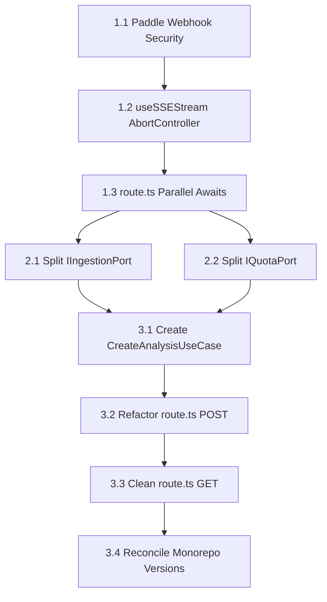

# IMPLEMENTATION SPECIFICATION: CORE PLATFORM STABILIZATION & ARCHITECTURE RECONCILIATION

- **Filename**: `IMPLEMENTATION_PLAN.md`
- **Location**: `/docs/specs/IMPLEMENTATION_PLAN.md`
- **Version**: `2.0.0`
- **Build**: `2026.06.10.01`
- **Timestamp**: `2026-06-10T10:35:00+03:00`
- **Purpose**: Implementation roadmap for resolving security vulnerabilities, database logs growth, latency issues, and hexagonal architectural drift across Next.js app and CF worker.

---

## 1. COMPLEXITY ASSESSMENT

This task is of **Medium Complexity** overall. It is composed of a few high-risk security items that must be resolved immediately, combined with structural refactoring to align the codebase with pure hexagonal design principles.

* **Security & Latency Fixes**: Low complexity. Localized code changes, low risk of regressions.
* **Interface Segregation (ISP/LSP)**: Medium complexity. Modifies core ports and adapters, requiring updates to type definitions and instantiation points.
* **UseCase Extraction**: Medium complexity. Moves business orchestration out of route files into clean classes. High risk of route regression if input/output interfaces are not perfectly mapped.

---

## 2. REFACTORING OPTIONS

### Option A: Tactical Security & Performance Wins (Wave 1 Only)
* **Description**: Apply hotfixes to high-risk areas only. Seal the Paddle webhook bypass, add the `AbortController` to the streaming code, and parallelize the `route.ts` awaits.
* **Effort**: ~1 hour of LLM execution time (1 turn).
* **Trade-off**: Fast stabilization but leaves the architectural debt (bloated ports, direct DB queries, untestable controllers) completely unaddressed.

### Option B: Complete Architectural Realignment (Recommended - Waves 1, 2, and 3)
* **Description**: Execute the security and performance hotfixes, segregate the bloated interfaces to satisfy ISP/LSP, extract the UseCase domain layer, and remove direct database query bypasses.
* **Effort**: ~3 hours of LLM execution time (3 coordinated turns).
* **Trade-off**: Requires modifying multiple files and interfaces, but it permanently secures the codebase against architectural drift, makes the core logic testable, and establishes a rigid pattern for future feature development.

---

## 3. WA-VE ROADMAP & DEPENDENCY MAP

We recommend executing the refactoring in **three sequential waves** to minimize risk and establish clear validation gates:

---

## 4. DETAILED IMPLEMENTATION STEPS

### WAVE 1: High-Priority Security & Resiliency (Quick Wins)
* **Goal**: Seal vulnerability vectors and prevent resource leaks.
* **Dependencies**: None.

#### Step 1.1: Secure Paddle Webhook Signature Verification
* **Target File**: [web/app/api/billing/webhook/route.ts](web/app/api/billing/webhook/route.ts)
* **Action**: Restore the signature verification mechanism using `@paddle/paddle-node-sdk`. Gate the JSON parsing fallback strictly behind `process.env.NODE_ENV === 'development'`.
* **Estimated LLM Effort**: 15 minutes.

#### Step 1.2: Add AbortController to useSSEStream
* **Target File**: [web/hooks/useSSEStream.ts](web/hooks/useSSEStream.ts)
* **Action**: Instantiate and maintain an `AbortController` in the SSE stream initiator. Call `.abort()` on the controller before starting a new stream or when the component unmounts to close old connections.
* **Estimated LLM Effort**: 20 minutes.

#### Step 1.3: Parallelize Traffic & Billing Checks in route.ts
* **Target File**: [web/app/api/analyses/route.ts](web/app/api/analyses/route.ts)
* **Action**: Group `trafficAdapter.checkGate()` and `billingAdapter.checkGate()` calls into a single `Promise.all()` block. Saves ~100ms of latency per POST request.
* **Estimated LLM Effort**: 15 minutes.

---

### WAVE 2: Port Segregation (ISP/LSP Resolution)
* **Goal**: Refactor interfaces to contain only single-responsibility definitions.
* **Dependencies**: Wave 1 complete.

#### Step 2.1: Split IIngestionPort
* **Target Files**:
  * [web/lib/ports/IngestionPort.ts](web/lib/ports/IngestionPort.ts)
  * [web/lib/adapters/WorkerIngestionAdapter.ts](web/lib/adapters/WorkerIngestionAdapter.ts)
* **Action**:
  * Create `MetadataIngestionPort` containing only `fetch()` and `buildJobMetadata()`.
  * Create `ModelResolutionPort` containing `resolveModels()`.
  * Create `CryptographicTokenPort` containing `signToken()`.
  * Refactor `WorkerIngestionAdapter` to only implement `MetadataIngestionPort`, removing the throwing methods.
  * Move resolution and signing implementations into separate adapter classes cleanly.
* **Estimated LLM Effort**: 45 minutes.

#### Step 2.2: Split IQuotaPort
* **Target Files**:
  * [web/lib/ports/QuotaPort.ts](web/lib/ports/QuotaPort.ts)
  * [web/lib/adapters/RedisTrafficAdapter.ts](web/lib/adapters/RedisTrafficAdapter.ts)
  * [web/lib/adapters/PostgresBillingAdapter.ts](web/lib/adapters/PostgresBillingAdapter.ts)
* **Action**:
  * Create `TrafficGuardPort` with `checkGate()` for DDoS/rate-limiting.
  * Create `BillingQuotaPort` with `checkGate()` and `refund()` for credit transactions.
  * Refactor `RedisTrafficAdapter` to implement `TrafficGuardPort` (removing the unused `refund` method).
  * Refactor `PostgresBillingAdapter` to implement `BillingQuotaPort`.
* **Estimated LLM Effort**: 30 minutes.

---

### WAVE 3: Domain UseCase Isolation & Clean Routing
* **Goal**: Move business orchestration into UseCase classes and unify persistence.
* **Dependencies**: Wave 2 complete.

#### Step 3.1: Create CreateAnalysisUseCase
* **Target File**: `web/lib/usecases/CreateAnalysisUseCase.ts` (New File)
* **Action**: Write the core analysis creation workflow inside a constructor-configured class using the new segregated ports. Keep it completely free of HTTP inputs or Next.js routing parameters.
* **Estimated LLM Effort**: 30 minutes.

#### Step 3.2: Refactor route.ts POST Handler
* **Target File**: [web/app/api/analyses/route.ts](web/app/api/analyses/route.ts)
* **Action**: Instantiate the adapters, pass them to `CreateAnalysisUseCase`, and execute the UseCase. Map resulting data to `NextResponse.json` payload shapes.
* **Estimated LLM Effort**: 20 minutes.

#### Step 3.3: Refactor route.ts GET Handler
* **Target File**: [web/app/api/analyses/route.ts](web/app/api/analyses/route.ts)
* **Action**: Add a `findAnalysesByUserId(userId: string): Promise<CachedAnalysis[]>` method to [PersistencePort](web/lib/ports/PersistencePort.ts). Query history through [SupabasePersistenceAdapter](web/lib/adapters/SupabasePersistenceAdapter.ts) instead of writing inline database calls in the GET route.
* **Estimated LLM Effort**: 25 minutes.

#### Step 3.4: Reconcile Monorepo Versions
* **Target Files**:
  * [package.json](package.json)
  * [web/package.json](web/package.json)
  * [worker/package.json](worker/package.json)
* **Action**: Unify monorepo package versions to `1.5.2` (or current clean state) to complete the Housekeeping checks.
* **Estimated LLM Effort**: 10 minutes.

---

## 5. VALIDATION GATES (FOR EACH WAVE)

To guarantee 100% correct execution:

1. **Pre-wave check**: Ensure git working directory is clean.
2. **Post-wave check**:
   * Run `pnpm --filter web type-check` (Strict type safety validation).
   * Run `pnpm build` (Production compilation validation).
   * Verify all tests pass.

---

## 6. RECOMMENDATION

We strongly recommend **Option B (Complete Architectural Realignment)**. 
While Option A fixes immediate security cracks, it leaves the codebase susceptible to drift and keeps business logic tightly coupled to framework code. Executing all three waves resolves technical debt, makes the system fully testable, and satisfies the strict compliance requirements of our engineering rules.
