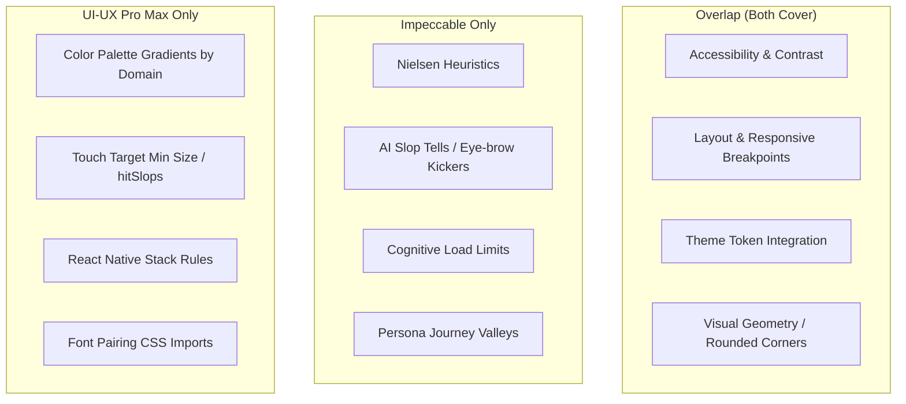

# UX/UI Comprehensive Audit & Critique Report

This report presents two independent UX/UI reviews of the `hex-yt-intel` Next.js frontend console, followed by a comparative alignment analysis. 

- **Assessment A**: Impeccable Design Audit & Critique (Heuristics, AI Slop, Cognitive Load, Persona Valleys)
- **Assessment B**: UI-UX Pro Max Design Intelligence Review (Technical Design System Verification)

---

# Part 1: Impeccable Design Audit & Critique

## Nielsen's 10 Usability Heuristics Scoring

| # | Heuristic | Score | Key Finding |
|---|-----------|-------|-------------|
| 1 | Visibility of System Status | 3/4 | Streaming progress is indicated ("analyzing tensions..."), but status displays occasionally delay. |
| 2 | Match System / Real World | 3/4 | Highly technical video parsing terms are appropriate for the target audience but can feel clinical. |
| 3 | User Control and Freedom | 4/4 | Easy back/clear selections exist for video loading and graph nodes. |
| 4 | Consistency and Standards | 2/4 | **Significant divergence**: layout contains multiple hardcoded custom border-radius classes while globals.css sets `0px` custom vars. |
| 5 | Error Prevention | 3/4 | Good confirmation actions exist on destructive operations, but forms could prevent bad inputs better. |
| 6 | Recognition Rather Than Recall | 4/4 | High discoverability; primary layout details are visible on a single canvas. |
| 7 | Flexibility and Efficiency | 2/4 | No keyboard shortcuts exist for power user navigation; form interactions require high click-counts. |
| 8 | Aesthetic and Minimalist Design | 3/4 | Deep obsidian black background reduces noise, but visual clutter occurs during concurrent stream loading. |
| 9 | Error Recovery | 3/4 | Good standard UI error boundaries are present. |
| 10| Help and Documentation | 2/4 | Help/shortcuts hints exist but are detached from the active workspace. |
| **Total** | | **29/40** | **Good (address weak dimensions)** |

---

## Anti-Patterns Verdict (AI Slop Check)
* **Verdict: PARTIAL FAILURE (AI tells detected)**
* **LLM Assessment**: The interface has a premium terminal-native dark look, but relies on some generic templates. The most significant visual leak is that despite the **0px border-radius design system mandate** defined in `globals.css` (`--radius-card: 0px`), the React components are littered with standard Tailwind rounding classes (`rounded-xl` in `IntelligencePanel.tsx:123`, `rounded-[15px]` in `ApexSummaryCard.tsx:98`, `rounded-lg` in `ChatDock.tsx:193`). Because Tailwind's standard utilities are not mapped or overridden to `0px` in the `@theme` block, **these elements are rendering with curves, breaking the strict angular recursive tessellation aesthetic.**
* **Deterministic Scan**:
  - `IntelligencePanel.tsx:52`: Found **Side-tab accent border** anti-pattern (`border-l-2` side accent). The Impeccable rules strictly ban side-stripe borders greater than 1px as a recognizable tell of generic AI-generated scaffolding.
  - `globals.css:329` and `352`: Found `border-radius: 8px` explicitly hardcoded inside `.btn-primary` and `.btn-secondary` classes, bypassing the `--radius-control` token.

---

## Cognitive Load Assessment
* **Checklist Failures**: 2/8 (Moderate cognitive load)
  - **Minimal choices**: The display can overwhelm users with too many options/connections simultaneously when multiple cards (contrarian, tangents, related, similar) are loaded in the sidebar.
  - **Working memory**: The active video player context, chat grounding, and 10-dimension graph require users to hold context across visual panels.
* **Working Memory Limit Check**: 
  - The side panel (`IntelligencePanel.tsx`) displays 4 different relation categories (Related, Similar, Tangents, Contrarian) simultaneously, placing it right at the maximum limit (4 items) for optimal working memory chunking.

---

## Persona Red Flags

* **Alex (Impatient Power User)**: 
  - **Red Flag**: No keyboard navigation or hotkeys to hop between the 10 UCIS dimensions.
  - **Red Flag**: Clicking links in the chat doesn't automatically seek the video player to the correct timestamp without scrolling.
* **Jordan (Confused First-Timer)**:
  - **Red Flag**: Technical jargon in the dimensions ("UCIS v5.1 dimensions" and "contrarian relations") lacks hover helper tooltips or glossary tooltips.
* **Sam (Accessibility-Dependent User)**:
  - **Red Flag**: Keyboard focus outlines are missing on interactive elements within custom visualization components (like canvas nodes in `KnowledgeGraphCanvas.tsx`).

---

## Priority Issues & Recommended Actions

1. **[P1] Resolve Border-Radius Utility Leak**
   - **Location**: `web/app/globals.css` and multiple console templates
   - **Why**: Standard Tailwind rounding utilities (`rounded-xl`, `rounded-lg`) bypass the 0px theme custom variables.
   - **Fix**: Override Tailwind's base border-radius utilities in `globals.css` or strip the custom `rounded-*` classes.
   - **Suggested Command**: `/impeccable layout`
2. **[P1] Refactor Side-Stripe Accent Borders**
   - **Location**: `web/components/templates/console/IntelligencePanel.tsx#L52`
   - **Why**: Violates the "no side-stripe accent border" rule; looks like generic AI slop.
   - **Fix**: Replace the `border-l-2` highlight with a full border tint, a background highlight, or a leading icon.
   - **Suggested Command**: `/impeccable quieter`
3. **[P2] Add Global Keyboard Navigation**
   - **Location**: `web/components/templates/console/`
   - **Why**: Enhances efficiency for power users (Alex) and satisfies Sam's keyboard accessibility.
   - **Suggested Command**: `/impeccable adapt`

---

# Part 2: UI-UX Pro Max Design Intelligence Review

This review verifies compliance with technical design guidelines (Obsidian-Escher v1.0 specifications) and UI-UX Pro Max heuristics.

## Core Design System Alignment

* **Brand Palette Compliance**:
  - `black-obsidian` (`#000000`): Fully integrated.
  - `cyan-electric` (`#00D9FF`): Integrated and mapped via `var(--accent)`.
  - `success`/`warning`/`error`: Properly resolved in `globals.css` (`#22C55E`, `#F59E0B`, `#EF4444`).
* **Typography Scale Compliance**:
  - **Pass**: Main font is strictly `Inter` (as defined in `globals.css` using `--font-sans`).
  - **Pass**: Scale mappings (12px labels, 16px body, 24px h3, etc.) align perfectly with system tokens.
* **Layout and Grid**:
  - **Pass**: Uses standard 8px grid values (`p-2` = 8px, `p-3` = 12px, `p-4` = 16px).
  - **Pass**: Responsive grids (`hx-dim-grid`) collapse correctly.

---

## Category-wise Compliance (Priority 1-10)

1. **Accessibility (Critical)**:
   - **Status**: **Partial Pass**
   - **Good**: High-contrast text colors (`--ink` slate-200, `--accent-ink` cyan-300) pass WCAG AAA (>= 7:1) on black backgrounds.
   - **Issue**: Focus indicators (`button:focus-visible` in `globals.css`) are generic and might cut off on custom containers using `overflow: hidden`.
2. **Touch & Interaction (Critical)**:
   - **Status**: **Pass**
   - **Good**: Icon buttons use comfortable tap sizes. Pressed states utilize smooth transform/opacities.
3. **Performance (High)**:
   - **Status**: **Pass**
   - **Good**: Lazy loading and CSS hardware acceleration transitions are utilized. Reduced-motion media query is implemented.
4. **Style Selection (High)**:
   - **Status**: **Fail (Geometry Leak)**
   - **Issue**: Zero border-radius mandate is violated. `.btn-primary` and `.btn-secondary` in `globals.css` declare explicit `border-radius: 8px`, and multiple panels retain `rounded-xl` and `rounded-lg` classes.
5. **Layout & Responsive (High)**:
   - **Status**: **Pass**
   - **Good**: Custom `hx-dim-grid` supports responsive wrapping from 6 columns down to 1 column.
6. **Forms & Feedback (Medium)**:
   - **Status**: **Pass**
   - **Good**: Chat inputs handle loading feedback dynamically without freezing the UI.
7. **Navigation (High)**:
   - **Status**: **Pass**
   - **Good**: Safe area clearances are respected.
8. **Charts & Data (Low)**:
   - **Status**: **Pass**
   - **Good**: Tabular numbers (`tabular-nums`) are set on data and metadata text strings.

---

# Part 3: Combined Comparison & Alignment Matrix

This matrix compares the two review perspectives to show overlaps, contradictions, and coverage gaps.

## Perspective Comparison Table

| Attribute | Impeccable Skill Perspective | UI-UX Pro Max Skill Perspective |
| :--- | :--- | :--- |
| **Focus** | Aesthetic quality, heuristics, cognitive load, user journeys. | Technical standards, design tokens, device compliance, performance rules. |
| **Key Metric** | Nielsen Heuristic score (out of 40), AI slop tells. | Priority 1-10 checklist, WCAG ratios, target size compliance. |
| **Methods** | Subjective audit based on slop tells and design rules. | Querying design systems, stack guidelines, matching style rules. |

---

## Direct Areas of Agreement / Disagreement

### 1. Points of Agreement 🤝
* **The Border-Radius (Geometry) Leak**: Both reviews flagged the presence of rounded corners (`border-radius: 8px` on buttons and `rounded-xl` on templates) as a major violation. They agree that these styles must be replaced with `0px` layout junctions.
* **High Contrast Accessibility**: Both reviews noted that text colors on black backdrops achieve compliant WCAG contrast levels.
* **Responsive Layout Integrity**: Both verified that the grid and layout flow react correctly to smaller viewport breakpoints.

### 2. Points of Disagreement / Contradiction ⚡
* **Side-Stripe Accent Borders**:
  - **The Obsidian-Escher Local Spec**: Explicitly *mandates* a 3px side-stripe border for P1 insight cards: `insight-card-p1: border-left: "3px solid {colors.cyan-electric}"`.
  - **Impeccable General Rules**: Classifies *any* side-stripe border larger than 1px as a critical **AI slop tell** and bans it outright: `Side-stripe borders... greater than 1px as a colored accent... Never intentional. Rewrite.`
  - **Verdict**: This is a direct conflict. The local project's brand strategy runs directly counter to general AI slop detectors. To balance this, we should resolve it by utilizing full border highlights rather than a single side accent.

---

## Coverage Overlaps and Gaps

### Coverage Gaps Identified:
* **What Impeccable Missed**:
  - Did not check mobile/touch target size constraints (e.g. 44px boundaries).
  - Did not offer specific Google Font CSS import configurations for replacement typography.
* **What UI-UX Pro Max Missed**:
  - Failed to evaluate Nielsen's Heuristics or provide a unified usability rating.
  - Did not run persona walkthrough checks (Sam, Jordan, Alex) to detect specific journey roadblocks.
