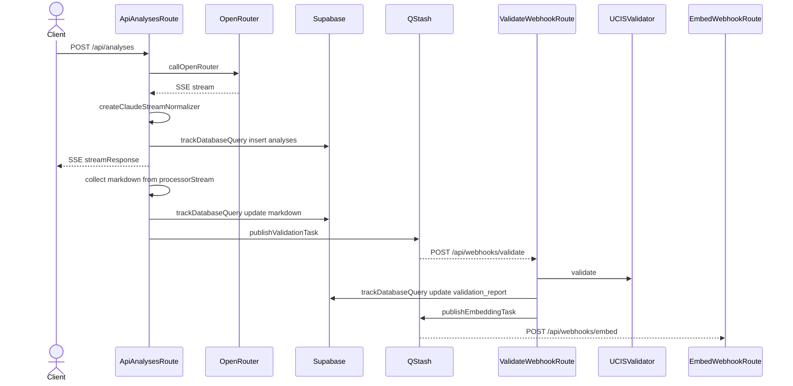
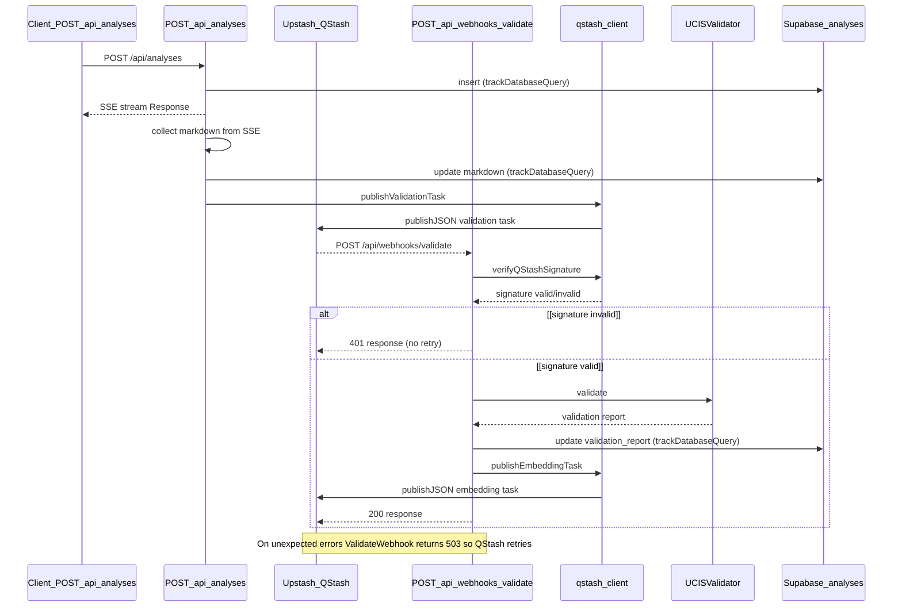
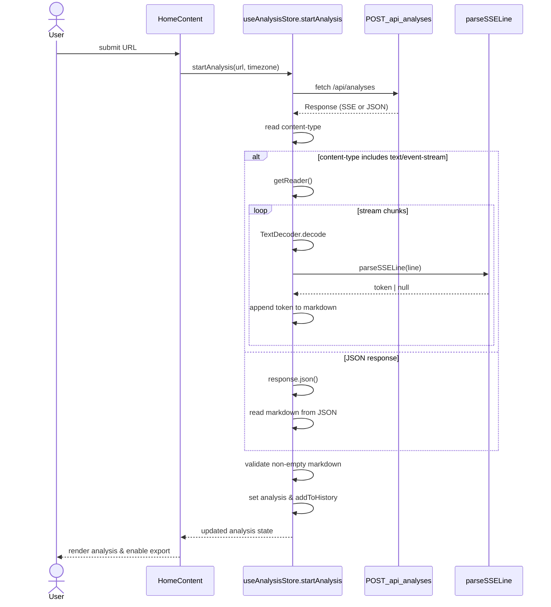
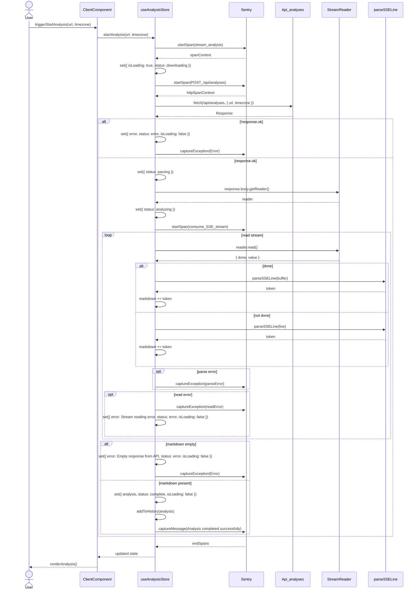
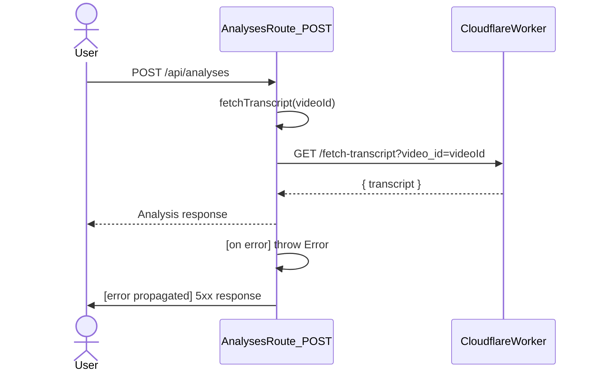

# Consolidated AI Review & Prompt Harvest Log
Generated on: 2026-05-19 09:15:45 UTC
Repository: Hex-Tech-Lab/hex-yt-intel
---

## PR #17 Review Payload

**Link:** https://github.com/Hex-Tech-Lab/hex-yt-intel/pull/17

**Title:** feat: implement 10x serverless architecture - QStash guaranteed queues, Zustand global state, Supabase GraphQL
**State:** OPEN

### Issue/Review Thread Comments

**@supabase** (2026-05-18T22:32:31Z):
[supa]:adnmbikaqnxivalqoild
This pull request has been ignored for the connected project `adnmbikaqnxivalqoild` because there are no changes detected in `supabase` directory. You can change this behaviour in [Project Integrations Settings ↗︎](https://supabase.com/dashboard/project/adnmbikaqnxivalqoild/settings/integrations).

<hr/>

Preview Branches by Supabase.
Learn more about [Supabase Branching ↗︎](https://supabase.com/docs/guides/platform/branching).

**@sourcery-ai** (2026-05-18T22:32:31Z):
<!-- Generated by sourcery-ai[bot]: start review_guide -->

## Reviewer's Guide

Refactors the analysis pipeline to offload validation and embedding tasks to Upstash QStash webhooks, introduces a global Zustand-backed analysis state store, and adds a zero-dependency, typed GraphQL client for Supabase pg_graphql while keeping existing HTTP contracts stable.

#### Sequence diagram for QStash-based analysis validation pipeline



### File-Level Changes

| Change | Details | Files |
| ------ | ------- | ----- |
| Offload markdown validation and embedding to Upstash QStash webhooks instead of in-process background work, and persist analysis metadata earlier in the request lifecycle. | <ul><li>Create a QStash client wrapper with helpers for publishing validation and embedding tasks and basic signature verification stub.</li><li>Refactor the analyses API route to create an analysis record before streaming, tee the response stream, reconstruct markdown from the secondary branch, persist markdown to the analysis record, and enqueue a validation task via QStash.</li><li>Add a validation webhook route that runs UCIS validation, stores the report and status in the analyses table, logs to Sentry, and then enqueues an embedding task for later processing.</li><li>Extend the analyses cache-hit JSON response to include analysisId alongside id for client tracking.</li></ul> | `web/lib/qstash-client.ts`<br/>`web/app/api/analyses/route.ts`<br/>`web/app/api/webhooks/validate/route.ts` |
| Introduce a reusable, zero-dependency GraphQL client for Supabase pg_graphql with typed query/mutation support and timeouts. | <ul><li>Implement a GraphQLClient class that wraps fetch with query and mutation helpers, 30s timeout using AbortController, and explicit GraphQL error handling.</li><li>Add a factory helper that reads Supabase URL and anon key from environment and validates configuration at creation time.</li><li>Document example usage of the client for typed analyses queries in comments.</li></ul> | `web/lib/graphql-client.ts` |
| Add a global Zustand store to manage current analysis state, rate-limit lockout, and per-session analysis history across components. | <ul><li>Define AnalysisState shape including analysis, loading flags, status enum, error, lockoutTimeRemaining, and analysisHistory.</li><li>Implement actions to mutate state immutably, including history management capped at the most recent 20 analyses and helpers to clear/reset analysis-related state.</li></ul> | `web/lib/stores/analysis.store.ts` |
| Wire in new runtime dependencies required for QStash and Zustand, updating lockfile accordingly. | <ul><li>Add @upstash/qstash and zustand to the web package.json dependencies.</li><li>Update pnpm-lock.yaml to reflect newly added libraries and versions.</li></ul> | `web/package.json`<br/>`web/pnpm-lock.yaml` |

---

<details>
<summary>Tips and commands</summary>

#### Interacting with Sourcery

- **Trigger a new review:** Comment `@sourcery-ai review` on the pull request.
- **Continue discussions:** Reply directly to Sourcery's review comments.
- **Generate a GitHub issue from a review comment:** Ask Sourcery to create an
  issue from a review comment by replying to it. You can also reply to a
  review comment with `@sourcery-ai issue` to create an issue from it.
- **Generate a pull request title:** Write `@sourcery-ai` anywhere in the pull
  request title to generate a title at any time. You can also comment
  `@sourcery-ai title` on the pull request to (re-)generate the title at any time.
- **Generate a pull request summary:** Write `@sourcery-ai summary` anywhere in
  the pull request body to generate a PR summary at any time exactly where you
  want it. You can also comment `@sourcery-ai summary` on the pull request to
  (re-)generate the summary at any time.
- **Generate reviewer's guide:** Comment `@sourcery-ai guide` on the pull
  request to (re-)generate the reviewer's guide at any time.
- **Resolve all Sourcery comments:** Comment `@sourcery-ai resolve` on the
  pull request to resolve all Sourcery comments. Useful if you've already
  addressed all the comments and don't want to see them anymore.
- **Dismiss all Sourcery reviews:** Comment `@sourcery-ai dismiss` on the pull
  request to dismiss all existing Sourcery reviews. Especially useful if you
  want to start fresh with a new review - don't forget to comment
  `@sourcery-ai review` to trigger a new review!

#### Customizing Your Experience

Access your [dashboard](https://app.sourcery.ai) to:
- Enable or disable review features such as the Sourcery-generated pull request
  summary, the reviewer's guide, and others.
- Change the review language.
- Add, remove or edit custom review instructions.
- Adjust other review settings.

#### Getting Help

- [Contact our support team](mailto:support@sourcery.ai) for questions or feedback.
- Visit our [documentation](https://docs.sourcery.ai) for detailed guides and information.
- Keep in touch with the Sourcery team by following us on [X/Twitter](https://x.com/SourceryAI), [LinkedIn](https://www.linkedin.com/company/sourcery-ai/) or [GitHub](https://github.com/sourcery-ai).

</details>

<!-- Generated by sourcery-ai[bot]: end review_guide -->

**@coderabbitai** (2026-05-18T22:32:37Z):
<!-- This is an auto-generated comment: summarize by coderabbit.ai -->
<!-- walkthrough_start -->

## Walkthrough

This PR refactors the analysis workflow to defer UCIS validation from the initial request to an asynchronous task queue. The analyses endpoint now persists records immediately and publishes validation work to QStash webhooks, which receive, validate, record results, and trigger embedding generation. Supporting infrastructure includes QStash and GraphQL clients and a Zustand state store.

## Changes

**Async Validation Pipeline via QStash**

|Layer / File(s)|Summary|
|---|---|
|**Package dependencies** <br> `web/package.json`|Adds `@upstash/qstash` (2.11.0) and `zustand` (5.0.13) for async task publishing and client state management.|
|**QStash client and validation task payload** <br> `web/lib/qstash-client.ts`|QStash client initialization, `ValidationPayload` interface for task metadata, `publishValidationTask` and `publishEmbeddingTask` publishing functions, and webhook signature verification stub.|
|**Supabase GraphQL client** <br> `web/lib/graphql-client.ts`|Zero-dependency GraphQL client supporting typed queries and mutations to Supabase endpoint with timeout, auth headers, error handling, and environment-based factory.|
|**Client-side analysis state management** <br> `web/lib/stores/analysis.store.ts`|Zustand store for analysis workflow state, status lifecycle, loading flags, error tracking, lockout time, and persisted analysis history (capped to 20 items).|
|**Analysis route: defer validation to QStash** <br> `web/app/api/analyses/route.ts`|Removes in-route `UCISValidator` import, generates `analysisId`, inserts analysis record immediately, tees SSE stream for async processing, reconstructs markdown from streamed chunks, updates database, and publishes validation task via QStash when markdown size threshold is exceeded.|
|**Validation webhook handler** <br> `web/app/api/webhooks/validate/route.ts`|New QStash webhook receives validation tasks, parses payload, runs `UCISValidator.validate`, records report and pass/fail status to database, logs outcomes to Sentry, publishes embedding task, and returns HTTP 200 with success/error; database failures and exceptions are logged and reported non-blockingly.|

## Estimated code review effort

🎯 4 (Complex) | ⏱️ ~50 minutes

## Possibly related PRs

- [Hex-Tech-Lab/hex-yt-intel#16](https://github.com/Hex-Tech-Lab/hex-yt-intel/pull/16): Both PRs modify the UCIS validation flow around `web/app/api/analyses/route.ts`—one adds v5 persona/timezone + async `UCISValidator.validate` after SSE, while the other removes in-route `UCISValidator` and forwards validation to an asynchronous QStash webhook that still runs `UCISValidator`—so the changes are tightly coupled to the same validation pipeline.

- [Hex-Tech-Lab/hex-yt-intel#14](https://github.com/Hex-Tech-Lab/hex-yt-intel/pull/14): Both PRs touch `web/app/api/analyses/route.ts` around the Supabase "insert analysis" persistence logic, creating code-level overlap in that path (even though the main PR also adds analysisId + QStash-based async validation).

<!-- walkthrough_end -->
<!-- pre_merge_checks_walkthrough_start -->

<details>
<summary>🚥 Pre-merge checks | ✅ 4 | ❌ 1</summary>

### ❌ Failed checks (1 warning)

|     Check name     | Status     | Explanation                                                                          | Resolution                                                                         |
| :----------------: | :--------- | :----------------------------------------------------------------------------------- | :--------------------------------------------------------------------------------- |
| Docstring Coverage | ⚠️ Warning | Docstring coverage is 0.00% which is insufficient. The required threshold is 80.00%. | Write docstrings for the functions missing them to satisfy the coverage threshold. |

<details>
<summary>✅ Passed checks (4 passed)</summary>

|         Check name         | Status   | Explanation                                                                                                                                                                       |
| :------------------------: | :------- | :-------------------------------------------------------------------------------------------------------------------------------------------------------------------------------- |
|         Title check        | ✅ Passed | The title directly reflects the main architectural changes: QStash queues, Zustand state management, and Supabase GraphQL integration, all of which are central to the changeset. |
|     Linked Issues check    | ✅ Passed | Check skipped because no linked issues were found for this pull request.                                                                                                          |
| Out of Scope Changes check | ✅ Passed | Check skipped because no linked issues were found for this pull request.                                                                                                          |
|      Description Check     | ✅ Passed | Check skipped - CodeRabbit’s high-level summary is enabled.                                                                                                                       |

</details>

<sub>✏️ Tip: You can configure your own custom pre-merge checks in the settings.</sub>

</details>

<!-- pre_merge_checks_walkthrough_end -->
<!-- finishing_touch_checkbox_start -->

<details>
<summary>✨ Finishing Touches</summary>

<details>
<summary>📝 Generate docstrings</summary>

- [ ] <!-- {"checkboxId": "7962f53c-55bc-4827-bfbf-6a18da830691"} --> Create stacked PR
- [ ] <!-- {"checkboxId": "3e1879ae-f29b-4d0d-8e06-d12b7ba33d98"} --> Commit on current branch

</details>
<details>
<summary>🧪 Generate unit tests (beta)</summary>

- [ ] <!-- {"checkboxId": "f47ac10b-58cc-4372-a567-0e02b2c3d479", "radioGroupId": "utg-output-choice-group-unknown_comment_id"} -->   Create PR with unit tests
- [ ] <!-- {"checkboxId": "6ba7b810-9dad-11d1-80b4-00c04fd430c8", "radioGroupId": "utg-output-choice-group-unknown_comment_id"} -->   Commit unit tests in branch `feat/three-strikes-qstash-zustand-graphql`

</details>
<details>
<summary>✨ Simplify code</summary>

- [ ] <!-- {"checkboxId": "f120d606-b0e2-4b7d-8316-181794555b43", "radioGroupId": "simplify-output-choice-group-unknown_comment_id"} -->   Create PR with simplified code
- [ ] <!-- {"checkboxId": "9a4e3077-58f6-4eba-b7ee-62e936ea00ea", "radioGroupId": "simplify-output-choice-group-unknown_comment_id"} -->   Commit simplified code in branch `feat/three-strikes-qstash-zustand-graphql`

</details>

</details>

<!-- finishing_touch_checkbox_end -->
<!-- tips_start -->

---

Thanks for using [CodeRabbit](https://coderabbit.ai?utm_source=oss&utm_medium=github&utm_campaign=Hex-Tech-Lab/hex-yt-intel&utm_content=17)! It's free for OSS, and your support helps us grow. If you like it, consider giving us a shout-out.

<details>
<summary>❤️ Share</summary>

- [X](https://twitter.com/intent/tweet?text=I%20just%20used%20%40coderabbitai%20for%20my%20code%20review%2C%20and%20it%27s%20fantastic%21%20It%27s%20free%20for%20OSS%20and%20offers%20a%20free%20trial%20for%20the%20proprietary%20code.%20Check%20it%20out%3A&url=https%3A//coderabbit.ai)
- [Mastodon](https://mastodon.social/share?text=I%20just%20used%20%40coderabbitai%20for%20my%20code%20review%2C%20and%20it%27s%20fantastic%21%20It%27s%20free%20for%20OSS%20and%20offers%20a%20free%20trial%20for%20the%20proprietary%20code.%20Check%20it%20out%3A%20https%3A%2F%2Fcoderabbit.ai)
- [Reddit](https://www.reddit.com/submit?title=Great%20tool%20for%20code%20review%20-%20CodeRabbit&text=I%20just%20used%20CodeRabbit%20for%20my%20code%20review%2C%20and%20it%27s%20fantastic%21%20It%27s%20free%20for%20OSS%20and%20offers%20a%20free%20trial%20for%20proprietary%20code.%20Check%20it%20out%3A%20https%3A//coderabbit.ai)
- [LinkedIn](https://www.linkedin.com/sharing/share-offsite/?url=https%3A%2F%2Fcoderabbit.ai&mini=true&title=Great%20tool%20for%20code%20review%20-%20CodeRabbit&summary=I%20just%20used%20CodeRabbit%20for%20my%20code%20review%2C%20and%20it%27s%20fantastic%21%20It%27s%20free%20for%20OSS%20and%20offers%20a%20free%20trial%20for%20proprietary%20code)

</details>


<sub>Comment `@coderabbitai help` to get the list of available commands and usage tips.</sub>

<!-- tips_end -->
<!-- internal state start -->


<!-- DwQgtGAEAqAWCWBnSTIEMB26CuAXA9mAOYCmGJATmriQCaQDG+Ats2bgFyQAOFk+AIwBWJBrngA3EsgEBPRvlqU0AgfFwA6NPEgQAfACgjoCEYDEZyAAUASpETZWaCrKPR1AGxJcAZiWpc8MzcXmwYuJAAjAAMAB72lFIUXojIzgwINGLYFCS6kACKAMq4aIiwkETYzpg0dJAAjtgkzYgANJAAWtiIpRj0RB6CaB72pTQdRdjcKmV5AOJU3LAFADJuCMi2kLk+aGL4FMi4sLl5iLK9JMzH+CjBFPhSkLQ5KvAe6rIdg8OjvdQSB1MPRcLJuPVaNQ0OgGAxpMgAO4ILw8XKIRLwDBESACbD9VFMDC9KhY3CIDSQADCsEwpEQHCMUBKFHgAGs8pFIIAUAkgAFVuADyoUSmUKmSSEQqOJ8BhGZB8gBBWi0JEkAQAek+moaQtgYAYn3YGnJkER6gq3GwAk+5QAaiN4FCZRhoGU2eh+jxrbbYABRZgCOi0LFEN2ID0AClyuFZ0k99CUHjQsgAlBoDAqoMrVWb1bB8PgPbSCZQ85q0NxuBrK/ANYj84W2YgNRJHc6SBrHngSCbbjt8fyqQBJIoOz7Ow4dCFHJARGFtifUeCygD6uW4hwiBE9I0u0g6GW0WGuQZVocgpQjwK9MZyWAATNFohms5AALKKeA+eDxhsVqsa24OtMD3DEW27Gg+y4XJmCeeMf1yMAQTAHxDlICJh2HAAxP1D1yQE0gwMDUFyJgKHoIM0NyMYCOYUND3wDwvDEZBmGcNlaHwREsB3GdEDnBNvRtJBYHjYor1gABudAVSIkjEGHUE7gYfYxLATIdmkTdiWkV98gAERICF+jIBhZC4AABaY9Q1XVJMsh8NEiSINBfJlIBZdk8gfHkuh6PoBiGAQRjGQF5SVOTyy1eBNV6Q5pBrYiPEuJANHi3I+0gSMnzAdRrgSVIVywTYCBcG8FI6JBVnwNAQ2xDoAVwHoOkoR4KA6IYGDZfA8HcNgbGuY8LxBWEXWQDFcA1Q1/AoGsVXTTN8j9YkcnjUCUoElsup6vAwpoHhKC2019keVJIGIiR4CIZdZSE1AroEm08l+ELmNkfSoCMkylAwcyuAALwCkFLIAVjc5yAGYMwMZlY28yBIb8zpKEIJQfrM+RFkrFZVkYI1wgi7Mov/GLNSlHGGg8A0Cc0U1zROSBseWNYqVpjQmkoWRgGgPRI1TITmDwW6MB5vnUw6SHomOIISF6iIrphRUBC3KlZVjJivA6yA2sOHhnAEhqhIYAiaCmGYQoxZncbZ39wn5yA9gOFxPsgFaVBSS9wXqa21kaZo4zSG6sV6TzplmDEeCIVcKeWKmzQteWddiWMYSxHwqBhu1KG/eBVJdLhuAwbhmC9iEDTE7rOrJG9KOwD56BGUYZlSSlFQoDJ8uyGj5aYNhkFtGhaC4KoanCEh6kXJ0RZeEhPiSb5KmC0Kmryfi5zMoFaP8ejsUgR7Yo+L4OjBCF6F9vHOcD2utNeeF6DgjAmItPOdnl854ABvJIwANgAdlBpAQASYSQAACwAMgKsAA8lSdM1h8C9DAGwCgpBLzumQFiQ02AlCMFNheICdZ/wFiLC2U8dAOjmlZHvHoJBFTJVSogEoCV+YdHohTcQe8bBWCpJeO4F9gTnj3jCXg+ApQIgTrQDCHR0ZDFkAxQWsp1CHAvEUdgLtICDSuiQREF18A0GQEwJItE84RF1nwEstBPhG1HlQcekI56SC5vrXANAKDEg6E/DAYAbT4G6heIhTZIAWK1u0WefhiSOO3mgUuMxZxG1GtnDuc9LyyyTs1DAoYYb6GMOAKAZB6D4B8DgAgxAyDKCHgoVg7BC58EECIMQjiZDyCYEoKgqh1BaB0NkkwUA4CoFQJgYphBSDkGlPUPuYROA7DQDohwTgXC4maYoZQ7TNDaF0GAQwOTTAGFJpWastYkpgUSpBXs5JGQACIrkGAsJARUw5SmjMBPQOZ7EFmFMYCWekGxUCKisMON+PZACYBPJTaqBESHDZD4IYOin46PXr0Iiu4wXIGdBHPIZFDiURINRDFJBmpuIvCcc4sYd4XnRDpDEN91CQDglIZAU9nTFS0ogSlh9PjiAQo8UuWIwCnKHKOfe7YZ47kGWUWQf1Tiyl6sgCSYowC0FZFILAIj4SpEODDIoEIGC51Uu9E+YlHYfDxXS+MxLIAAAM+QjjHMKsqFr7ibgoPOL0dVcwWqtCJe0drirhjZBaykUCsCqQyHkTIoTzUACkihQIAHIsspXkOFKA/oeGwfGC1G0GFKQDXcnwrj0D2GwHCBEPhsCjCgSZGw78+Akh3im9Q8ARYGoxe/SoZSxlpEtVmraOaqq6WdV28gOjHg6LJHcc1mb6HgQdaUZ62UGYVGuNwMElq3mcW4hgB1o1GUz2hWgIgE18W8LCWgct5IJZCWJbxCexxDVPwoOxT4X96BFCKH6KJPLwh3BhIaO2EQ63RKEsIx4arEB60A8wGGw5iQ0DqvwIpXUm7yF3RwnEkH6jyytLgFtaJfEIgg6SoDqBgn1HFZKx4T8egpUCBEAiuYm6fvGbAfEzYOiYtgxQYtppzVluYrSjiXEeIKHHuERZ+s4k4gtWijgDqrFcpYJeQ1b6P0zFkEMOqHRpgdjvXkKdxzEAOtHQnRm5qmDMVEBU9dQmMC125MiMgAmKAbuE6gTxYB4aKw8NyT1vp1pCqXC6NBEZ95NpFJJETpQsQXms5ujoP4vDEX7jfNgpQ0WUj9BQdqqKcgXkg3hsD8i0WWzyNpwiN85XCl86JEaNFVLYCILAF19ANxbnqO5nxfjsQpVCzCIYh6hKqPCC7Iwo3bmKg8K4kW/ZzVKENDUcaCHk5OoqXrarDAdbhEbdIDysbZTf3NSQWIK36gWqsFAoo0BowkE5r0Lgsaju4EGrd3AqYHVlr+kFgSRBiIEryKNI7K2tLsSxJAfER5sT1FBycVACWSCLQMKsLE8YIekGHpAAA1JESGkMNRgAABygKMH6XoQRnkKBwbkLROicXUSmQACWurAAwVyLlMh2XswChyAkkNbHazspzoIs+ueNh5Izyn1Fec4eQHzUc7YMIqC62jIAPZThoIQyA/kAv5ZGM7F3oAWoFoiMosklDKSCSCVEAo9ThbFOWYhHpUPMuogKoo+9wZcla4OykcAw2W7LLE8CSm8g849NGuN+t1O1VoOx/EyArU2vHNPMqGhUMkEjLFni8XjVJfhxa9jogsW6YC8n5lXvmv61SBqPYHx9o9BTTuSdPbpCzo9nkUH5t0ULqWGfFNlrU7dQMtCErBQA6yG3V6DrO0Lx3Rr2m3Il7+sMp9XdXuLAzV3CG7GReo1r2XlZEQUgRxg9K5TjweAEJ5NjGMuJ6r5QRonkDMGIl7peuWrv/6J/giwzulzcOCIbAZQa0yAR2ogeAzK4gbAQkd4biXa4e8aDgJa50FKsokcd05qtIVY8gMwJwMkd0mA8gZiVUEQqkK6wBJ+R28IK6zKHeai8go0pO/GMBxIkA9O0A0AVgkAT40QJmFQFqiBYGvgIwGIs6P6Eg+AToWk8Meko2NylgE2U2i2jehqc2yY0oxUyAHygObWBSfA62m24gnKiAHkOYdAXAeul212L292j2z2rQr2Dq2hzq9QH2DSd0oOFqnOBywE9YjYvOaeXY78fYFqRgSO5ABiXyZhmOkQoC0QeO0QxOpO7EFSLSeK1OOsPgdOXAjOjWwubOsMHO6oZMGoscsAVMNM/6QurOchdyYuHa5OUu7yRScuxhCuSuOiX8jwCqxk+SmMTMSwuM+M/62UFqF8ts7AhuKAGCw2igxadAlI/+eGV0Sg8eV84+QkFqQs4wxUDqqWBYuYJw1As8XgN0B0oq9gtIuQ9AFqoBDAPYux+K+xFCCAGQ1g+u/YFqAAJAAN75KbhkgAC+JRAxVMrYkQDqPQRKhqIiyxZGnikAHI8gLuKsjMFqioeABYrIAMIsE+1xiowEiJDqYkdUR0PuhquQL2UxZoPe9Qi6KSbAScDgVYW4b+aJKszqasMxFmFAuJUh94xeF8lqaKDqamGmBSWAAhCICx24UqiIIBx2nwOqpiWWhwyALu7mD4sQ8QbBHBCaqBB4/ROMfsNxKpRwDq0O5J2k+puIigi89ERUe80m0I+e0BN29h9JcseAFIMAhqcO6AHg4Gpu8eJs/gZs4cJWYxtM/MLpMITsZU8ghxdG/g7qsafoAAGtAKuFYHyAAEKrDDhUirhFB8hWCKg5mKjvqrh8g2CrC8kWqpkZlZm5n5mFnFmlnlmVmKixpxqrgADSfoAAmu9tyu/qBlKWQBIC6ScKOhgkUiQBaGWKgPaYbEQDfMwV2kSD+FUFcZapGf+uabBpgPCDDOYPIZNuUhoSerNqIGodNktk4atnoT6K/OwNtq0cTGbstjofjGUAyLuQMazLTAeZaqTNqMCZTNTH+saOSCEW+KYfQESCSNxocOYYhbGMhRQJGH8RIYTMYvEp4r2SQBZHhauR6fLFwBgI4EGHwAALyIzPjPhvZLQfn1B7GKB/kWprE8yQB0UEF8xrFcAkjyJtisht6IAAD8XAg05EtAwAQl+FsgegqYXAVg3KSAJAYssFkUn5bFqo5hWxIs3FvFGAilkYAlJFHQIlTaz0ElUlheFEcl8MClSlKlalGImlsMdyKo9QD5Lh4OBclqIZgIneEZAFqw4x9sylhpLM4VQFfenhRRYFpR5RUF4QwRshNR74mA340gEQ2Exqdy9CnRoRyOERdIURWOkMAAnPEYkZAeTqkVpOkbTluFwO+HQPAI4HkezmAEYKBbFHZHqBUdBQyN1aLo8hLi8o4G8jLs0ZEa0YrsOrbsKKlREIiDSXwHBK8KiAMt5bQNKQ2uII6F/EitbhFhahFbgBCSuaOfhq3BORoMUNABWfTquNAFAv2bGg6pGEoHsOekSncBagAORA2G4HW/WlWFqnynZJ5MqyhWAphikHmuJOz/ZegwlOhmoQq6JeKdZsgXgf4XhiQeD8TcgerPneqBa+q/4bEf4Bhnj1Q/4RgWrciJkiZIViD26BLVmrBqkjkepjn3UYASAaANmZnZl5kFmrh/JWBVk1nfV7DMQXghTdQnowiXG0CpH0A82Xp6qjCcV6gaAf7wEOp0mbnXRrQtb4ouAahJgpi4gkC0hXRTiQD9Yn7oj/V7z9yIAHokBKQ3x3RmIDyiKzxRYBmukEpYDA2sZwoYCg0ppXDwYfLTncSZKQCLHCF3APnx5JDfiyCVawBFDXS/ZrRWH2FvYN69H0Au6h4JB3GshgjPF5wVD0bF4Wo2SSRgDfYl25BEnJllh4gkE5C5DhA9brn95cYkCm2Jx7QzjUS7w4j7DNQrzF3UBrQaj07viKg8K50/j5zFRrn4r8mWqK0iH8AnixBUHjQnk1EKEXmoFXkqE3kLaXlaHHbflrbPkbavlGG7bK6+X0ASgUCo3mGw0iwI1R51TAUJWahgX2TyqrXBG8FGpzzuqwn4B9prqCaboukWpw6564M0IUCYP6YoqYOjSbH4p1TOkjGGFeC4MQ7kAeDuC4D0MdD4DUGyihTSZvAuhg2eUPY07v3OHV3+XFTmEf5gMuh+qRiinR5cBSPFQQNilRWqUsDqWOVUJEB6DQP9U6hDWIMwUZhQCCNfkiOOxiOygSMU2f4M2hgyNyN1RcDfHIrZro7yVEAySZ5ygkUyRENKSCVOU4gAmqNuUaUeM6PxV6ODWd2GOGbGMq7/3CMVKuEBUWq7352ijlBF0/Zr25Bl25V2UvahPqPuUqxMT+AYCRMeHRPwPlDDVpVGMlXhGfLlXo5Y7RCgy1UGAk71UpHLJNW/g06ZGtWsFM7dUFG9W7KJUDUZSJQ9ppRzNVEi7yF1FPIVKNGzWtOQ4LXtH+QAhehzMjE0J0IKRMK90Cz9IzF3z1A7jsTESoILNIiQrQrcT7RbyYJpqM2MDD3sDdrTpIBGbSDnqdTR4Xj7qkVNT16fB+DmQzQjFOj0O22bpikaiB6hhHIpQAwYt9whD4qdhmKXqjSDImntQPGpC+0HWZ3777DNiFoWo7Tyz9QkCDQg4ZLYgOpMD4gFqjRstRYsEktPOM4ZTrHOBUDyB0lipuG8R3C8A9GT7K5PMsrnpEQIWVhjAJT0ClSHAJkTqGpwShxkR/NPgGGBxkkkoJRflB5L2Xk7iTTTReDOAn710j0uqVRg7cAdiu1gvYgahQukKmlai+K7TbiywCL0BqK/j9javlTGyOt8AYFzg6s33jbnnqEP3KF5CqEv0P1v0na6HCSKkGFvkmF7V7MAOV3AP7DeCWqnMoqig0C6MzNxRlTzMAsUhLMwWeXwXlvJOS6ttBJNjmEnPtvnNT3IPQ21ujvjDjs1PNt+utsthPPpStvpWI6Q1y7tOgw1VgAJE9NJENUDNU5DMZFZEfgdVdXVGTN9VFEzDdSUsa5WNjWrMTVjJTXzJbMtFGAwYgW3u0sPvgZbq4boy9F/RRuu2CTG7IBlYVJyCm4XgWrWSCiSQxNijboKxHTMoWpOQuRuQxlehwduoIdAwHO0Dof7yYd3QWrgwvjY7fXIgFUWoAyKBAtsvx6gIaAceQxg0q53B6JiS1omwX6mh6wgemR/SEHDbgcNh1aRH7WyGpuKG2t6tZvP3pssF5sf1PkiTf1ba/0CP7bZSyg9Yer/ukDq6AcOpie/TmSzzzbqdqg0Rup0Aagwd0CpjNMo5ydcAY645gCRB1Vk79OU4kDNUjPOptUXvMATPZIGA9KbYFJFJnolLi5vuVKTIwQzJFofviapFtJqBrJdKbJxe5I+n9JIrJfDL1H9NVK4VKBh3jIDN43ZczXTI7O5fLL5cdLrKxcADa3xFytipASkFyHAg35Vq4JAf8+OtAf8kQPgoMhOtA+OFybQFyOBsAo3FyXhBCmL+4EEQR5Iq3FyAIzqYRJAo3+Oa3+S53l3a3mzW3rL8Ebd1qo4Ujhw5pwQLJGcim5qpyrUnwu8y4e8vK/Kr3buTud01nmMGgx3qROZO0aswQXgsQXwW3MKFyAJbQA3Q3fttAW3uPq4oMoCJA4C+O03DAewkMx3G3W3O3hyzeB3PYfYx3p3uAt3HAkQV3FyN3yOo3XP93010uW3OYSKQQQOLu5NXqsAijsofqohm2behbNWe8kPWAEKzmb+BdsPa38PiPLAeLqPYI6P3EmP2P43kOI3Y3hPAg+OewaAD4kQf88IVVkQNP1Am3Y39PPhjPgRzPR393pQZ3fPnP4C13/QHPMRf8gvH7W3foKc+SxeIa6kmk8BkeYpJ6nz6ano/zCkOaKDHglEcw4pzrak9QmKFEIKlqToAacPyyCPwbSPhvaPY3GPWPOP5VVvFvpAq4nTVV0QoCaAwY03+Pa3tPXvRR+yu3vvguAfJ3Qf7PIfUsD44ftAHPkMoCK/J3QvLgIv+aZYlaZA1aPYtaxa8IdAEa5JbayaQV+ihaS1pDbjLpIclAJ0CgWWVp/QCHjPRmbzkY0WR1d6Mg2XSrpvGQkX6mekmwl44aEpGdkSy9B1Bi8D6J9J/HqAqZP09gPjuQFxC2JXiqkLAEGAKwIgyMFwCjNKmowfQ6+SgBvt1Cb4o8W+FyNgCGEcBm8O+lvfHtbwm4zcYiMQSGH/Ft6a13eJwOnpPy5w+9p0JyQ7ogFZ4L91+oMaPjzwj4h9QE27GPjNUe7GRkwaqE/LwBXB8ByMG2JDKMDV7esiAr8SVstX1AlZ6AwES/Mjlozs1HAZqaEoLXAy1oiMzAAvGhS4ysQnMLmLAD91LjoCnSpQWTJ8lYyhI3ObdRnhoG8bAUQqcwG+B/n8wmCrwHoBzFgDAGUEJ4DGewKgKUzogCwhfGSIxjnzkFnAfuUsPQCnzBtQwPWOkv1jMG+st8LsKgSQBoFsg6BR2BgQgEaysDu+ePAnhNwfDO8f4VVWgFVVd4+BIgP8IQZ7226iDvChCPws2D5yBYBcUgmQc4EX7kB+eq/Dng+FBhqDheY3IyD+Babmpa6jjF5JgTyCKxLUsvDAMo2jzP9U02CC8ORHby/RxAP4I6NlHQb+0wcGIYhjHlca9paAAsEIPXnB5+CbM1eHPNEjRoPwqGaKAvrmElZYAOGLoUKK8HU468LkevRvgb3oHG9W+pvdvgMK76E8fADAfHJTz/g/xQEkMNAPsDmEiCAISw3wgIAdwtgAis/aQYH22EHCFBvPXYZzwF7b9Y+Y3YcMj2uDsBi8tdCwgbkdgwouAS+LSPCGE7TgDY8YNPtcMsr85kAMIokDQHCBeCi8J+EweXhPQJDI4kYOkhagHxsgh8c6OYKPi5i8kYQNQrrDiDKE0RSMFAS9NcHUDIAWh8gb2r7RkDF9z6leFsHPmnA2N1oj+OxnvFS4ip3QjEYID2ByzqdD6kdOAjGnjQoFdIkWYaI6UlKpBcGTzEhgCLI43w1e00SuB6C5bhAKQbQjoV0KN6yAtuTAzqswH6G48qRE3EnrQB/jwgBAPgaqjEDZET8ORu3UPLyP5x+8oIc/NnpH0iBVV9hIfbHJuMlHqCxuovHPmYmcQVA2auLbMTrGTCChIQvDA+rokfTHVnBeQFOsJmPHnEPGoLAbOoEPCVg/sGCCILQWGwSsLQ9JD4erEex5jj6OpTgtwWQYWoXGRBItEgT/Kn08gAJBXrSzhReBJEeKTUSuh1jKozQYkLACYNVQIhwW2gAMviMJG0DiR3Q0kYwKi4DjO+HAgYauB8DLcN+oMaINVVBgO8ZxCw2BgNWSqQV2Yq42QduK3FiiYg3PB7geKiiTo9yExR1KEHYAiwuA0Na4msQtQahNiwsPhtSX2R/D4I+gtEJIEBCWpbi9xWlI8UUBKYji52S7DNmUzhk5g0VQYthTJDINMAsoMAIiWKSwBWoGAaiNoJhAUl3SkBT0grDCxslVY6sR4NyRdKB4nxkANPsWKpRXpZSmhLANBMdiUTgCHQQUqS1VIullyCHYUjfEinywNQ/HMsNkM4bEhqJ9ffXrKK7E9imJFIwcaxMJ5oBpuD4H+CFBCgPgqqoCASdExEkNM6YAo+fkKO3ExEpJF3TnocOOG795J7qW/iQFtEkAlJkVU2i8RbrJlQxrkyOJ5LEzEt4S/kwIbdTAwaAJy31esumXFrNkpabZMshWT9By1ayHQB6Y2QlotkiyJZN6Z2W7Kxo+yg5Q3AahnIoA5yC5PgIuGaBUkVAGIM0cbFQLoVfBMIUYmFUurT1TMT9JVI12CkW08R7Ylqc3wYlt9zeXUoYZDlXCgIBAf8UQMTwYDRBIgDAWYWPw97sjiiE0uJlsOD7SSRhC0/ntVRWndi1pXaLiHcUmQzwJkfzcoKnSEQX1okeLJbGsQfwGZxMRDIEVCTyCINSZRI1qQwMplsDhu3UibiQHxwxAGRDvKbnVDGnzs6m+oPmYKIFmLTIgws8UWLJF5RQvRyuLauWmfG0gAJh5LbIRBz5nU7cF1OKubW3IuF+aT1F6m9Q+p+gvq2UEAfIA8anpz06YA2bRKNkUzyRVMliTTJ760ABAKg8nj4AATbsLunM4QbOOKJOzJpLPV2TsPdmQxPZD4UBN7OlHXM5ibdR4c8KgYwBvYRQITvhKAao1+0WCb5uEQqSUM0sNDDEfwAancNcROJJqdQLJkkjxZFyE2ZSPNm0z1QVVUGJDAYACBGRJAGIg7KEn6NYmYk6aWuKX4ezFBa/EPqDC35ySLkh4qXr6EeHy8T0H+B4SvieGI0XhataARZNrr3CDakkI2jYxNrIMfwsQcvtbXkBBgnaegmSOqIrFIgQJMIVpI4mREUszZCYdhgEPym5BPxIBU0qHUomqs+SsBS1EDRjqbpQaW89oTvPol7zexLAzqSXM4G0yB+DAP+P1NUiTDCct8puQY0fn8z25o3Rbp7Pxxfyd+e83+XTS/yM1AFfEGxkeK0Uv4Qs1wtWsmNpIrCZIsc8giGEyKUA/mMYG2nbWwI1BUsR0GhUhLAzIMIxZsgOpQo+BrRTBtC9qPQo+CMLx60dDAGyFjocK85nQuiW1LG58L+xAi9gaXJIDsSL5w0n+LQCZFoBQEK3eufMNqayLKi4k2aWKPxzc9RR7szpr3J/lRR0mOcHwJk0kg5Me647M8U2LVJ6xJ0HdeVN3TybjtiSrSY2L81HryAwl6FcdouiThz1DgC9LSCvVyZ/YKOrIPes2jylK094KtD0DuDwbCFZ2RSDAv3T4BLkkAN1PWIMnqlBZfE9dNsbr2amGzyZe83oZt2SVmzUlq4Kqj/Gxx/wVBPgAQFOOkVgU5mS7dtiuwSityZpbsvYW/IOE/xalZwyGodj7Z4lp2gIZGpQGnnwc94vwwvl0oTaGoXWfzJ5qCzqgYt/WGoY8avFBbdQ0kssGlj6OnCYcrgtALuuRN8m9B1MYaJNrG2JYWN+Mk0JbDa1nyWMJSq9P8Y7D1gwccW8bXWZHHhl6QYlnY42UXNNmDChFPfH+KIDQB8DmRqgDiUCtmaLs9uW0cFZlFKXQqOAD4SpUoLFGqC9xJwi5FSFNgpT26GIOtgwjHYOpugpHDVjRDpIACm0/wGdgFlaD3RZRkyYvBW2FWZDbJqoGeV82/4qhoA+AYVvGT2nN00Q8rXMEtSVYe1JsjC9Cn9HDmP8toaanVgr3NTJh9EEQE1vlBuAlCAydwcXqpNbH4xZoM+ZoqMrdYoohIMbSgfcu3mPLd57U5gUkuLkpKNVaSpkbSPJ4Pg0A+OKqmgDd4FLuZd7NkAB1lDyLI+Nq9+dJNklqKfZn5SdEh1shOyrO2avokcSSACQqOOHVyNEFr6DquFw6nhSb0RDMTJ1bEnibQG4kVLl1oCA1ausbnrrN1GAbdSH2GmeypYtSlaA4B3JMcWOVJQVbso45cdPRZbSdCR0CgXqMYEndABh1nBUcaOUMJ9QSIeX5ynl76zHgAF1tkeSL0B8kq6vtD2tXKZPV0omNccEzXTZm13pAddWkKgArp0g2SGB4uEydQKuCdCIB1woXIZnQFXBs9RN9GqIAwA35VU/4PEkgNEE1qgIGAeS/5cushigwWZoCV3tED/j7BLNoMW3lqtoC+RYu4mlgPRFwBSbVQsm6nApvyTKb4ucrVcMgh76hpuoMmpTbF2+JLQLkSAWwB0LoBI9JkVgBBEPFG4bKqUEWpAFAiSCshvK4GoQgGSBARapZHjNWEkF9owZXEyUBtotMgDhaFQCoQSUBE5ELi1hyeDYf72kHOMlotWyABcgIClAPA2EUVe1qiBtBOttWi5Kkw0IAB1C0AZF8QeMhtCRLrVj1G31ap+DPCQUzxXFDaatXW7rb1pGADbPsGhZLSv1G11aJtqBabScFm0MB5tyWxbbVoBJLRltdW1IjYCE3qBJtjwGgKpRYZeBktqEkbXVuTC9AaQogNkINAcAFrktvXUbTtq60EimxsaREclouR/a9ZTY1bmdu63+tktkyoHbtp54KlQILoVHb7hSSsMs28AMiKw3GU4oWIPGfVseHQAdxMglmN4KMBaJcAC6/sFoAaR9WBR3mAmB5nKJRmjQtp7kv2BKHYR3jGMHyBjq8QqGMA1EoUTNts3pD4ode2OxgcslR3G5CU2ILHbtu60cYtya0AHfsoJ0I7lETQkYGDu6jI62AqOuhhd1G0vbat8OsbUFrZCO6qtFyG7VnOK3KBSARuwnbjty2pbjdROkICTuKio6A9QTBQCVtQSoAXwz4AAKRETM1VzBwJkTziVEfSeKJoNTtuanBpARQwBsgHxxp7og6erXVHvRBMRwCW6rgBci+35QXgc2oJvipPwXaWCZUveMSlLh2tlwiAJpc6xMm+0Ch5epiPtVD0I6tqfu/XeyyIDz6xtNurEHbqR0o7W9hW7vWziW1W7qt2u73b7tR1hEOQ9AYcKkDDXe619dW8PfvmaBH66tgOZML9jj2t77dHoCMBfl7xBh6skcJ+BBwiVQ4b9f4WxZKvxDV1ulmwb0EwTdK5V69hOxfXrucAr7793WjfclG/1n7W9ViS/dfocDSBFQqQBEJMgP2Paj9nu17dvqd2t6oEe0D5OPI4Z5AaQ5VCIuDswMzTmoQ2/Hdrrf2x6W93W7/fYHxpVh6gABs9EAbuAEGwDxBxznkDQjQHJVBK1AFaAQMvZkDC+3Xa3uX2hhuD2BrfeDrwNYG8AUCHwCwYhDsGdmpB8CIgAoNu7qDJ+ug37qMiIAJ5QWb/dwcf38Go9ghj/cIadVNixDf++oFADVhKB3tqyKvi8rABeApA/wNRVSTIBt459L+7ragb0PoGDDGRi5EYY8C4Gd93WlYp4bj1u6loNGgnfvLKC4BbA7hso0EZ1VVUJxI0kaSQB/gPgGAoMKbp0xZGLqVFf8Kqh0b/hSxpuP8RkbSIrnRBSetvaYWgFBjcTHe0QBdU+BICQxIgaAVmaHpqO9BbA6O1HQ+AEAtGXIJPFQaAloArHQEExp8D4B/h8D8ci3SGGMNBj/K7ZF8hgNjkXWTiL5+OCY1VR8B28SAD4PYJvx4krGqqOxhWeWloAdDbAFuvLdUZDC0AbA+IBo6yAaneGI9+WurcidROuhPAJALE0/pxMlGnQ+Jm7V5GxCIBiTkygwE9pK4QAs1/mygIFs6WTcvQ3SUrpV1XAzAaEimmdgKe2HKaDAA3EHXUekN0BFQT2OTdoli3Ob1AasblqN2iAMn4uPJvkxiCFM0AOT9AfQEAA=== -->

<!-- internal state end -->

**@vercel** (2026-05-18T22:33:26Z):
[vc]: #vBgvkKeEhxsVigSEAcbY8mWtTjJUB6HO7k1I97Z6LwQ=:eyJpc01vbm9yZXBvIjp0cnVlLCJ0eXBlIjoiZ2l0aHViIiwicHJvamVjdHMiOlt7Im5hbWUiOiJoZXgteXQtaW50ZWwiLCJwcm9qZWN0SWQiOiJwcmpfaktBbzN6OGpLeUh3aTNxWHFTSWVvWk8xSUxrdSIsImxpdmVGZWVkYmFjayI6eyJyZXNvbHZlZCI6MCwidW5yZXNvbHZlZCI6MCwidG90YWwiOjAsImxpbmsiOiJoZXgteXQtaW50ZWwtZ2l0LWZlYXQtdGhyZWUtc3RyaWtlcy00MGVjZmMtdGVjaGh5cGV4cHMtcHJvamVjdHMudmVyY2VsLmFwcCJ9LCJpbnNwZWN0b3JVcmwiOiJodHRwczovL3ZlcmNlbC5jb20vdGVjaGh5cGV4cHMtcHJvamVjdHMvaGV4LXl0LWludGVsLzNQTldIMnZDNUNtTnNIeUtaZW5zUWZFOEdyR3UiLCJwcmV2aWV3VXJsIjoiaGV4LXl0LWludGVsLWdpdC1mZWF0LXRocmVlLXN0cmlrZXMtNDBlY2ZjLXRlY2hoeXBleHBzLXByb2plY3RzLnZlcmNlbC5hcHAiLCJuZXh0Q29tbWl0U3RhdHVzIjoiREVQTE9ZRUQiLCJyb290RGlyZWN0b3J5Ijoid2ViIn1dfQ==
The latest updates on your projects. Learn more about [Vercel for GitHub](https://vercel.link/github-learn-more).

| Project | Deployment | Actions | Updated (UTC) |
| :--- | :----- | :------ | :------ |
| [hex-yt-intel](https://vercel.com/techhypexps-projects/hex-yt-intel) |  [Ready](https://vercel.com/techhypexps-projects/hex-yt-intel/3PNWH2vC5CmNsHyKZensQfE8GrGu) | [Preview](https://hex-yt-intel-git-feat-three-strikes-40ecfc-techhypexps-projects.vercel.app), [Comment](https://vercel.live/open-feedback/hex-yt-intel-git-feat-three-strikes-40ecfc-techhypexps-projects.vercel.app?via=pr-comment-feedback-link) | May 18, 2026 10:57pm |


**@coderabbitai** (2026-05-18T22:40:37Z):
<!-- This is an auto-generated comment: autofix status by CodeRabbit -->
> [!NOTE]
> Autofix is a beta feature. Expect some limitations and changes as we gather feedback and continue to improve it.

⚠️ **Branch updated during autofix.**

The branch was updated while autofix was in progress. Please try again.
<!-- autofix-run-id: 1ba70c4e-58c0-44e1-96f7-3ca363c6c971 -->


### Inline Code Review Comments

**web/app/api/analyses/route.ts:<no value>** (@sourcery-ai[bot]):
>**issue (bug_risk):** Handle downstream usage when analysis record creation fails

If the insert into `analyses` fails, we still use `analysisId` to update markdown and publish the validation task, so the async processor will operate on a non‑existent row. Please short‑circuit the downstream work when the insert fails (e.g., track an `analysisInsertSucceeded` flag) or guard the update/publish paths with a check that the record actually exists.

✅ Addressed in d083cf50f7c361a1a767e8fdd71566e27366a84c: Insert failures now short‑circuit the handler by catching the error, logging, and returning a 500 response before the async processing IIFE is scheduled, so downstream updates and validation are not attempted when the analysis record is not created.

**web/app/api/webhooks/validate/route.ts:27** (@sourcery-ai[bot]):
>**🚨 issue (security):** Add QStash request verification in the webhook handler

This handler currently processes any POST body and updates `analyses` without verifying that the request is actually from QStash. Since the client exposes `verifyQStashSignature`, add a verification step (signature/origin) before reading the payload and return 401/403 on failure to prevent spoofed updates to validation state.

✅ Addressed in d083cf50f7c361a1a767e8fdd71566e27366a84c: The webhook now calls verifyQStashSignature before parsing the body and returns a 401 JSON response if verification fails, preventing unauthorized requests from updating analyses.

**web/lib/qstash-client.ts:<no value>** (@sourcery-ai[bot]):
>**🚨 issue (security):** Stubbed verifyQStashSignature always returning true is a security risk

Since this function is likely used as a security gate for webhooks, returning `true` without verification can cause callers to believe requests are validated when they aren’t. Either implement real verification (e.g., QStash V2 helpers / HMAC check on `upstash-signature`) or fail closed (throw or return `false`) until a proper implementation is in place so it can’t be accidentally relied on in production.

✅ Addressed in d083cf50f7c361a1a767e8fdd71566e27366a84c: verifyQStashSignature has been implemented using the Upstash Receiver with current/next signing keys and returns false on missing keys or verification failure instead of unconditionally returning true.

**web/app/api/analyses/route.ts:<no value>** (@coderabbitai[bot]):
>_⚠️ Potential issue_ | _🟠 Major_ | _🏗️ Heavy lift_

**Silent failure risk: streaming proceeds even if record creation fails.**

If the insert fails (lines 327-332), the response streams successfully but the async processor at line 403 and the QStash webhook will attempt to update a non-existent record. Consider either:
1. Making the insert blocking (fail the request if record can't be created)
2. Passing a flag to skip async processing if insert failed

<details>
<summary>🔧 Suggested approach: fail fast on insert error</summary>

```diff
-    ).catch((err) => {
-      console.warn('[analyses] Failed to create analysis record', { analysisId, error: String(err) });
-      addBreadcrumb('Analysis record creation failed', { analysisId, error: String(err) }, 'database');
-      // Continue non-blocking - Sentry will capture this
-      Sentry.captureException(err, { tags: { operation: 'analysis-insert' } });
-    });
+    );
```

Then wrap the entire streaming section in a try block that returns a 500 on insert failure.
</details>

<details>
<summary>🤖 Prompt for AI Agents</summary>

```
Verify each finding against current code. Fix only still-valid issues, skip the
rest with a brief reason, keep changes minimal, and validate.

In `@web/app/api/analyses/route.ts` around lines 302 - 332, The insert into
analyses is currently swallowed by the .catch which allows streaming to continue
despite a failed insert; instead make record creation blocking: remove or change
the catch so errors from trackDatabaseQuery/supabase.from('analyses') propagate
(or set an insertFailed flag) and immediately return a 500 before the streaming
begins. Concretely, ensure the logic around analysisId, trackDatabaseQuery and
the supabase .insert call either rethrows the error or sets a failure state;
then wrap the subsequent streaming/async processor code (the block that starts
streaming and the async processor invoked later) in a try that checks that the
insert succeeded and returns a 500 response if not, or pass a skip-async flag
downstream if you prefer the alternate approach.
```

</details>

<!-- fingerprinting:phantom:medusa:ocelot -->

<!-- This is an auto-generated comment by CodeRabbit -->

✅ Addressed in commits e81f45c to d083cf5

**web/app/api/analyses/route.ts:<no value>** (@coderabbitai[bot]):
>_⚠️ Potential issue_ | _🔴 Critical_ | _🏗️ Heavy lift_

**Fire-and-forget IIFE may not complete in serverless/Edge environments.**

This async IIFE is not awaited—the response returns at line 461 while the IIFE still runs. In Vercel Serverless/Edge, the function may terminate once the response is sent, causing:
- Markdown never saved to database
- Validation task never published to QStash
- User sees streaming success but backend state is incomplete

This undermines the "guaranteed delivery" benefit of QStash since the publish itself may never execute.

Consider using Next.js 15's `unstable_after()` API which is designed for post-response work:

```typescript
import { unstable_after as after } from 'next/server';

// Instead of the IIFE, use:
after(async () => {
  // Stream processing logic here
});
```

Alternatively, collect chunks synchronously during streaming and use a separate mechanism (e.g., client-side callback or edge config) to trigger post-processing.

<details>
<summary>🤖 Prompt for AI Agents</summary>

```
Verify each finding against current code. Fix only still-valid issues, skip the
rest with a brief reason, keep changes minimal, and validate.

In `@web/app/api/analyses/route.ts` around lines 360 - 459, The async IIFE that
reads processorStream (processorStream.getReader()) and then calls
trackDatabaseQuery(...) and publishValidationTask(...) must not be
fire-and-forget; replace the IIFE with Next.js's unstable_after (import {
unstable_after as after } from 'next/server') and move the entire
stream-processing block into after(async () => { ... }) so the runtime will run
post-response work reliably; ensure you reference the same symbols
(processorStream.getReader, trackDatabaseQuery, publishValidationTask,
Sentry.captureException) inside the after callback and preserve the existing
error handling/logging.
```

</details>

<!-- fingerprinting:phantom:medusa:ocelot -->

<!-- This is an auto-generated comment by CodeRabbit -->

**web/app/api/webhooks/validate/route.ts:46** (@coderabbitai[bot]):
>_⚠️ Potential issue_ | _🔴 Critical_ | _⚡ Quick win_

<details>
<summary>🧩 Analysis chain</summary>

🌐 Web query:

`QStash webhook signature verification `@upstash/qstash` Receiver`

💡 Result:

To verify QStash webhook signatures, you should use the Receiver class provided by the official Upstash SDKs [1][2]. This ensures that incoming requests are authentic and have not been tampered with [2][3]. How it works: QStash sends a JWT (JSON Web Token) in the Upstash-Signature HTTP header with every request [2][3]. This token is signed using your secret signing keys [2]. The Receiver class simplifies the process of validating this JWT against your keys and verifying the request body [2]. Implementation Steps: 1. Initialize the Receiver: Create an instance of the Receiver using your current and next signing keys, which you can obtain from the Upstash Console [1][4]. 2. Extract Data: In your request handler, retrieve the Upstash-Signature header and the raw request body [1][2]. 3. Verify: Call the verify method on your receiver instance, passing the signature, the raw body, and your endpoint URL [1][2]. Example (TypeScript): import { Receiver } from "`@upstash/qstash`"; const receiver = new Receiver({ currentSigningKey: "YOUR_CURRENT_SIGNING_KEY", nextSigningKey: "YOUR_NEXT_SIGNING_KEY", }); // Inside your request handler const signature = req.headers["upstash-signature"]; const body = req.body; // Ensure this is the raw request body const isValid = await receiver.verify({ body, signature, url: "YOUR-SITE-URL", }); if (!isValid) { throw new Error("Invalid signature"); } Manual Verification: If you prefer not to use the SDK, you can manually verify the JWT [2]. The process involves: 1. Splitting the JWT into its header, payload, and signature [2]. 2. Verifying the signature using HMAC-SHA256 with your signing key [2][3]. 3. Decoding the payload and verifying the claims: - iss: Must be Upstash [2]. - sub: Must match your API URL [2]. - exp/nbf: Ensure the token is within its valid time window [2]. - body: Hash the raw request body using SHA-256 and compare it with the body claim in the JWT [2][5].

Citations:

- 1: https://upstash.com/docs/qstash/sdks/ts/examples/receiver
- 2: https://upstash.com/docs/qstash/howto/signature
- 3: https://upstash.com/docs/qstash/features/security
- 4: https://github.com/upstash/sdk-qstash-ts/blob/main/src/receiver.ts
- 5: https://github.com/marksalpeter/go-qstash/blob/9802db9203d0eae03d3e8af3ddaa80147afe5d28/receiver.go

---

🏁 Script executed:

```shell
# Read the webhook validation route file
cat -n web/app/api/webhooks/validate/route.ts
```

Repository: Hex-Tech-Lab/hex-yt-intel

Length of output: 5261

---

🏁 Script executed:

```shell
# Search for any signature verification in the codebase
rg "Upstash-Signature|receiver\.verify|Receiver" web/app/api/webhooks/ --type ts
```

Repository: Hex-Tech-Lab/hex-yt-intel

Length of output: 51

---

🏁 Script executed:

```shell
# Check if there are other webhook routes that might have signature verification as reference
fd "route.ts" web/app/api/webhooks/ --type f
```

Repository: Hex-Tech-Lab/hex-yt-intel

Length of output: 108

---


</details>

**Add QStash webhook signature verification.**

The endpoint accepts any POST request without verifying QStash's cryptographic signature via the `Upstash-Signature` header, allowing unauthorized callers to trigger the validation pipeline.

<details>
<summary>🔒 Suggested fix: add signature verification</summary>

```diff
+import { Receiver } from '`@upstash/qstash`';
+
+const receiver = new Receiver({
+  currentSigningKey: process.env.QSTASH_CURRENT_SIGNING_KEY!,
+  nextSigningKey: process.env.QSTASH_NEXT_SIGNING_KEY!,
+});

 export async function POST(request: NextRequest) {
   const startTime = performance.now();

   try {
     console.log('[validate-webhook] Request received');

+    // Verify QStash signature
+    const signature = request.headers.get('Upstash-Signature');
+    const body = await request.text();
+    const isValid = await receiver.verify({
+      signature: signature || '',
+      body,
+      url: request.url,
+    });
+    if (!isValid) {
+      return NextResponse.json({ error: 'Invalid signature' }, { status: 401 });
+    }
+
-    const payload: ValidationPayload = await request.json();
+    const payload: ValidationPayload = JSON.parse(body);
```
</details>

<details>
<summary>🤖 Prompt for AI Agents</summary>

```
Verify each finding against current code. Fix only still-valid issues, skip the
rest with a brief reason, keep changes minimal, and validate.

In `@web/app/api/webhooks/validate/route.ts` around lines 30 - 35, The webhook
currently parses the request body without verifying the QStash signature; update
the handler in route.ts to read the Upstash-Signature header, compute/verify the
cryptographic signature against the raw request body using the QStash/Upstash
public key (store key in an env var like QSTASH_PUBLIC_KEY) or the Upstash
verification helper, and reject requests with a missing or invalid signature
with a 401/403 response before proceeding to parse ValidationPayload (videoId,
markdown, filename, userId, analysisId). Ensure the verification step is
performed early in the request flow (before using request.json()) and surface
clear error responses when verification fails.
```

</details>

<!-- fingerprinting:phantom:medusa:ocelot -->

<!-- This is an auto-generated comment by CodeRabbit -->

✅ Addressed in commits e81f45c to d083cf5

**web/app/api/webhooks/validate/route.ts:122** (@coderabbitai[bot]):
>_⚠️ Potential issue_ | _🟠 Major_ | _⚡ Quick win_

**Unhandled `publishEmbeddingTask` error breaks pipeline guarantee.**

If `publishEmbeddingTask` throws, execution falls to the outer catch block which returns HTTP 200. This means:
- Validation succeeded and was saved
- QStash won't retry (200 acknowledged)
- Embedding task is silently dropped

Wrap with `.catch()` for non-blocking handling, or rethrow to trigger QStash retry:

<details>
<summary>🔧 Option A: Non-blocking (log and continue)</summary>

```diff
     // Trigger embedding generation (next step in pipeline)
     console.log('[validate-webhook] Publishing embedding task');
-    await publishEmbeddingTask({
+    await publishEmbeddingTask({
       analysisId,
       markdown,
       userId,
-    });
+    }).catch((err) => {
+      console.error('[validate-webhook] Failed to publish embedding task', { analysisId, error: String(err) });
+      Sentry.captureException(err, { tags: { operation: 'embedding-publish' } });
+      // Non-blocking: validation still succeeded
+    });
```
</details>

<details>
<summary>🔧 Option B: Retry-able (return non-200)</summary>

```diff
+    try {
       await publishEmbeddingTask({
         analysisId,
         markdown,
         userId,
       });
+    } catch (err) {
+      // Return 500 so QStash retries the entire validation+embedding
+      return NextResponse.json({ error: 'Embedding publish failed' }, { status: 500 });
+    }
```
</details>

<!-- suggestion_start -->

<details>
<summary>📝 Committable suggestion</summary>

> ‼️ **IMPORTANT**
> Carefully review the code before committing. Ensure that it accurately replaces the highlighted code, contains no missing lines, and has no issues with indentation. Thoroughly test & benchmark the code to ensure it meets the requirements.

```suggestion
    // Trigger embedding generation (next step in pipeline)
    console.log('[validate-webhook] Publishing embedding task');
    try {
      await publishEmbeddingTask({
        analysisId,
        markdown,
        userId,
      });
    } catch (err) {
      // Return 500 so QStash retries the entire validation+embedding
      return NextResponse.json({ error: 'Embedding publish failed' }, { status: 500 });
    }
```

</details>

<!-- suggestion_end -->

<details>
<summary>🤖 Prompt for AI Agents</summary>

```
Verify each finding against current code. Fix only still-valid issues, skip the
rest with a brief reason, keep changes minimal, and validate.

In `@web/app/api/webhooks/validate/route.ts` around lines 96 - 102, The call to
publishEmbeddingTask in the route handler can throw and currently falls through
to the outer catch (returning HTTP 200) which silently drops the embedding task;
update the publish step in route.ts so the publishEmbeddingTask({ analysisId,
markdown, userId }) call is either awaited with a .catch(err => {
processLogger.error(...) }) to log the error and continue non-blocking, or
allowed to propagate (rethrow) so the outer handler returns a non-200 and QStash
will retry—modify the code around the publishEmbeddingTask invocation
accordingly and ensure you reference publishEmbeddingTask and the surrounding
route handler when making the change.
```

</details>

<!-- fingerprinting:phantom:medusa:ocelot -->

<!-- This is an auto-generated comment by CodeRabbit -->

✅ Addressed in commits e81f45c to d083cf5

**web/lib/qstash-client.ts:<no value>** (@coderabbitai[bot]):
>_⚠️ Potential issue_ | _🟠 Major_ | _⚡ Quick win_

**Empty token fallback creates a silently broken client.**

If `QSTASH_TOKEN` is unset, the client initializes with an empty string and all publish calls will fail at runtime with authentication errors. Consider throwing during module initialization or at first use to fail fast.


<details>
<summary>Proposed fix to fail fast on missing token</summary>

```diff
-const qstash = new Client({
-  token: process.env.QSTASH_TOKEN || '',
-});
+const QSTASH_TOKEN = process.env.QSTASH_TOKEN;
+if (!QSTASH_TOKEN) {
+  throw new Error('Missing QSTASH_TOKEN environment variable');
+}
+
+const qstash = new Client({
+  token: QSTASH_TOKEN,
+});
```
</details>

<!-- suggestion_start -->

<details>
<summary>📝 Committable suggestion</summary>

> ‼️ **IMPORTANT**
> Carefully review the code before committing. Ensure that it accurately replaces the highlighted code, contains no missing lines, and has no issues with indentation. Thoroughly test & benchmark the code to ensure it meets the requirements.

```suggestion
const QSTASH_TOKEN = process.env.QSTASH_TOKEN;
if (!QSTASH_TOKEN) {
  throw new Error('Missing QSTASH_TOKEN environment variable');
}

const qstash = new Client({
  token: QSTASH_TOKEN,
});
```

</details>

<!-- suggestion_end -->

<details>
<summary>🤖 Prompt for AI Agents</summary>

```
Verify each finding against current code. Fix only still-valid issues, skip the
rest with a brief reason, keep changes minimal, and validate.

In `@web/lib/qstash-client.ts` around lines 9 - 11, The module currently
constructs qstash = new Client({ token: process.env.QSTASH_TOKEN || '' }) which
silently creates a broken client when QSTASH_TOKEN is missing; change this to
validate process.env.QSTASH_TOKEN and fail fast by throwing a clear error (or
exporting a factory that throws on first use) instead of supplying an empty
string. Update web/lib/qstash-client.ts to check process.env.QSTASH_TOKEN, throw
a descriptive error if falsy, and only then instantiate Client (referencing the
Client constructor and the qstash export) so runtime publishes won't fail
silently.
```

</details>

<!-- fingerprinting:phantom:medusa:ocelot -->

<!-- This is an auto-generated comment by CodeRabbit -->

✅ Addressed in commits e81f45c to d083cf5

**web/lib/qstash-client.ts:130** (@coderabbitai[bot]):
>_⚠️ Potential issue_ | _🔴 Critical_ | _⚡ Quick win_

**Critical: Signature verification is bypassed—webhooks are unprotected.**

This function returns `true` if any `upstash-signature` header is present, without validating the HMAC. Attackers can invoke `/api/webhooks/validate` directly with arbitrary payloads. The `@upstash/qstash` package provides a `Receiver` class that performs proper signature verification.


<details>
<summary>Proposed fix using QStash Receiver for HMAC verification</summary>

```diff
-import { Client } from '`@upstash/qstash`';
+import { Client, Receiver } from '`@upstash/qstash`';

 const qstash = new Client({
-  token: process.env.QSTASH_TOKEN || '',
+  token: process.env.QSTASH_TOKEN!,
 });

+const receiver = new Receiver({
+  currentSigningKey: process.env.QSTASH_CURRENT_SIGNING_KEY!,
+  nextSigningKey: process.env.QSTASH_NEXT_SIGNING_KEY!,
+});

 // ... existing code ...

 export async function verifyQStashSignature(
-  request: Request
+  request: Request,
+  body: string
 ): Promise<boolean> {
   try {
     const signature = request.headers.get('upstash-signature');
     if (!signature) return false;

-    // QStash provides verification helper
-    // For now, we rely on environment-based token validation
-    // In production, implement full HMAC verification
-    return true;
+    return await receiver.verify({
+      signature,
+      body,
+    });
   } catch (error) {
     console.warn('[qstash] Signature verification failed', {
       error: error instanceof Error ? error.message : String(error),
     });
     return false;
   }
 }
```
</details>


```web
`@upstash/qstash` Receiver signature verification
```

<details>
<summary>🤖 Prompt for AI Agents</summary>

```
Verify each finding against current code. Fix only still-valid issues, skip the
rest with a brief reason, keep changes minimal, and validate.

In `@web/lib/qstash-client.ts` around lines 88 - 105, The verifyQStashSignature
function currently returns true whenever an upstash-signature header exists,
leaving webhooks unprotected; replace the naive header check by using the
`@upstash/qstash` Receiver to perform real HMAC verification: import and
instantiate Receiver from '`@upstash/qstash`' (using a signing key from an env var
like QSTASH_SIGNING_KEY) and call its verification method with the incoming
Request inside verifyQStashSignature, return the boolean result, and log/return
false on verification errors; update any error logging in verifyQStashSignature
to include the thrown error details for debugging.
```

</details>

<!-- fingerprinting:phantom:medusa:ocelot -->

<!-- This is an auto-generated comment by CodeRabbit -->

✅ Addressed in commits e81f45c to d083cf5

**web/lib/stores/analysis.store.ts:<no value>** (@coderabbitai[bot]):
>_🧹 Nitpick_ | _🔵 Trivial_ | _💤 Low value_

**Consider deduplicating history entries.**

The current implementation allows the same analysis to be added multiple times. If `AnalysisResult` has a unique identifier (e.g., `analysisId`), consider deduplicating to prevent redundant entries:

<details>
<summary>♻️ Optional deduplication pattern</summary>

```diff
 addToHistory: (analysis) =>
   set((state) => {
-    const updated = [analysis, ...state.analysisHistory].slice(0, 20);
+    const filtered = state.analysisHistory.filter(
+      (item) => item.analysisId !== analysis.analysisId
+    );
+    const updated = [analysis, ...filtered].slice(0, 20);
     return { analysisHistory: updated };
   }),
```
</details>

If tracking multiple runs of the same analysis is intentional, this can be skipped.

<details>
<summary>🤖 Prompt for AI Agents</summary>

```
Verify each finding against current code. Fix only still-valid issues, skip the
rest with a brief reason, keep changes minimal, and validate.

In `@web/lib/stores/analysis.store.ts` around lines 52 - 56, addToHistory
currently prepends the incoming AnalysisResult to analysisHistory allowing
duplicates; update addToHistory to deduplicate by checking the incoming
analysis.analysisId against existing entries in state.analysisHistory (or use a
suitable unique key on AnalysisResult) and only prepend if not present, then
slice to keep the most recent 20; reference the addToHistory setter and
analysisHistory state and compare on analysis.analysisId (or fallback equality)
to remove duplicates before returning the updated array.
```

</details>

<!-- fingerprinting:phantom:poseidon:puma -->

<!-- This is an auto-generated comment by CodeRabbit -->

**web/app/api/webhooks/validate/route.ts:157** (@cubic-dev-ai[bot]):
><!-- metadata:{"confidence":9} -->
P0: Returning 200 in the catch block acknowledges failed executions as successful, which prevents QStash retries and can silently drop jobs.

<details>
<summary>Prompt for AI agents</summary>

```text
Check if this issue is valid — if so, understand the root cause and fix it. At web/app/api/webhooks/validate/route.ts, line 137:

<comment>Returning 200 in the catch block acknowledges failed executions as successful, which prevents QStash retries and can silently drop jobs.</comment>

<file context>
@@ -0,0 +1,140 @@
+    // Return 200 to acknowledge receipt (don't retry on validation errors)
+    return NextResponse.json(
+      { error: errorMsg, success: false },
+      { status: 200 }
+    );
+  }
</file context>
```

</details>

**web/lib/qstash-client.ts:<no value>** (@cubic-dev-ai[bot]):
><!-- metadata:{"confidence":10} -->
P0: `verifyQStashSignature` accepts any non-empty signature header, so webhook authentication can be bypassed.

<details>
<summary>Prompt for AI agents</summary>

```text
Check if this issue is valid — if so, understand the root cause and fix it. At web/lib/qstash-client.ts, line 98:

<comment>`verifyQStashSignature` accepts any non-empty signature header, so webhook authentication can be bypassed.</comment>

<file context>
@@ -0,0 +1,105 @@
+    // QStash provides verification helper
+    // For now, we rely on environment-based token validation
+    // In production, implement full HMAC verification
+    return true;
+  } catch (error) {
+    console.warn('[qstash] Signature verification failed', {
</file context>
```

</details>

✅ Addressed in [`d083cf5`](https://github.com/Hex-Tech-Lab/hex-yt-intel/commit/d083cf50f7c361a1a767e8fdd71566e27366a84c)

**web/app/api/analyses/route.ts:<no value>** (@cubic-dev-ai[bot]):
><!-- metadata:{"confidence":8} -->
P1: Creating the analysis row with `markdown: ''` before stream completion can produce false cache hits that return empty analysis content on retries.

<details>
<summary>Prompt for AI agents</summary>

```text
Check if this issue is valid — if so, understand the root cause and fix it. At web/app/api/analyses/route.ts, line 316:

<comment>Creating the analysis row with `markdown: ''` before stream completion can produce false cache hits that return empty analysis content on retries.</comment>

<file context>
@@ -298,15 +299,47 @@ export async function POST(request: NextRequest) {
+            video_id: videoId,
+            user_id: userId,
+            title: metadata.title,
+            markdown: '', // Will be populated after streaming
+            model_attempted: 'anthropic/claude-haiku-4.5',
+            model_used: 'anthropic/claude-haiku-4.5',
</file context>
```

</details>

**web/app/api/webhooks/validate/route.ts:45** (@cubic-dev-ai[bot]):
><!-- metadata:{"confidence":9} -->
P1: This webhook processes requests without verifying the QStash signature, so unauthenticated callers can invoke the pipeline.

<details>
<summary>Prompt for AI agents</summary>

```text
Check if this issue is valid — if so, understand the root cause and fix it. At web/app/api/webhooks/validate/route.ts, line 34:

<comment>This webhook processes requests without verifying the QStash signature, so unauthenticated callers can invoke the pipeline.</comment>

<file context>
@@ -0,0 +1,140 @@
+    console.log('[validate-webhook] Request received');
+
+    // Parse QStash payload
+    const payload: ValidationPayload = await request.json();
+    const { videoId, markdown, filename, userId, analysisId } = payload;
+
</file context>
```

</details>

✅ Addressed in [`d083cf5`](https://github.com/Hex-Tech-Lab/hex-yt-intel/commit/d083cf50f7c361a1a767e8fdd71566e27366a84c)

**web/lib/qstash-client.ts:62** (@cubic-dev-ai[bot]):
><!-- metadata:{"confidence":9} -->
P1: Do not swallow QStash publish failures with `'unknown'`; this can silently lose validation jobs.

<details>
<summary>Prompt for AI agents</summary>

```text
Check if this issue is valid — if so, understand the root cause and fix it. At web/lib/qstash-client.ts, line 50:

<comment>Do not swallow QStash publish failures with `'unknown'`; this can silently lose validation jobs.</comment>

<file context>
@@ -0,0 +1,105 @@
+      error: error instanceof Error ? error.message : String(error),
+    });
+    // Non-blocking: log but don't throw - validation is best-effort
+    return 'unknown';
+  }
+}
</file context>
```

</details>

```suggestion
    throw error instanceof Error ? error : new Error(String(error));
```

**web/app/api/analyses/route.ts:368** (@cubic-dev-ai[bot]):
><!-- metadata:{"confidence":9} -->
P1: This fire-and-forget async IIFE is not awaited — the response is returned on the next line while this closure still runs. In Vercel Serverless, the function may terminate once the response is sent, meaning markdown is never persisted and the QStash validation task is never published. This undermines the guaranteed-delivery benefit of QStash. Use Next.js `after()` (from `next/server`) or Vercel's `waitUntil()` to keep the invocation alive for post-response work.

<details>
<summary>Prompt for AI agents</summary>

```text
Check if this issue is valid — if so, understand the root cause and fix it. At web/app/api/analyses/route.ts, line 360:

<comment>This fire-and-forget async IIFE is not awaited — the response is returned on the next line while this closure still runs. In Vercel Serverless, the function may terminate once the response is sent, meaning markdown is never persisted and the QStash validation task is never published. This undermines the guaranteed-delivery benefit of QStash. Use Next.js `after()` (from `next/server`) or Vercel's `waitUntil()` to keep the invocation alive for post-response work.</comment>

<file context>
@@ -321,93 +354,109 @@ export async function POST(request: NextRequest) {
+    // Process validator stream asynchronously via QStash (guaranteed delivery)
+    // Collect streamed chunks, save markdown, and trigger validation via webhook
+    console.log('[analyses] 11. Setting up async validation via QStash', { analysisId });
+    (async () => {
+      try {
+        const reader = processorStream.getReader();
</file context>
```

</details>

**web/app/api/analyses/route.ts:<no value>** (@cubic-dev-ai[bot]):
><!-- metadata:{"confidence":7} -->
P2: The insert error is handled as non-blocking, but downstream update/publish still executes with the same `analysisId`, causing inconsistent state when the row was never created.

<details>
<summary>Prompt for AI agents</summary>

```text
Check if this issue is valid — if so, understand the root cause and fix it. At web/app/api/analyses/route.ts, line 327:

<comment>The insert error is handled as non-blocking, but downstream update/publish still executes with the same `analysisId`, causing inconsistent state when the row was never created.</comment>

<file context>
@@ -298,15 +299,47 @@ export async function POST(request: NextRequest) {
+        if (error) throw error;
+      },
+      { analysisId, videoId, userId }
+    ).catch((err) => {
+      console.warn('[analyses] Failed to create analysis record', { analysisId, error: String(err) });
+      addBreadcrumb('Analysis record creation failed', { analysisId, error: String(err) }, 'database');
</file context>
```

</details>

```suggestion
    ).catch((err) => {
      console.warn('[analyses] Failed to create analysis record', { analysisId, error: String(err) });
      addBreadcrumb('Analysis record creation failed', { analysisId, error: String(err) }, 'database');
      Sentry.captureException(err, { tags: { operation: 'analysis-insert' } });
      throw err;
    });
```

✅ Addressed in [`d083cf5`](https://github.com/Hex-Tech-Lab/hex-yt-intel/commit/d083cf50f7c361a1a767e8fdd71566e27366a84c)

**web/lib/qstash-client.ts:<no value>** (@cubic-dev-ai[bot]):
><!-- metadata:{"confidence":9} -->
P2: Falling back to an empty string when `QSTASH_TOKEN` is unset creates a silently broken client — all publish calls will fail at runtime with auth errors instead of failing fast. Throw during initialization if the token is missing.

<details>
<summary>Prompt for AI agents</summary>

```text
Check if this issue is valid — if so, understand the root cause and fix it. At web/lib/qstash-client.ts, line 10:

<comment>Falling back to an empty string when `QSTASH_TOKEN` is unset creates a silently broken client — all publish calls will fail at runtime with auth errors instead of failing fast. Throw during initialization if the token is missing.</comment>

<file context>
@@ -0,0 +1,105 @@
+import { Client } from '@upstash/qstash';
+
+const qstash = new Client({
+  token: process.env.QSTASH_TOKEN || '',
+});
+
</file context>
```

</details>

✅ Addressed in [`d083cf5`](https://github.com/Hex-Tech-Lab/hex-yt-intel/commit/d083cf50f7c361a1a767e8fdd71566e27366a84c)

**web/lib/streaming/decoder.ts:<no value>** (@cubic-dev-ai[bot]):
><!-- metadata:{"confidence":9} -->
P1: `reconstructMarkdown` can lose streamed tokens because it parses at most one SSE message per transport chunk.

<details>
<summary>Prompt for AI agents</summary>

```text
Check if this issue is valid — if so, understand the root cause and fix it. At web/lib/streaming/decoder.ts, line 72:

<comment>`reconstructMarkdown` can lose streamed tokens because it parses at most one SSE message per transport chunk.</comment>

<file context>
@@ -0,0 +1,79 @@
+  let markdown = '';
+
+  for (const chunk of chunks) {
+    const message = parseSSEChunk(chunk);
+    if (message && !message.isComplete) {
+      markdown += message.token;
</file context>
```

</details>

✅ Addressed in [`d083cf5`](https://github.com/Hex-Tech-Lab/hex-yt-intel/commit/d083cf50f7c361a1a767e8fdd71566e27366a84c)

**web/store/useAnalysisStore.ts:<no value>** (@cubic-dev-ai[bot]):
><!-- metadata:{"confidence":8} -->
P1: SSE parsing is not chunk-safe: parsing each read chunk as complete lines can drop split JSON events and produce truncated or empty markdown.

<details>
<summary>Prompt for AI agents</summary>

```text
Check if this issue is valid — if so, understand the root cause and fix it. At web/store/useAnalysisStore.ts, line 131:

<comment>SSE parsing is not chunk-safe: parsing each read chunk as complete lines can drop split JSON events and produce truncated or empty markdown.</comment>

<file context>
@@ -0,0 +1,209 @@
+                  if (done) break;
+
+                  // Decode SSE chunk
+                  const text = new TextDecoder().decode(value);
+                  const lines = text.split('\n');
+
</file context>
```

</details>

✅ Addressed in [`d083cf5`](https://github.com/Hex-Tech-Lab/hex-yt-intel/commit/d083cf50f7c361a1a767e8fdd71566e27366a84c)

**web/store/useAnalysisStore.ts:110** (@cubic-dev-ai[bot]):
><!-- metadata:{"confidence":9} -->
P1: Handle JSON success responses before SSE parsing; otherwise cache-hit responses are treated as stream data and incorrectly fail as empty results.

<details>
<summary>Prompt for AI agents</summary>

```text
Check if this issue is valid — if so, understand the root cause and fix it. At web/store/useAnalysisStore.ts, line 109:

<comment>Handle JSON success responses before SSE parsing; otherwise cache-hit responses are treated as stream data and incorrectly fail as empty results.</comment>

<file context>
@@ -0,0 +1,209 @@
+
+          set({ status: 'parsing' });
+
+          const reader = response.body?.getReader();
+          if (!reader) {
+            const error = new Error('Response body not readable');
</file context>
```

</details>

**web/lib/streaming/decoder.ts:<no value>** (@cubic-dev-ai[bot]):
><!-- metadata:{"confidence":7} -->
P2: `[DONE]` detection is too broad; substring matching can mark normal content as stream completion.

<details>
<summary>Prompt for AI agents</summary>

```text
Check if this issue is valid — if so, understand the root cause and fix it. At web/lib/streaming/decoder.ts, line 24:

<comment>`[DONE]` detection is too broad; substring matching can mark normal content as stream completion.</comment>

<file context>
@@ -0,0 +1,79 @@
+    const text = new TextDecoder().decode(chunk);
+
+    // Handle [DONE] sentinel
+    if (text.includes('[DONE]')) {
+      return { token: '', isComplete: true };
+    }
</file context>
```

</details>

✅ Addressed in [`d083cf5`](https://github.com/Hex-Tech-Lab/hex-yt-intel/commit/d083cf50f7c361a1a767e8fdd71566e27366a84c)

**web/app/api/analyses/route.ts:368** (@github-code-quality[bot]):
>## Expression has no effect

This expression has no effect.

---

<p>Use an immediately invoked async function expression (async IIFE) so the background stream-processing logic actually executes.</p>
<p>Best fix (without changing intended functionality):</p>
<ul>
<li>In <code>web/app/api/analyses/route.ts</code>, at the block starting around line 368, change:
<ul>
<li>from <code>(async () =&gt; { ... });</code></li>
<li>to <code>(async () =&gt; { ... })();</code></li>
</ul>
</li>
<li>This preserves fire-and-forget behavior and keeps response streaming immediate.</li>
<li>No new imports, methods, or dependencies are required.</li>
</ul>

**web/lib/qstash-client.ts:117** (@cubic-dev-ai[bot]):
><!-- metadata:{"confidence":9} -->
P0: `verifyQStashSignature` consumes the request body, which breaks later `request.json()` parsing in webhook handlers and can silently drop queued jobs.

<details>
<summary>Prompt for AI agents</summary>

```text
Check if this issue is valid — if so, understand the root cause and fix it. At web/lib/qstash-client.ts, line 117:

<comment>`verifyQStashSignature` consumes the request body, which breaks later `request.json()` parsing in webhook handlers and can silently drop queued jobs.</comment>

<file context>
@@ -83,19 +95,32 @@ export async function publishEmbeddingTask(payload: {
+      nextSigningKey: nextKey,
+    });
+
+    const body = await request.text();
+    const verified = await receiver.verify({
+      signature: request.headers.get('upstash-signature') || '',
</file context>
```

</details>

```suggestion
    const body = await request.clone().text();
```

**web/app/api/webhooks/validate/route.ts:113** (@cubic-dev-ai[bot]):
><!-- metadata:{"confidence":8} -->
P2: This `.catch(...)` is ineffective because `publishEmbeddingTask` swallows errors and resolves `'unknown'`. Handle the returned value (or let `publishEmbeddingTask` throw) instead of relying on rejection here.

<details>
<summary>Prompt for AI agents</summary>

```text
Check if this issue is valid — if so, understand the root cause and fix it. At web/app/api/webhooks/validate/route.ts, line 113:

<comment>This `.catch(...)` is ineffective because `publishEmbeddingTask` swallows errors and resolves `'unknown'`. Handle the returned value (or let `publishEmbeddingTask` throw) instead of relying on rejection here.</comment>

<file context>
@@ -99,6 +110,15 @@ export async function POST(request: NextRequest) {
       analysisId,
       markdown,
       userId,
+    }).catch((err) => {
+      console.error('[validate-webhook] Embedding task publish failed', {
+        analysisId,
</file context>
```

</details>

**web/store/useAnalysisStore.ts:136** (@cubic-dev-ai[bot]):
><!-- metadata:{"confidence":8} -->
P2: The final buffered SSE line is never processed on stream completion, so the last token can be dropped when the stream doesn't end with a newline.

<details>
<summary>Prompt for AI agents</summary>

```text
Check if this issue is valid — if so, understand the root cause and fix it. At web/store/useAnalysisStore.ts, line 136:

<comment>The final buffered SSE line is never processed on stream completion, so the last token can be dropped when the stream doesn't end with a newline.</comment>

<file context>
@@ -122,34 +123,27 @@ export const useAnalysisStore = create<AnalysisState>((set, get) => ({
-                  const lines = text.split('\n');
+                  buffer += decoder.decode(value, { stream: true });
+                  const lines = buffer.split('\n');
+                  buffer = lines.pop() || ''; // Retain incomplete line
 
                   for (const line of lines) {
</file context>
```

</details>


---

## PR #18 Review Payload

**Link:** https://github.com/Hex-Tech-Lab/hex-yt-intel/pull/18

**Title:** fix: QStash P0/P1 security and reliability fixes
**State:** OPEN

### Issue/Review Thread Comments

**@vercel** (2026-05-18T23:12:56Z):
[vc]: #GyczSJivDxeGpXQGVKks65tY/kRI2mj0eKbIXB37yT8=:eyJpc01vbm9yZXBvIjp0cnVlLCJ0eXBlIjoiZ2l0aHViIiwicHJvamVjdHMiOlt7Im5hbWUiOiJoZXgteXQtaW50ZWwiLCJwcm9qZWN0SWQiOiJwcmpfaktBbzN6OGpLeUh3aTNxWHFTSWVvWk8xSUxrdSIsImluc3BlY3RvclVybCI6Imh0dHBzOi8vdmVyY2VsLmNvbS90ZWNoaHlwZXhwcy1wcm9qZWN0cy9oZXgteXQtaW50ZWwvQnk3QTZmVFBHcEc1U3VZWlFlVmVCYXBhQ0hFWSIsInByZXZpZXdVcmwiOiJoZXgteXQtaW50ZWwtZ2l0LWZpeC1xc3Rhc2gtcDAtaXNzdWVzLXRlY2hoeXBleHBzLXByb2plY3RzLnZlcmNlbC5hcHAiLCJuZXh0Q29tbWl0U3RhdHVzIjoiREVQTE9ZRUQiLCJsaXZlRmVlZGJhY2siOnsicmVzb2x2ZWQiOjAsInVucmVzb2x2ZWQiOjAsInRvdGFsIjowLCJsaW5rIjoiaGV4LXl0LWludGVsLWdpdC1maXgtcXN0YXNoLXAwLWlzc3Vlcy10ZWNoaHlwZXhwcy1wcm9qZWN0cy52ZXJjZWwuYXBwIn0sInJvb3REaXJlY3RvcnkiOiJ3ZWIifV19
The latest updates on your projects. Learn more about [Vercel for GitHub](https://vercel.link/github-learn-more).

| Project | Deployment | Actions | Updated (UTC) |
| :--- | :----- | :------ | :------ |
| [hex-yt-intel](https://vercel.com/techhypexps-projects/hex-yt-intel) |  [Ready](https://vercel.com/techhypexps-projects/hex-yt-intel/By7A6fTPGpG5SuYZQeVeBapaCHEY) | [Preview](https://hex-yt-intel-git-fix-qstash-p0-issues-techhypexps-projects.vercel.app), [Comment](https://vercel.live/open-feedback/hex-yt-intel-git-fix-qstash-p0-issues-techhypexps-projects.vercel.app?via=pr-comment-feedback-link) | May 18, 2026 11:14pm |


**@sourcery-ai** (2026-05-18T23:12:58Z):
<!-- Generated by sourcery-ai[bot]: start review_guide -->

## Reviewer's Guide

Implements QStash-backed background processing for UCIS validation and embeddings with secure webhook handling, replaces the client-side streaming hook with a Zustand+SSE-aware store, hardens SSE decoding and cached-response handling, and ensures markdown persistence plus non-empty cache hits for analyses.

#### Sequence diagram for QStash-based validation and embedding pipeline



#### Sequence diagram for startAnalysis SSE vs JSON handling



### File-Level Changes

| Change | Details | Files |
| ------ | ------- | ----- |
| Ensure analyses cache hits only return valid, non-empty markdown and persist streamed markdown plus analysis metadata before/after SSE streaming, while publishing QStash validation tasks reliably. | <ul><li>Add non-empty markdown guard before treating DB analyses as cache hits and include analysisId in JSON response payloads.</li><li>Create an analysis record synchronously before starting the SSE stream and update it afterward with collected markdown.</li><li>Split the normalized SSE stream into client and markdown-collector branches and implement a tracked async promise that reconstructs markdown from SSE chunks and updates the analysis row.</li><li>Publish a validation task to QStash with full context (videoId, analysisId, markdown, metadata) once markdown is collected, and add error handling/telemetry around insert, update, and publish operations.</li></ul> | `web/app/api/analyses/route.ts` |
| Replace the local streaming hook with a global observable Zustand store that can consume either SSE or JSON responses, centralizing analysis state, streaming parsing, and Sentry instrumentation. | <ul><li>Wire HomeContent to use useAnalysisStore instead of useAnalysisStream for starting/clearing analyses and reading analysis/loading state.</li><li>Implement a Zustand-based useAnalysisStore that manages analysis state, rate-limit metadata, and history plus an async startAnalysis operation wrapped in Sentry spans.</li><li>Within startAnalysis, inspect Content-Type to distinguish SSE vs JSON, parse SSE via a shared parseSSELine helper with correct buffer handling for final incomplete lines, and handle JSON cache hits and error responses robustly.</li><li>On successful completion, set the analysis object from streamed or cached markdown, update status flags, append to history, and capture success/failure telemetry in Sentry.</li></ul> | `web/components/HomeContent.tsx`<br/>`web/store/useAnalysisStore.ts`<br/>`web/lib/streaming/decoder.ts`<br/>`web/hooks/useAnalysisStream.ts` |
| Introduce a secure, retry-friendly QStash webhook handler for UCIS validation plus an Upstash QStash client wrapper and signature verification utilities. | <ul><li>Add a /api/webhooks/validate POST route that reads the raw body once, verifies the QStash signature using a provided header and body string before JSON.parse, runs UCIS validation, persists the report to the analyses table, and publishes an embedding task.</li><li>Return 401 when signature verification fails and 503 on unhandled errors so QStash can retry, while logging rich Sentry telemetry and timing data.</li><li>Create a qstash-client utility that lazily instantiates the Upstash Client, exposes publishValidationTask and publishEmbeddingTask helpers with retry and delay options, and wraps failures as non-fatal where appropriate.</li><li>Implement verifyQStashSignature using Upstash Receiver and configured signing keys, gracefully degrading and logging if keys are missing or verification fails.</li></ul> | `web/app/api/webhooks/validate/route.ts`<br/>`web/lib/qstash-client.ts` |
| Add a minimal GraphQL client for Supabase pg_graphql with timeout handling and env-driven configuration for future use. | <ul><li>Implement a GraphQLClient class with query/mutation helpers backed by a shared execute method that posts to Supabase's /graphql/v1 endpoint with anon key headers.</li><li>Add robust error handling for HTTP failures, GraphQL errors array, missing data, and request timeouts via AbortController.</li><li>Provide a createSupabaseGraphQLClient factory that reads NEXT_PUBLIC_SUPABASE_URL and NEXT_PUBLIC_SUPABASE_ANON_KEY and throws if they are not configured.</li></ul> | `web/lib/graphql-client.ts` |
| Update package dependencies to support QStash integration and Zustand-based state management. | <ul><li>Add @upstash/qstash as a runtime dependency for background task publishing and webhook verification.</li><li>Add zustand as a runtime dependency for global analysis state management.</li><li>Regenerate pnpm-lock.yaml to reflect new dependencies and removed useAnalysisStream hook.</li></ul> | `web/package.json`<br/>`web/pnpm-lock.yaml` |

---

<details>
<summary>Tips and commands</summary>

#### Interacting with Sourcery

- **Trigger a new review:** Comment `@sourcery-ai review` on the pull request.
- **Continue discussions:** Reply directly to Sourcery's review comments.
- **Generate a GitHub issue from a review comment:** Ask Sourcery to create an
  issue from a review comment by replying to it. You can also reply to a
  review comment with `@sourcery-ai issue` to create an issue from it.
- **Generate a pull request title:** Write `@sourcery-ai` anywhere in the pull
  request title to generate a title at any time. You can also comment
  `@sourcery-ai title` on the pull request to (re-)generate the title at any time.
- **Generate a pull request summary:** Write `@sourcery-ai summary` anywhere in
  the pull request body to generate a PR summary at any time exactly where you
  want it. You can also comment `@sourcery-ai summary` on the pull request to
  (re-)generate the summary at any time.
- **Generate reviewer's guide:** Comment `@sourcery-ai guide` on the pull
  request to (re-)generate the reviewer's guide at any time.
- **Resolve all Sourcery comments:** Comment `@sourcery-ai resolve` on the
  pull request to resolve all Sourcery comments. Useful if you've already
  addressed all the comments and don't want to see them anymore.
- **Dismiss all Sourcery reviews:** Comment `@sourcery-ai dismiss` on the pull
  request to dismiss all existing Sourcery reviews. Especially useful if you
  want to start fresh with a new review - don't forget to comment
  `@sourcery-ai review` to trigger a new review!

#### Customizing Your Experience

Access your [dashboard](https://app.sourcery.ai) to:
- Enable or disable review features such as the Sourcery-generated pull request
  summary, the reviewer's guide, and others.
- Change the review language.
- Add, remove or edit custom review instructions.
- Adjust other review settings.

#### Getting Help

- [Contact our support team](mailto:support@sourcery.ai) for questions or feedback.
- Visit our [documentation](https://docs.sourcery.ai) for detailed guides and information.
- Keep in touch with the Sourcery team by following us on [X/Twitter](https://x.com/SourceryAI), [LinkedIn](https://www.linkedin.com/company/sourcery-ai/) or [GitHub](https://github.com/sourcery-ai).

</details>

<!-- Generated by sourcery-ai[bot]: end review_guide -->

**@supabase** (2026-05-18T23:12:58Z):
[supa]:adnmbikaqnxivalqoild
This pull request has been ignored for the connected project `adnmbikaqnxivalqoild` because there are no changes detected in `supabase` directory. You can change this behaviour in [Project Integrations Settings ↗︎](https://supabase.com/dashboard/project/adnmbikaqnxivalqoild/settings/integrations).

<hr/>

Preview Branches by Supabase.
Learn more about [Supabase Branching ↗︎](https://supabase.com/docs/guides/platform/branching).

**@coderabbitai** (2026-05-18T23:12:58Z):
<!-- This is an auto-generated comment: summarize by coderabbit.ai -->
<!-- This is an auto-generated comment: rate limited by coderabbit.ai -->

> [!WARNING]
> ## Rate limit exceeded
> 
> `@TechHypeXP` has exceeded the limit for the number of commits that can be reviewed per hour. Please wait **5 minutes and 22 seconds** before requesting another review.
> 
> You’ve run out of usage credits. Purchase more in the [billing tab](https://app.coderabbit.ai/settings/subscription?tab=usage&tenantId=a163b6bb-577b-41fc-9316-9facd273ccb9).
> 
> <details>
> <summary>⌛ How to resolve this issue?</summary>
> 
> After the wait time has elapsed, a review can be triggered using the `@coderabbitai review` command as a PR comment. Alternatively, push new commits to this PR.
> 
> We recommend that you space out your commits to avoid hitting the rate limit.
> 
> </details>
> 
> 
> <details>
> <summary>🚦 How do rate limits work?</summary>
> 
> CodeRabbit enforces hourly rate limits for each developer per organization.
> 
> Our paid plans have higher rate limits than the trial, open-source and free plans. In all cases, we re-allow further reviews after a brief timeout.
> 
> Please see our [FAQ](https://docs.coderabbit.ai/faq) for further information.
> 
> </details>
> 
> <details>
> <summary>ℹ️ Review info</summary>
> 
> <details>
> <summary>⚙️ Run configuration</summary>
> 
> **Configuration used**: Organization UI
> 
> **Review profile**: ASSERTIVE
> 
> **Plan**: Pro
> 
> **Run ID**: `674ef125-4a41-4084-b2f8-d5553f565ef6`
> 
> </details>
> 
> <details>
> <summary>📥 Commits</summary>
> 
> Reviewing files that changed from the base of the PR and between 39e3f3920d61040ed22fc6424a3ea55cf7ccf40a and 1871e30a88ed20a48d867987814bced84cc569cb.
> 
> </details>
> 
> <details>
> <summary>⛔ Files ignored due to path filters (1)</summary>
> 
> * `web/pnpm-lock.yaml` is excluded by `!**/pnpm-lock.yaml`
> 
> </details>
> 
> <details>
> <summary>📒 Files selected for processing (9)</summary>
> 
> * `web/app/api/analyses/route.ts`
> * `web/app/api/webhooks/validate/route.ts`
> * `web/components/HomeContent.tsx`
> * `web/hooks/useAnalysisStream.ts`
> * `web/lib/graphql-client.ts`
> * `web/lib/qstash-client.ts`
> * `web/lib/streaming/decoder.ts`
> * `web/package.json`
> * `web/store/useAnalysisStore.ts`
> 
> </details>
> 
> </details>

<!-- end of auto-generated comment: rate limited by coderabbit.ai -->

<!-- finishing_touch_checkbox_start -->

<details>
<summary>✨ Finishing Touches</summary>

<details>
<summary>🧪 Generate unit tests (beta)</summary>

- [ ] <!-- {"checkboxId": "f47ac10b-58cc-4372-a567-0e02b2c3d479", "radioGroupId": "utg-output-choice-group-4483413020"} -->   Create PR with unit tests
- [ ] <!-- {"checkboxId": "6ba7b810-9dad-11d1-80b4-00c04fd430c8", "radioGroupId": "utg-output-choice-group-4483413020"} -->   Commit unit tests in branch `fix/qstash-p0-issues`

</details>
<details>
<summary>✨ Simplify code</summary>

- [ ] <!-- {"checkboxId": "f120d606-b0e2-4b7d-8316-181794555b43", "radioGroupId": "simplify-output-choice-group-4483413020"} -->   Create PR with simplified code
- [ ] <!-- {"checkboxId": "9a4e3077-58f6-4eba-b7ee-62e936ea00ea", "radioGroupId": "simplify-output-choice-group-4483413020"} -->   Commit simplified code in branch `fix/qstash-p0-issues`

</details>

</details>

<!-- finishing_touch_checkbox_end -->
<!-- tips_start -->

---

Thanks for using [CodeRabbit](https://coderabbit.ai?utm_source=oss&utm_medium=github&utm_campaign=Hex-Tech-Lab/hex-yt-intel&utm_content=18)! It's free for OSS, and your support helps us grow. If you like it, consider giving us a shout-out.

<details>
<summary>❤️ Share</summary>

- [X](https://twitter.com/intent/tweet?text=I%20just%20used%20%40coderabbitai%20for%20my%20code%20review%2C%20and%20it%27s%20fantastic%21%20It%27s%20free%20for%20OSS%20and%20offers%20a%20free%20trial%20for%20the%20proprietary%20code.%20Check%20it%20out%3A&url=https%3A//coderabbit.ai)
- [Mastodon](https://mastodon.social/share?text=I%20just%20used%20%40coderabbitai%20for%20my%20code%20review%2C%20and%20it%27s%20fantastic%21%20It%27s%20free%20for%20OSS%20and%20offers%20a%20free%20trial%20for%20the%20proprietary%20code.%20Check%20it%20out%3A%20https%3A%2F%2Fcoderabbit.ai)
- [Reddit](https://www.reddit.com/submit?title=Great%20tool%20for%20code%20review%20-%20CodeRabbit&text=I%20just%20used%20CodeRabbit%20for%20my%20code%20review%2C%20and%20it%27s%20fantastic%21%20It%27s%20free%20for%20OSS%20and%20offers%20a%20free%20trial%20for%20proprietary%20code.%20Check%20it%20out%3A%20https%3A//coderabbit.ai)
- [LinkedIn](https://www.linkedin.com/sharing/share-offsite/?url=https%3A%2F%2Fcoderabbit.ai&mini=true&title=Great%20tool%20for%20code%20review%20-%20CodeRabbit&summary=I%20just%20used%20CodeRabbit%20for%20my%20code%20review%2C%20and%20it%27s%20fantastic%21%20It%27s%20free%20for%20OSS%20and%20offers%20a%20free%20trial%20for%20proprietary%20code)

</details>


<sub>Comment `@coderabbitai help` to get the list of available commands and usage tips.</sub>

<!-- tips_end -->

**@TechHypeXP** (2026-05-19T00:30:11Z):
@coderabbitai review


**@coderabbitai** (2026-05-19T00:30:16Z):
<!-- This is an auto-generated reply by CodeRabbit -->
<details>
<summary>✅ Actions performed</summary>

Review triggered.

> Note: CodeRabbit is an incremental review system and does not re-review already reviewed commits. This command is applicable only when automatic reviews are paused.

</details>


### Inline Code Review Comments

**web/lib/qstash-client.ts:120** (@sourcery-ai[bot]):
>**issue (bug_risk):** Signature verification will always return falsy and effectively disable QStash webhooks

In @upstash/qstash v2, `Receiver.verify` throws on invalid signatures and resolves with `void` on success. With `await receiver.verify(...).catch(() => false)`, `verified` becomes `undefined` on success and `false` on failure; returning `verified` makes both cases appear falsy, so successful signatures are never treated as valid and all webhook requests get a 401.

Instead, explicitly map success/failure to booleans, e.g.:

```ts
try {
  await receiver.verify({ signature, body });
  return true;
} catch {
  return false;
}
```

**web/app/api/webhooks/validate/route.ts:38** (@sourcery-ai[bot]):
>**issue (bug_risk):** Due to the verifier implementation, this check will reject all requests as unauthorized

Given the current `verifyQStashSignature` behavior (`undefined` on success, `false` on failure), `verified` is never `true`, so this logic will always return 401 and all QStash retries will fail. Until `verifyQStashSignature` returns a proper boolean, this handler will be unable to successfully process any webhook.

**web/app/api/analyses/route.ts:374** (@sourcery-ai[bot]):
>**suggestion (bug_risk):** The processingPromise is never awaited, so QStash delivery is not actually guaranteed before function exit

The code comment says this work "must complete before function exit", but `processingPromise` is never awaited or bound to something like `waitUntil`, so it still runs as fire-and-forget and can be terminated early in a serverless environment.

To align behavior with the comment, either:
- `await processingPromise` before returning, or
- in an Edge/runtime that supports it, use `request.waitUntil(processingPromise)`.

Without this, markdown collection/QStash publishing can still be dropped under load, contradicting the stated guarantee.

Suggested implementation:

```typescript
    // CRITICAL: Process markdown collection and QStash publishing as a tracked Promise
    // Must complete before function exit to guarantee QStash delivery and database consistency
    console.log('[analyses] 11. Setting up markdown collection and QStash publishing', { analysisId });
    // Start the async work immediately and track it as a Promise
    const processingPromise = (async () => {
      try {
        const reader = collectorStream.getReader();
        const chunks: Uint8Array[] = [];

```

```typescript
    // Inject persona header and wrap client stream in response
    const streamResponse = new Response(clientStream, {
      },
    });

    // Ensure markdown collection and QStash publishing complete before returning
    await processingPromise;

    // CRITICAL: Process markdown collection and QStash publishing as a tracked Promise

```

1. If the `processingPromise` async IIFE currently ends with `});` (i.e. it is not invoked), change that closing to `})();` so the async function is actually executed:
   - Replace the specific closing `});` that matches the `const processingPromise = (async () => { ...` block with `})();`.
2. Ensure the surrounding route handler is declared `async` (e.g. `export async function POST(...)`) so `await processingPromise;` is valid.
3. If you decide instead to keep the response streaming out immediately and not block the handler, you can replace `await processingPromise;` with the platform-specific hook, e.g. `request.waitUntil(processingPromise);` where `request` is the incoming `NextRequest` (or equivalent), but that requires the runtime to support `waitUntil`.

**web/store/useAnalysisStore.ts:65** (@sourcery-ai[bot]):
>**suggestion (bug_risk):** Cached JSON responses ignore server-provided id/title and replace them with client-side placeholders

Here the store discards the server-provided `id`/`title` and replaces them with `id: url` and a hard-coded title, even though the JSON now includes `id`, `analysisId`, `title`, and `markdown`. This breaks alignment with backend metadata (e.g., stable analysis IDs, real video titles) and makes correlating client state with DB records harder.

Please populate `analysis` from the JSON payload instead, e.g.:

```ts
const { id, title, markdown: serverMarkdown } = jsonData;
set({
  analysis: {
    id,
    markdown: serverMarkdown,
    title,
  },
  status: 'complete',
  isLoading: false,
});
```

You can still provide a default title if the server omits it.

**web/app/api/webhooks/validate/route.ts:23** (@sourcery-ai[bot]):
>**suggestion:** ValidationPayload is duplicated across qstash-client and the webhook, increasing drift risk

There’s a `ValidationPayload` interface here and another exported from `lib/qstash-client.ts`. They’re identical now, but duplicating the type makes it easy for one to change and the other to lag. Consider importing and reusing the existing `ValidationPayload` from `lib/qstash-client.ts` so any payload shape changes stay consistent and are enforced by the compiler.

Suggested implementation:

```typescript
import { publishEmbeddingTask, verifyQStashSignature, type ValidationPayload } from '@/lib/qstash-client';

```

```typescript
import { publishEmbeddingTask, verifyQStashSignature, type ValidationPayload } from '@/lib/qstash-client';

```

To fully implement the suggestion and avoid duplication:

1. Remove the locally-declared `interface ValidationPayload { ... }` from `web/app/api/webhooks/validate/route.ts`, since the type is now imported from `@/lib/qstash-client`.
2. Ensure all usages in this file reference the imported `ValidationPayload` type (no further code changes should be needed if it was only used as a type).

**web/app/api/analyses/route.ts:476** (@cubic-dev-ai[bot]):
><!-- metadata:{"confidence":8} -->
P1: `processingPromise` is still fire-and-forget. Because the response is returned immediately, markdown persistence and QStash publish are not lifecycle-bound and can be dropped on cancellation; use `after`/`waitUntil` to make this reliable.

<details>
<summary>Prompt for AI agents</summary>

```text
Check if this issue is valid — if so, understand the root cause and fix it. At web/app/api/analyses/route.ts, line 476:

<comment>`processingPromise` is still fire-and-forget. Because the response is returned immediately, markdown persistence and QStash publish are not lifecycle-bound and can be dropped on cancellation; use `after`/`waitUntil` to make this reliable.</comment>

<file context>
@@ -321,93 +362,120 @@ export async function POST(request: NextRequest) {
+
+    // Store promise for tracking (prevents garbage collection during async processing)
+    // In production, consider using waitUntil() if moving to Edge Runtime
+    processingPromise.catch((err) => {
+      console.error('[analyses] Unhandled processing error', { analysisId, error: String(err) });
+    });
</file context>
```

</details>

**web/lib/qstash-client.ts:45** (@cubic-dev-ai[bot]):
><!-- metadata:{"confidence":8} -->
P1: Using a hardcoded production fallback URL can leak non-production webhook payloads to production when `NEXT_PUBLIC_APP_URL` is missing.

<details>
<summary>Prompt for AI agents</summary>

```text
Check if this issue is valid — if so, understand the root cause and fix it. At web/lib/qstash-client.ts, line 45:

<comment>Using a hardcoded production fallback URL can leak non-production webhook payloads to production when `NEXT_PUBLIC_APP_URL` is missing.</comment>

<file context>
@@ -0,0 +1,132 @@
+ */
+export async function publishValidationTask(payload: ValidationPayload): Promise<string> {
+  try {
+    const webhookUrl = `${process.env.NEXT_PUBLIC_APP_URL || 'https://hex-yt-intel.vercel.app'}/api/webhooks/validate`;
+    const result = await getQStashClient().publishJSON({
+      url: webhookUrl,
</file context>
```

</details>

**web/lib/graphql-client.ts:69** (@cubic-dev-ai[bot]):
><!-- metadata:{"confidence":8} -->
P2: The timeout is cleared before `response.json()` finishes, so slow/stalled response body reads can bypass the configured timeout.

<details>
<summary>Prompt for AI agents</summary>

```text
Check if this issue is valid — if so, understand the root cause and fix it. At web/lib/graphql-client.ts, line 69:

<comment>The timeout is cleared before `response.json()` finishes, so slow/stalled response body reads can bypass the configured timeout.</comment>

<file context>
@@ -0,0 +1,139 @@
+        signal: controller.signal,
+      });
+
+      clearTimeout(timeoutId);
+
+      if (!response.ok) {
</file context>
```

</details>

**web/app/api/webhooks/validate/route.ts:25** (@cubic-dev-ai[bot]):
><!-- metadata:{"confidence":8} -->
P2: This payload type is duplicated instead of reusing the shared `ValidationPayload` definition, which increases contract-drift risk.

<details>
<summary>Prompt for AI agents</summary>

```text
Check if this issue is valid — if so, understand the root cause and fix it. At web/app/api/webhooks/validate/route.ts, line 14:

<comment>This payload type is duplicated instead of reusing the shared `ValidationPayload` definition, which increases contract-drift risk.</comment>

<file context>
@@ -0,0 +1,164 @@
+import * as Sentry from '@sentry/nextjs';
+import { addBreadcrumb, trackDatabaseQuery } from '@/lib/monitoring/sentry-utils';
+
+interface ValidationPayload {
+  videoId: string;
+  markdown: string;
</file context>
```

</details>

```suggestion
type ValidationPayload = import('@/lib/qstash-client').ValidationPayload;
```

**web/lib/streaming/decoder.ts:13** (@cubic-dev-ai[bot]):
><!-- metadata:{"confidence":9} -->
P2: The SSE parser incorrectly requires a space after `data:` and will drop valid `data:` frames without that space.

<details>
<summary>Prompt for AI agents</summary>

```text
Check if this issue is valid — if so, understand the root cause and fix it. At web/lib/streaming/decoder.ts, line 13:

<comment>The SSE parser incorrectly requires a space after `data:` and will drop valid `data:` frames without that space.</comment>

<file context>
@@ -0,0 +1,21 @@
+ */
+export function parseSSELine(line: string): string | null {
+  const trimmed = line.trim();
+  if (!trimmed.startsWith('data: ') || trimmed === 'data: [DONE]') {
+    return null;
+  }
</file context>
```

</details>

**web/lib/qstash-client.ts:62** (@cubic-dev-ai[bot]):
><!-- metadata:{"confidence":9} -->
P2: `publish*Task` catches and returns `'unknown'` instead of rejecting, which makes caller `.catch(...)` handlers unreachable and hides failed QStash dispatches.

<details>
<summary>Prompt for AI agents</summary>

```text
Check if this issue is valid — if so, understand the root cause and fix it. At web/lib/qstash-client.ts, line 62:

<comment>`publish*Task` catches and returns `'unknown'` instead of rejecting, which makes caller `.catch(...)` handlers unreachable and hides failed QStash dispatches.</comment>

<file context>
@@ -0,0 +1,132 @@
+      error: error instanceof Error ? error.message : String(error),
+    });
+    // Non-blocking: log but don't throw - validation is best-effort
+    return 'unknown';
+  }
+}
</file context>
```

</details>

**web/store/useAnalysisStore.ts:186** (@cubic-dev-ai[bot]):
><!-- metadata:{"confidence":8} -->
P2: Cached JSON markdown validation is too weak: whitespace-only markdown is accepted as a successful result.

<details>
<summary>Prompt for AI agents</summary>

```text
Check if this issue is valid — if so, understand the root cause and fix it. At web/store/useAnalysisStore.ts, line 186:

<comment>Cached JSON markdown validation is too weak: whitespace-only markdown is accepted as a successful result.</comment>

<file context>
@@ -0,0 +1,247 @@
+            try {
+              const jsonData = await response.json();
+              // Extract markdown from cached JSON response
+              if (jsonData.markdown) {
+                markdown = jsonData.markdown;
+                Sentry.captureMessage('Analysis loaded from cache (JSON)', 'info');
</file context>
```

</details>

**web/store/useAnalysisStore.ts:100** (@cubic-dev-ai[bot]):
><!-- metadata:{"confidence":9} -->
P2: 429/rate-limit responses are not mapped to `lockoutTimeRemaining`, so the client never applies cooldown behavior even though the API provides retry timing.

<details>
<summary>Prompt for AI agents</summary>

```text
Check if this issue is valid — if so, understand the root cause and fix it. At web/store/useAnalysisStore.ts, line 100:

<comment>429/rate-limit responses are not mapped to `lockoutTimeRemaining`, so the client never applies cooldown behavior even though the API provides retry timing.</comment>

<file context>
@@ -0,0 +1,247 @@
+          if (!response.ok) {
+            const errorData = await response.json().catch(() => ({}));
+            const errorMsg = errorData.error || `HTTP ${response.status}`;
+            set({ error: errorMsg, status: 'error', isLoading: false });
+            Sentry.captureException(new Error(errorMsg), {
+              tags: { operation: 'startAnalysis', phase: 'http_response' },
</file context>
```

</details>

**web/store/useAnalysisStore.ts:215** (@cubic-dev-ai[bot]):
><!-- metadata:{"confidence":8} -->
P2: For JSON cache-hit responses, use the server-provided `id` and `title` instead of replacing them with `url` and a placeholder title.

<details>
<summary>Prompt for AI agents</summary>

```text
Check if this issue is valid — if so, understand the root cause and fix it. At web/store/useAnalysisStore.ts, line 215:

<comment>For JSON cache-hit responses, use the server-provided `id` and `title` instead of replacing them with `url` and a placeholder title.</comment>

<file context>
@@ -0,0 +1,247 @@
+
+          set({
+            analysis: {
+              id: url,
+              markdown,
+              title: 'Analysis Result',
</file context>
```

</details>


---

## PR #19 Review Payload

**Link:** https://github.com/Hex-Tech-Lab/hex-yt-intel/pull/19

**Title:** refactor(ui): implement atomic design folder structure for components
**State:** OPEN

### Issue/Review Thread Comments

**@vercel** (2026-05-18T23:35:38Z):
[vc]: #z41/zUoGiCsDrgn59OfuAd8SjqhT7gQp6BjYYVFLP+s=:eyJpc01vbm9yZXBvIjp0cnVlLCJ0eXBlIjoiZ2l0aHViIiwicHJvamVjdHMiOlt7Im5hbWUiOiJoZXgteXQtaW50ZWwiLCJwcm9qZWN0SWQiOiJwcmpfaktBbzN6OGpLeUh3aTNxWHFTSWVvWk8xSUxrdSIsImxpdmVGZWVkYmFjayI6eyJyZXNvbHZlZCI6MCwidW5yZXNvbHZlZCI6MCwidG90YWwiOjAsImxpbmsiOiJoZXgteXQtaW50ZWwtZ2l0LXJlZmFjdG9yLXN0cmlrZS0yLWF0b21pYy10ZWNoaHlwZXhwcy1wcm9qZWN0cy52ZXJjZWwuYXBwIn0sImluc3BlY3RvclVybCI6Imh0dHBzOi8vdmVyY2VsLmNvbS90ZWNoaHlwZXhwcy1wcm9qZWN0cy9oZXgteXQtaW50ZWwvNkh1YlRyUnEybjVhWGdodTRKY0c0UnN0OVNuUSIsInByZXZpZXdVcmwiOiJoZXgteXQtaW50ZWwtZ2l0LXJlZmFjdG9yLXN0cmlrZS0yLWF0b21pYy10ZWNoaHlwZXhwcy1wcm9qZWN0cy52ZXJjZWwuYXBwIiwibmV4dENvbW1pdFN0YXR1cyI6IkRFUExPWUVEIn1dfQ==
The latest updates on your projects. Learn more about [Vercel for GitHub](https://vercel.link/github-learn-more).

| Project | Deployment | Actions | Updated (UTC) |
| :--- | :----- | :------ | :------ |
| [hex-yt-intel](https://vercel.com/techhypexps-projects/hex-yt-intel) |  [Ready](https://vercel.com/techhypexps-projects/hex-yt-intel/6HubTrRq2n5aXghu4JcG4Rst9SnQ) | [Preview](https://hex-yt-intel-git-refactor-strike-2-atomic-techhypexps-projects.vercel.app), [Comment](https://vercel.live/open-feedback/hex-yt-intel-git-refactor-strike-2-atomic-techhypexps-projects.vercel.app?via=pr-comment-feedback-link) | May 18, 2026 11:35pm |


**@sourcery-ai** (2026-05-18T23:35:39Z):
<!-- Generated by sourcery-ai[bot]: start review_guide -->

<details>
<summary>Reviewer's guide (collapsed on small PRs)</summary>

## Reviewer's Guide

Refactors the UI component structure to follow an Atomic Design approach by introducing an organisms folder, relocating HomeContent and Navigation into it, and updating all affected imports to use the new paths and absolute aliases.

### File-Level Changes

| Change | Details | Files |
| ------ | ------- | ----- |
| Adopt Atomic Design folder structure for UI components and prepare for future atoms/molecules reorganization. | <ul><li>Introduced components/organisms directory for complex multi-section components.</li><li>Created placeholder components/molecules and components/atoms directories for future use.</li><li>Left components/ui (shadcn/ui) structure intact to avoid impacting third-party or shared UI primitives.</li></ul> | `web/components/organisms/`<br/>`web/components/molecules/`<br/>`web/components/atoms/`<br/>`web/components/ui/` |
| Relocate existing page-level components into the organisms layer and fix imports in app routes. | <ul><li>Moved HomeContent component into the organisms directory and updated its import path.</li><li>Moved Navigation component into the organisms directory and updated its import path.</li><li>Updated app-level route files to import HomeContent and Navigation from the new organisms paths using absolute aliases (@/).</li></ul> | `web/components/HomeContent.tsx`<br/>`web/components/Navigation.tsx`<br/>`web/components/organisms/HomeContent.tsx`<br/>`web/components/organisms/Navigation.tsx`<br/>`web/app/page.tsx`<br/>`web/app/(dashboard)/layout.tsx` |

</details>

---

<details>
<summary>Tips and commands</summary>

#### Interacting with Sourcery

- **Trigger a new review:** Comment `@sourcery-ai review` on the pull request.
- **Continue discussions:** Reply directly to Sourcery's review comments.
- **Generate a GitHub issue from a review comment:** Ask Sourcery to create an
  issue from a review comment by replying to it. You can also reply to a
  review comment with `@sourcery-ai issue` to create an issue from it.
- **Generate a pull request title:** Write `@sourcery-ai` anywhere in the pull
  request title to generate a title at any time. You can also comment
  `@sourcery-ai title` on the pull request to (re-)generate the title at any time.
- **Generate a pull request summary:** Write `@sourcery-ai summary` anywhere in
  the pull request body to generate a PR summary at any time exactly where you
  want it. You can also comment `@sourcery-ai summary` on the pull request to
  (re-)generate the summary at any time.
- **Generate reviewer's guide:** Comment `@sourcery-ai guide` on the pull
  request to (re-)generate the reviewer's guide at any time.
- **Resolve all Sourcery comments:** Comment `@sourcery-ai resolve` on the
  pull request to resolve all Sourcery comments. Useful if you've already
  addressed all the comments and don't want to see them anymore.
- **Dismiss all Sourcery reviews:** Comment `@sourcery-ai dismiss` on the pull
  request to dismiss all existing Sourcery reviews. Especially useful if you
  want to start fresh with a new review - don't forget to comment
  `@sourcery-ai review` to trigger a new review!

#### Customizing Your Experience

Access your [dashboard](https://app.sourcery.ai) to:
- Enable or disable review features such as the Sourcery-generated pull request
  summary, the reviewer's guide, and others.
- Change the review language.
- Add, remove or edit custom review instructions.
- Adjust other review settings.

#### Getting Help

- [Contact our support team](mailto:support@sourcery.ai) for questions or feedback.
- Visit our [documentation](https://docs.sourcery.ai) for detailed guides and information.
- Keep in touch with the Sourcery team by following us on [X/Twitter](https://x.com/SourceryAI), [LinkedIn](https://www.linkedin.com/company/sourcery-ai/) or [GitHub](https://github.com/sourcery-ai).

</details>

<!-- Generated by sourcery-ai[bot]: end review_guide -->

**@supabase** (2026-05-18T23:35:39Z):
[supa]:adnmbikaqnxivalqoild
This pull request has been ignored for the connected project `adnmbikaqnxivalqoild` because there are no changes detected in `supabase` directory. You can change this behaviour in [Project Integrations Settings ↗︎](https://supabase.com/dashboard/project/adnmbikaqnxivalqoild/settings/integrations).

<hr/>

Preview Branches by Supabase.
Learn more about [Supabase Branching ↗︎](https://supabase.com/docs/guides/platform/branching).

**@coderabbitai** (2026-05-18T23:35:45Z):
<!-- This is an auto-generated comment: summarize by coderabbit.ai -->
No actionable comments were generated in the recent review. 🎉

<details>
<summary>ℹ️ Recent review info</summary>

<details>
<summary>⚙️ Run configuration</summary>

**Configuration used**: Organization UI

**Review profile**: ASSERTIVE

**Plan**: Pro

**Run ID**: `a6d8a034-d7a5-4b74-a2e4-583e24162c52`

</details>

<details>
<summary>📥 Commits</summary>

Reviewing files that changed from the base of the PR and between 39e3f3920d61040ed22fc6424a3ea55cf7ccf40a and fdaed4d9feb3b2664285634cc630a3d0d768a480.

</details>

<details>
<summary>📒 Files selected for processing (4)</summary>

* `web/app/(dashboard)/layout.tsx`
* `web/app/page.tsx`
* `web/components/organisms/HomeContent.tsx`
* `web/components/organisms/Navigation.tsx`

</details>

</details>

---
<!-- walkthrough_start -->

## Walkthrough

Component import paths reorganized to move Navigation and HomeContent into the organisms subdirectory. Dashboard layout and home page imports updated accordingly with no behavioral changes to rendering or logic.

## Changes

**Component Directory Reorganization**

| Layer / File(s) | Summary |
|---|---|
| **Component import reorganization** <br> `web/app/(dashboard)/layout.tsx`, `web/app/page.tsx` | Navigation and HomeContent component imports updated to reference `@/components/organisms/` directory structure. |

## Estimated code review effort

🎯 1 (Trivial) | ⏱️ ~2 minutes

<!-- walkthrough_end -->
<!-- pre_merge_checks_walkthrough_start -->

<details>
<summary>🚥 Pre-merge checks | ✅ 5</summary>

<details>
<summary>✅ Passed checks (5 passed)</summary>

|         Check name         | Status   | Explanation                                                                                                                                                           |
| :------------------------: | :------- | :-------------------------------------------------------------------------------------------------------------------------------------------------------------------- |
|      Description Check     | ✅ Passed | Check skipped - CodeRabbit’s high-level summary is enabled.                                                                                                           |
|         Title check        | ✅ Passed | The title accurately describes the main change: introducing atomic design folder structure for components by creating organisms/, molecules/, and atoms/ directories. |
|     Docstring Coverage     | ✅ Passed | No functions found in the changed files to evaluate docstring coverage. Skipping docstring coverage check.                                                            |
|     Linked Issues check    | ✅ Passed | Check skipped because no linked issues were found for this pull request.                                                                                              |
| Out of Scope Changes check | ✅ Passed | Check skipped because no linked issues were found for this pull request.                                                                                              |

</details>

<sub>✏️ Tip: You can configure your own custom pre-merge checks in the settings.</sub>

</details>

<!-- pre_merge_checks_walkthrough_end -->
<!-- finishing_touch_checkbox_start -->

<details>
<summary>✨ Finishing Touches</summary>

<details>
<summary>📝 Generate docstrings</summary>

- [ ] <!-- {"checkboxId": "7962f53c-55bc-4827-bfbf-6a18da830691"} --> Create stacked PR
- [ ] <!-- {"checkboxId": "3e1879ae-f29b-4d0d-8e06-d12b7ba33d98"} --> Commit on current branch

</details>
<details>
<summary>🧪 Generate unit tests (beta)</summary>

- [ ] <!-- {"checkboxId": "f47ac10b-58cc-4372-a567-0e02b2c3d479", "radioGroupId": "utg-output-choice-group-unknown_comment_id"} -->   Create PR with unit tests
- [ ] <!-- {"checkboxId": "6ba7b810-9dad-11d1-80b4-00c04fd430c8", "radioGroupId": "utg-output-choice-group-unknown_comment_id"} -->   Commit unit tests in branch `refactor/strike-2-atomic`

</details>
<details>
<summary>✨ Simplify code</summary>

- [ ] <!-- {"checkboxId": "f120d606-b0e2-4b7d-8316-181794555b43", "radioGroupId": "simplify-output-choice-group-unknown_comment_id"} -->   Create PR with simplified code
- [ ] <!-- {"checkboxId": "9a4e3077-58f6-4eba-b7ee-62e936ea00ea", "radioGroupId": "simplify-output-choice-group-unknown_comment_id"} -->   Commit simplified code in branch `refactor/strike-2-atomic`

</details>

</details>

<!-- finishing_touch_checkbox_end -->
<!-- tips_start -->

---

Thanks for using [CodeRabbit](https://coderabbit.ai?utm_source=oss&utm_medium=github&utm_campaign=Hex-Tech-Lab/hex-yt-intel&utm_content=19)! It's free for OSS, and your support helps us grow. If you like it, consider giving us a shout-out.

<details>
<summary>❤️ Share</summary>

- [X](https://twitter.com/intent/tweet?text=I%20just%20used%20%40coderabbitai%20for%20my%20code%20review%2C%20and%20it%27s%20fantastic%21%20It%27s%20free%20for%20OSS%20and%20offers%20a%20free%20trial%20for%20the%20proprietary%20code.%20Check%20it%20out%3A&url=https%3A//coderabbit.ai)
- [Mastodon](https://mastodon.social/share?text=I%20just%20used%20%40coderabbitai%20for%20my%20code%20review%2C%20and%20it%27s%20fantastic%21%20It%27s%20free%20for%20OSS%20and%20offers%20a%20free%20trial%20for%20the%20proprietary%20code.%20Check%20it%20out%3A%20https%3A%2F%2Fcoderabbit.ai)
- [Reddit](https://www.reddit.com/submit?title=Great%20tool%20for%20code%20review%20-%20CodeRabbit&text=I%20just%20used%20CodeRabbit%20for%20my%20code%20review%2C%20and%20it%27s%20fantastic%21%20It%27s%20free%20for%20OSS%20and%20offers%20a%20free%20trial%20for%20proprietary%20code.%20Check%20it%20out%3A%20https%3A//coderabbit.ai)
- [LinkedIn](https://www.linkedin.com/sharing/share-offsite/?url=https%3A%2F%2Fcoderabbit.ai&mini=true&title=Great%20tool%20for%20code%20review%20-%20CodeRabbit&summary=I%20just%20used%20CodeRabbit%20for%20my%20code%20review%2C%20and%20it%27s%20fantastic%21%20It%27s%20free%20for%20OSS%20and%20offers%20a%20free%20trial%20for%20proprietary%20code)

</details>


<sub>Comment `@coderabbitai help` to get the list of available commands and usage tips.</sub>

<!-- tips_end -->
<!-- internal state start -->


<!-- DwQgtGAEAqAWCWBnSTIEMB26CuAXA9mAOYCmGJATmriQCaQDG+Ats2bgFyQAOFk+AIwBWJBrngA3EsgEBPRvlqU0AgfFwA6NPEgQAfACgjoCEYDEZyAAUASpETZWaCrKPR1AGxJcKJAGZoYvgUABTY8ACUXPDM3F5sGLjoBMzwDJBKiPBEWH74Hkp8iLgU2GLYvpB5fEyx+OSJyJAGAHKOApRcAIwAnJDNAKo2ADJcsLi43IgcAPQzROqw2AIatTMAEiQAHmDQorBgwyozsNtgsrhg8IkkHjPc2B53vf0GA4idMPvrstwkABpWV4AZXwFQYJEgAioGAYsB8/kCBAoM2KFHgAGsSGAAExgagsNKQQBJhDBnKQktDMHCuMxtFhmsDcNRsNN+H8GQYAMK+ah0ZJcHEABhxADYwEKAKxgLoADmgOIAzBxFZKVYqAFpGAAi0gY6O44nqkBCATEyHqHlkUQMUCsFW4+A+XAAkokKIoypDMMlCelMtlcvlCvYSmVcBVIdVIAMXQo6g1cIgNLbIC0SAB3KrByjINC0JT0bAYEMZkgCGa1R2JxAzLjBIiYJDMWsAGkgzHyoke0hm7YJLZmGhgp0g2yQ4gwREgZYrVfq7Fr4RmJsQsHzDAwM3C8eri4iKGQvGklCkRdh66ndBTUAAYvAvMhfB58Aw+bQOAZ+lB1iwSFz6hoRINCTLYO3wM9IAIGdy0rFg90aGYGybRBB1/NgAJuYDQK/XQ0zQCRsmoeB6hAxAwM7SDoNnOCE0XJCKEbDBm1rFoCKIo0MDIrZUxsMFJyIGYYkdCgkmwbhaD5aZcKgGi0G4bh7jQUhuMgDB8CzYTgiTSB0P/QD2CqD1mEgAABWiEKTBimJYjY/0woDcBkmCK3kxSQkktcBHwZxaAiGYPDQWR+NU9TNLqUTkDYwjG04oyWDMiyF0Q5DmNQ1j2NikiMFTF0IqSTB6CUDklFheR1JoaTv0gABZCD+XnGtIFZb0BEQfI8G9Dx4DQD5kBCcyD2jLTIpTaqWnwSBn2IqQrnyw8HGkFB3U9CF6DkbMCkoDISENWBGEvUhk2cmw+WGGJ1AAQS8UT0BLfhcFOPhirIUqGHgJbfDpa50AYCFECyAQvBvSAADVKHgPw0mI41fAcDwk0/aruAwbgTNwX5sThUQMS4IUYEx4F9XgQ0xwoD0KEQZyUbRyBusSPG6euATIEI/IYYwKnkdRkyBHCAouCsD1aHDbKoX5+gHD+6RED8R4TS6F4MQAIQ7eACy8DNnBICJUwAeTwWpvEgABRYoVG6tclse70UiJAMcmzYtJLi6M5YjSpOy8Bgezu+gBymkhUvgAAvDmU1tMBDAMEwoFe/g/BwAhiDIZQaHoWoEk4Hg+EEEQxEkJaNqYQoVDUTRtF0KOY/AKA4FQVAfTQPBCFIcgqHT+Ms58NAswcJwXCheQS+UVR1C0HR9CMGvTAMOSFJmDzetgbzfP8wLgrwbjPwAIj3gwLEgS6XRT9v33sRw6UH/BE7hTAjqMAYJPPgADbVl9XihaCOTfcBfwBMAmQCNHS0EWpQVHC/aKHFsov13MlJIfhjKQBfuZRq9Fg7pRmFArK9RYHXGKCQfMCdkGoPgvAjKMUOYv2HBNB6T06b4AWOkYIgcSwQynFCEg642Z8B+i/ee7lPIrx8l/deQUQqgVgXfK8tAI7mEsNdGgHdsrIGgjbHaDBArKPqBaRO2wRKdxYQ8IGRJ2DqA+lTVME1yBGHOuQZA0jSAfkgAAai6DMGURgzbiDpJ3EegdCKZjHH4ao2dhgaQMHvHeRgIBgCMAIpSKlQK733ofY+p8078n7lfeQN8Dr32kI/Z+ncX56QcuwPB81uDUH2nwhJ1SknkVgdBXwfhKBkAhCQpKNZrIoTQvZAyiQ8GcxoEQvJKDun0TKYMv+NDJr4BtnwF8TDlrgMhA0yEaDEj5JkQAbmQbQWQGA0CpAYLAr69JkAfCSNBF+AByaoEIwCHOOacu5sDCprJ2gER4SRSl/ikWQxMoYHweFYYUZAL9gDTKwkkGYehqHTwPgohGacVFQUmuopQmjnAc10WOLYBj+RGOWN1dIZjxCFKsZNfR2k6D3FJfbUQWi8U7Kcas/hsE3KJJINxRFBg7FLUcXQLgbiPFdC8cUGI59/G+ECVmfwoSuDhIzJE/ekdo6xzHPdPJzdk5t0yRnFg3cpq9wvgPeQxdFCj3LhPKuhgtX1yAXmLAerW6pw7g1Y17AuBKGZA+L1SgoQvgYBic1OTTVXhkMPa1VAx4V0ntXAwABtAA3jvGEpAXS0B3hwDNBSAD6AB2HoPRRSyhIKKPwooIRoB3q2He1THq5p3gkpeXkRF+QCuIreoF6073NqJQVubFQNtesOlUDbsnOFkC2uAkJIGZSoSgKpNSZy9WasU/kLT/DtNhJCdRGCWxgAEL1fknYRZeGWgQsZid1HHjZqyDF3AwBeCkGCrZOkm2wA0P2keysQ0YgArELwWx1CzrzS+DMO8AC+rZ02ZpINmltiGC3VtoDiLoRbFQMElP4UU/bv0tvqcpXlfap3MiHdcEguauhjpLBOujA7L4zpbVyQ626IEwscpUgx9gwQUE6YghKEzP21m4xUjFXSxO9LSv0jCMzqF/utQB18QH4KgfAy2qDsGAC6xha7avoLqluGTPVGtYD6na/qvBGqDUDNT4aZ2RqOkPBQpd412qnlqzO6gC3q0QAWuVH0yy0ALYOpIU8Z5QD8JJOgAAWWgPQ2kCEVAIMUop4s4llJKUUip4t/Ty0KNAipaBCloEW8taB4uynxlFnzxq/MBaCyQeVdAC3x284Z48Ba2CMRIAW7GobAsRftUYVNuEd5IFsKp0NdBgNZysE6dOuaqhoA8B8Vsk2kB6ykOTdWpVVsBA2yQLb/Qd60FfGia4RAAJ7dI26JRxyPBMj5Kt1NcHJsj1OvGgA6h6GgQt3C4C8Ed9bm3JtrjBAUWbGJbBg5O2dyAF31Y2GLNqV8TJ0RTkQOxnGq2wyncm7QVHxZgdeDx6GgnpQifnZJ7QNHGBdSIGJoabKlOMQI4h+d+mWJaAugBtgaQWPVt7yRzvQKxQOc2GkL8xAq3k24X6BN/oqvkdDYxGxNgovmes7ihz+tSvVcDuZBGeXXBCdI7VzvfRgVjmcVFxz+wGISZ/HoFAACSgfvl0AZABARADhvtuE5weqAyAW2vIbtX52L00a4K25wzEpxR+jzvYI2RrjrY51ruPyPMh6+ytEtXn21cq9TxrnPovyebNOFTq3xvzZm+p0L+v53beYA5lX0c4gQfej+hUPkVodos/RB0VRo5vpYGFdEFaIt3ocIHEyrIjs8hbSKGGcolRoxibc/qQhLMj1tnAt7HsR/PkDlrBkeAvggjomkL+1vyPY+i61hQJPRAU/W5v/UKGRBIxc9p1T3TwWGe2zxOVzx3h71ByNxL1VzL2twr3AJ1yuxKBu0gDu2UFIE/wb1N1ZGb0AOt3b3t0L3j1oTllhE4mQDyGdlWXUWFXoChkfCk1a3W2wD5AyBQOx2nCYHuxUkgGBBdwUjQMuwYGuw4R4MwJrxxgfyN3Ozhg6gd3j3+3UEhBELEKICoJYXUXIILh0TVgBjQJtnRkmkQGIllnkDoPqioFIHAThlgGDBkOjyf2tRf0Txu2wPO2AMzw8DAO13jzUNQJxyL1V1gOV1kPV1r01yQPjzsT50gAF0WgcUiI8OR0bzwItxp0fxt0JTt073jyd0QEELd04TfDAXUiZgwDiKQESJgi3zBHumjEelQAeCeEDgAEchdihHDU9n949X938Ui090QQCs9IjK949ec6AEjOjLoAYZYs5gj+hQjIB4DjdEC/DkcDYkg8kiZ8A/h0COMkj8csi0jzcoJMjwjsi4gO9FDkcCiij+QOhSiPg1JJpJj6BqjOjaiox6iGCtCEAjxHgwVfAOjpBNBBjejkd+j3CsivDQCxjojkd+I9Y/Bdi/h2MClEBZi+pUJ2BFjIAYNcJdNxdJdcBbBdcDRbid48McsSAehaA/B4si0BBZQ/BJR8whQSBSsCs/AuhFQcQcQSAi14s/BhQGSeh4tERFQ0BJQegi0Qk0AJSSAhRRQhQ/BVAuhRQSAsNZQCMSTeoySbBq9RdEtJQi1Cx4shQGABAlA0sGAcQJT5SGAktct5Sa1JRVBJRJRpSrS0A6SGA2S/AhQBA8MhRZQcR0sSAasGBgz4tFQeholCTosc4Bs+tSBBtIjAtOtq4tU3UC1qkWpwtTcBtRsot01SSrBm4PhaBLpcAZc2taAFt1AAJixcBc0hQkzcyW58yqySziyOt7p9AgA== -->

<!-- internal state end -->


### Inline Code Review Comments


---

## PR #20 Review Payload

**Link:** https://github.com/Hex-Tech-Lab/hex-yt-intel/pull/20

**Title:** refactor(architecture): enforce RSC boundaries and hydration
**State:** OPEN

### Issue/Review Thread Comments

**@vercel** (2026-05-18T23:45:30Z):
[vc]: #7dcnPV/TV5nJU6/JE98bLRFVk8Eopf35wdWkxdUqU6s=:eyJpc01vbm9yZXBvIjp0cnVlLCJ0eXBlIjoiZ2l0aHViIiwicHJvamVjdHMiOlt7Im5hbWUiOiJoZXgteXQtaW50ZWwiLCJwcm9qZWN0SWQiOiJwcmpfaktBbzN6OGpLeUh3aTNxWHFTSWVvWk8xSUxrdSIsImluc3BlY3RvclVybCI6Imh0dHBzOi8vdmVyY2VsLmNvbS90ZWNoaHlwZXhwcy1wcm9qZWN0cy9oZXgteXQtaW50ZWwvOHNFUFBrbThIUVFWN3NLdXJBaGhSRmlTZjRjbiIsInByZXZpZXdVcmwiOiIiLCJuZXh0Q29tbWl0U3RhdHVzIjoiRkFJTEVEIiwibGl2ZUZlZWRiYWNrIjp7InJlc29sdmVkIjowLCJ1bnJlc29sdmVkIjowLCJ0b3RhbCI6MCwibGluayI6IiJ9LCJyb290RGlyZWN0b3J5Ijoid2ViIn1dfQ==
The latest updates on your projects. Learn more about [Vercel for GitHub](https://vercel.link/github-learn-more).

| Project | Deployment | Actions | Updated (UTC) |
| :--- | :----- | :------ | :------ |
| [hex-yt-intel](https://vercel.com/techhypexps-projects/hex-yt-intel) |  [Error](https://vercel.com/techhypexps-projects/hex-yt-intel/8sEPPkm8HQQV7sKurAhhRFiSf4cn) |  | May 18, 2026 11:46pm |


**@sourcery-ai** (2026-05-18T23:45:31Z):
<!-- Generated by sourcery-ai[bot]: start review_guide -->

## Reviewer's Guide

Refactors the analysis typing and state management into a new observable client-side store with Sentry-instrumented streaming, adds pure streaming utilities and server actions, and simplifies global types to align with new RSC/client boundaries and hydration behavior.

#### Sequence diagram for startAnalysis streaming flow with SSE decoding and Sentry



### File-Level Changes

| Change | Details | Files |
| ------ | ------- | ----- |
| Introduce an SSR-safe, observable global analysis store using Zustand with Sentry-instrumented streaming consumption of SSE responses. | <ul><li>Create a client-only Zustand store that centralizes analysis state, status, errors, lockout timing, and in-memory history.</li><li>Implement a startAnalysis async action that posts to /api/analyses, validates HTTP responses, and handles error reporting via Sentry.</li><li>Stream and incrementally decode the SSE response body using a TextDecoder plus buffer management, appending markdown tokens and persisting the final analysis into store state and history.</li><li>Add structured Sentry spans and exceptions for HTTP, stream setup, chunk parsing, and unhandled errors to provide production observability.</li></ul> | `web/store/useAnalysisStore.ts` |
| Add framework-agnostic SSE decoding utilities to robustly reconstruct markdown from Claude-style streaming responses. | <ul><li>Implement parseSSELine to safely parse single SSE lines, supporting both Claude 4.5 delta.content and legacy .text formats and handling completion/keep-alive markers.</li><li>Implement reconstructMarkdown to merge raw Uint8Array chunks, split into lines, and rebuild the markdown by feeding each line into parseSSELine.</li></ul> | `web/lib/streaming/decoder.ts` |
| Define server-only actions for health checks and future analysis retrieval, enforcing server execution boundaries. | <ul><li>Create a server actions module with the 'use server' directive to guarantee backend-only execution.</li><li>Add pingAction for server health monitoring, returning a status and timestamp.</li><li>Stub getAnalysisAction to later perform database-backed analysis lookup while currently returning a placeholder payload.</li></ul> | `web/app/actions.ts` |
| Simplify and narrow shared analysis-related type definitions to match the new store and streaming model. | <ul><li>Trim the global types module down to AnalysisResult, AnalysisMetadata, and AnalysisStatus, removing legacy video, persona, rate limiting, and hook-specific types.</li><li>Adjust AnalysisResult to the minimal shape required by the new analysis store and UI, and add AnalysisMetadata for basic video context.</li><li>Introduce AnalysisStatus as a shared union for analysis lifecycle states.</li></ul> | `web/lib/types.ts` |

---

<details>
<summary>Tips and commands</summary>

#### Interacting with Sourcery

- **Trigger a new review:** Comment `@sourcery-ai review` on the pull request.
- **Continue discussions:** Reply directly to Sourcery's review comments.
- **Generate a GitHub issue from a review comment:** Ask Sourcery to create an
  issue from a review comment by replying to it. You can also reply to a
  review comment with `@sourcery-ai issue` to create an issue from it.
- **Generate a pull request title:** Write `@sourcery-ai` anywhere in the pull
  request title to generate a title at any time. You can also comment
  `@sourcery-ai title` on the pull request to (re-)generate the title at any time.
- **Generate a pull request summary:** Write `@sourcery-ai summary` anywhere in
  the pull request body to generate a PR summary at any time exactly where you
  want it. You can also comment `@sourcery-ai summary` on the pull request to
  (re-)generate the summary at any time.
- **Generate reviewer's guide:** Comment `@sourcery-ai guide` on the pull
  request to (re-)generate the reviewer's guide at any time.
- **Resolve all Sourcery comments:** Comment `@sourcery-ai resolve` on the
  pull request to resolve all Sourcery comments. Useful if you've already
  addressed all the comments and don't want to see them anymore.
- **Dismiss all Sourcery reviews:** Comment `@sourcery-ai dismiss` on the pull
  request to dismiss all existing Sourcery reviews. Especially useful if you
  want to start fresh with a new review - don't forget to comment
  `@sourcery-ai review` to trigger a new review!

#### Customizing Your Experience

Access your [dashboard](https://app.sourcery.ai) to:
- Enable or disable review features such as the Sourcery-generated pull request
  summary, the reviewer's guide, and others.
- Change the review language.
- Add, remove or edit custom review instructions.
- Adjust other review settings.

#### Getting Help

- [Contact our support team](mailto:support@sourcery.ai) for questions or feedback.
- Visit our [documentation](https://docs.sourcery.ai) for detailed guides and information.
- Keep in touch with the Sourcery team by following us on [X/Twitter](https://x.com/SourceryAI), [LinkedIn](https://www.linkedin.com/company/sourcery-ai/) or [GitHub](https://github.com/sourcery-ai).

</details>

<!-- Generated by sourcery-ai[bot]: end review_guide -->

**@coderabbitai** (2026-05-18T23:45:31Z):
<!-- This is an auto-generated comment: summarize by coderabbit.ai -->
<!-- This is an auto-generated comment: review in progress by coderabbit.ai -->

> [!NOTE]
> Currently processing new changes in this PR. This may take a few minutes, please wait...
> 
> <details>
> <summary>⚙️ Run configuration</summary>
> 
> **Configuration used**: Organization UI
> 
> **Review profile**: ASSERTIVE
> 
> **Plan**: Pro
> 
> **Run ID**: `06bfad12-fe5a-4e96-aa05-498f4de54266`
> 
> </details>
> 
> <details>
> <summary>📥 Commits</summary>
> 
> Reviewing files that changed from the base of the PR and between fdaed4d9feb3b2664285634cc630a3d0d768a480 and 0d2155c663dda3a1c702f5c375dfd7feff5dc79d.
> 
> </details>
> 
> <details>
> <summary>📒 Files selected for processing (4)</summary>
> 
> * `web/app/actions.ts`
> * `web/lib/streaming/decoder.ts`
> * `web/lib/types.ts`
> * `web/store/useAnalysisStore.ts`
> 
> </details>
> 
> ```ascii
>  __________________________________________________________________________________________________________________________
> < Unix was not designed to stop its users from doing stupid things, as that would also stop them from doing clever things. >
>  --------------------------------------------------------------------------------------------------------------------------
>   \
>    \   \
>         \ /\
>         ( )
>       .( o ).
> ```

<!-- end of auto-generated comment: review in progress by coderabbit.ai -->

<!-- finishing_touch_checkbox_start -->

<details>
<summary>✨ Finishing Touches</summary>

<details>
<summary>📝 Generate docstrings</summary>

- [ ] <!-- {"checkboxId": "7962f53c-55bc-4827-bfbf-6a18da830691"} --> Create stacked PR
- [ ] <!-- {"checkboxId": "3e1879ae-f29b-4d0d-8e06-d12b7ba33d98"} --> Commit on current branch

</details>
<details>
<summary>🧪 Generate unit tests (beta)</summary>

- [ ] <!-- {"checkboxId": "f47ac10b-58cc-4372-a567-0e02b2c3d479", "radioGroupId": "utg-output-choice-group-4483204152"} -->   Create PR with unit tests
- [ ] <!-- {"checkboxId": "6ba7b810-9dad-11d1-80b4-00c04fd430c8", "radioGroupId": "utg-output-choice-group-4483204152"} -->   Commit unit tests in branch `refactor/strike-3-rsc`

</details>
<details>
<summary>✨ Simplify code</summary>

- [ ] <!-- {"checkboxId": "f120d606-b0e2-4b7d-8316-181794555b43", "radioGroupId": "simplify-output-choice-group-4483204152"} -->   Create PR with simplified code
- [ ] <!-- {"checkboxId": "9a4e3077-58f6-4eba-b7ee-62e936ea00ea", "radioGroupId": "simplify-output-choice-group-4483204152"} -->   Commit simplified code in branch `refactor/strike-3-rsc`

</details>

</details>

<!-- finishing_touch_checkbox_end -->
<!-- tips_start -->

---

Thanks for using [CodeRabbit](https://coderabbit.ai?utm_source=oss&utm_medium=github&utm_campaign=Hex-Tech-Lab/hex-yt-intel&utm_content=20)! It's free for OSS, and your support helps us grow. If you like it, consider giving us a shout-out.

<details>
<summary>❤️ Share</summary>

- [X](https://twitter.com/intent/tweet?text=I%20just%20used%20%40coderabbitai%20for%20my%20code%20review%2C%20and%20it%27s%20fantastic%21%20It%27s%20free%20for%20OSS%20and%20offers%20a%20free%20trial%20for%20the%20proprietary%20code.%20Check%20it%20out%3A&url=https%3A//coderabbit.ai)
- [Mastodon](https://mastodon.social/share?text=I%20just%20used%20%40coderabbitai%20for%20my%20code%20review%2C%20and%20it%27s%20fantastic%21%20It%27s%20free%20for%20OSS%20and%20offers%20a%20free%20trial%20for%20the%20proprietary%20code.%20Check%20it%20out%3A%20https%3A%2F%2Fcoderabbit.ai)
- [Reddit](https://www.reddit.com/submit?title=Great%20tool%20for%20code%20review%20-%20CodeRabbit&text=I%20just%20used%20CodeRabbit%20for%20my%20code%20review%2C%20and%20it%27s%20fantastic%21%20It%27s%20free%20for%20OSS%20and%20offers%20a%20free%20trial%20for%20proprietary%20code.%20Check%20it%20out%3A%20https%3A//coderabbit.ai)
- [LinkedIn](https://www.linkedin.com/sharing/share-offsite/?url=https%3A%2F%2Fcoderabbit.ai&mini=true&title=Great%20tool%20for%20code%20review%20-%20CodeRabbit&summary=I%20just%20used%20CodeRabbit%20for%20my%20code%20review%2C%20and%20it%27s%20fantastic%21%20It%27s%20free%20for%20OSS%20and%20offers%20a%20free%20trial%20for%20proprietary%20code)

</details>


<sub>Comment `@coderabbitai help` to get the list of available commands and usage tips.</sub>

<!-- tips_end -->

**@supabase** (2026-05-18T23:45:31Z):
[supa]:adnmbikaqnxivalqoild
This pull request has been ignored for the connected project `adnmbikaqnxivalqoild` because there are no changes detected in `supabase` directory. You can change this behaviour in [Project Integrations Settings ↗︎](https://supabase.com/dashboard/project/adnmbikaqnxivalqoild/settings/integrations).

<hr/>

Preview Branches by Supabase.
Learn more about [Supabase Branching ↗︎](https://supabase.com/docs/guides/platform/branching).


### Inline Code Review Comments

**web/store/useAnalysisStore.ts:18** (@sourcery-ai[bot]):
>**suggestion:** Reuse the shared `AnalysisStatus` type instead of repeating the literal union here.

Since `AnalysisStatus` now exists in `lib/types.ts`, please use it for this `status` field instead of the inline union so the status values stay consistent and don’t diverge over time.

Suggested implementation:

```typescript
import { create } from 'zustand';
import * as Sentry from '@sentry/nextjs';
import type { AnalysisResult, AnalysisStatus } from '@/lib/types';
import { parseSSELine } from '@/lib/streaming/decoder';

```

```typescript
  // Current analysis
  analysis: AnalysisResult | null;
  isLoading: boolean;
  status: AnalysisStatus;
  error: string | null;

```

```typescript
  // Actions
  setAnalysis: (analysis: AnalysisResult | null) => void;
  setIsLoading: (loading: boolean) => void;
  setStatus: (status: AnalysisStatus) => void;
  setError: (error: string | null) => void;
  setLockoutTimeRemaining: (time: number) => void;

```

These edits assume `AnalysisStatus` in `@/lib/types` matches the previous string union (`'idle' | 'downloading' | 'parsing' | 'analyzing' | 'complete' | 'error'`).  
If `AnalysisStatus` is exported under a different name or from a different module, adjust the import path/name accordingly.

**web/store/useAnalysisStore.ts:170** (@sourcery-ai[bot]):
>**issue (bug_risk):** Avoid double-reporting the same stream read error to Sentry.

In the loop, `readError` is captured with `Sentry.captureException` and then rethrown, and the outer `try/catch` around `startAnalysis` also calls `Sentry.captureException`. This can cause the same failure to be reported twice. To avoid duplicate telemetry, either don’t rethrow here (letting the loop exit after setting `status` to `error`), or skip capturing again in the outer catch when `status` is already `error`.

**web/lib/streaming/decoder.ts:16** (@sourcery-ai[bot]):
>**suggestion (bug_risk):** Handle SSE lines that use `data:` without a trailing space.

The SSE spec allows `data:` with or without a trailing space, so this check will skip valid lines like `data:{...}`. Consider matching on `line.startsWith('data:')` and then slicing after the first `:`, or otherwise trimming appropriately, so all valid `data:` lines are handled.

Suggested implementation:

```typescript
 * Parse a single SSE line and extract the token content
 * Handles Claude 4.5 delta.content format and legacy .text fallback
 * @param line SSE line starting with "data:" (optionally followed by a space)
 * @returns Extracted token content, or null if no valid token found
 * @throws Error if JSON in data field is malformed (non-recoverable)
 */
export function parseSSELine(line: string): string | null {

```

```typescript
export function parseSSELine(line: string): string | null {

/**
 * Parse a single SSE line and extract the token content
 * Handles Claude 4.5 delta.content format and legacy .text fallback
 * @param line SSE line starting with "data:" (optionally followed by a space)
 * @returns Extracted token content, or null if no valid token found
 * @throws Error if JSON in data field is malformed (non-recoverable)
 */
export function parseSSELine(line: string): string | null {
  if (!line.startsWith('data:')) {
    return null;
  }

  // Normalise payload so both "data:foo" and "data: foo" are handled
  const firstColonIndex = line.indexOf(':');
  const dataPayload = line.slice(firstColonIndex + 1).trimStart();

```

To fully support `data:` without a trailing space, any later code inside `parseSSELine` that currently does something like `const json = line.slice('data: '.length)` (or otherwise slices based on a fixed `"data: "` prefix) should be updated to use `dataPayload` instead. For example, replace `JSON.parse(line.slice('data: '.length))` with `JSON.parse(dataPayload)`. This ensures JSON extraction works for both `data: {...}` and `data:{...}` forms.

**web/lib/streaming/decoder.ts:15** (@cubic-dev-ai[bot]):
><!-- metadata:{"confidence":8} -->
P2: `parseSSELine` is too strict on the `data:` prefix and can skip valid SSE payload lines that omit the post-colon space.

<details>
<summary>Prompt for AI agents</summary>

```text
Check if this issue is valid — if so, understand the root cause and fix it. At web/lib/streaming/decoder.ts, line 15:

<comment>`parseSSELine` is too strict on the `data:` prefix and can skip valid SSE payload lines that omit the post-colon space.</comment>

<file context>
@@ -0,0 +1,83 @@
+ * @throws Error if JSON in data field is malformed (non-recoverable)
+ */
+export function parseSSELine(line: string): string | null {
+  if (!line.startsWith('data: ')) {
+    return null;
+  }
</file context>
```

</details>


---

## PR #21 Review Payload

**Link:** https://github.com/Hex-Tech-Lab/hex-yt-intel/pull/21

**Title:** refactor(performance): implement bundle size enforcement and performance budgets
**State:** OPEN

### Issue/Review Thread Comments

**@vercel** (2026-05-18T23:57:29Z):
[vc]: #qodhwIfkhunr7bRPjH4ruqLO563+JHlbEv+MofLPBWs=:eyJpc01vbm9yZXBvIjp0cnVlLCJ0eXBlIjoiZ2l0aHViIiwicHJvamVjdHMiOlt7Im5hbWUiOiJoZXgteXQtaW50ZWwiLCJwcm9qZWN0SWQiOiJwcmpfaktBbzN6OGpLeUh3aTNxWHFTSWVvWk8xSUxrdSIsImluc3BlY3RvclVybCI6Imh0dHBzOi8vdmVyY2VsLmNvbS90ZWNoaHlwZXhwcy1wcm9qZWN0cy9oZXgteXQtaW50ZWwvSDM3OVdSYnFaTnNQTWV3WjNxa0ZjRXdqN0xYZSIsInByZXZpZXdVcmwiOiJoZXgteXQtaW50ZWwtZ2l0LXJlZmFjdG9yLXN0cmlrZS00LTRiNGIyMi10ZWNoaHlwZXhwcy1wcm9qZWN0cy52ZXJjZWwuYXBwIiwibmV4dENvbW1pdFN0YXR1cyI6IkRFUExPWUVEIiwibGl2ZUZlZWRiYWNrIjp7InJlc29sdmVkIjowLCJ1bnJlc29sdmVkIjowLCJ0b3RhbCI6MCwibGluayI6ImhleC15dC1pbnRlbC1naXQtcmVmYWN0b3Itc3RyaWtlLTQtNGI0YjIyLXRlY2hoeXBleHBzLXByb2plY3RzLnZlcmNlbC5hcHAifSwicm9vdERpcmVjdG9yeSI6IndlYiJ9XX0=
The latest updates on your projects. Learn more about [Vercel for GitHub](https://vercel.link/github-learn-more).

| Project | Deployment | Actions | Updated (UTC) |
| :--- | :----- | :------ | :------ |
| [hex-yt-intel](https://vercel.com/techhypexps-projects/hex-yt-intel) |  [Ready](https://vercel.com/techhypexps-projects/hex-yt-intel/H379WRbqZNsPMewZ3qkFcEwj7LXe) | [Preview](https://hex-yt-intel-git-refactor-strike-4-4b4b22-techhypexps-projects.vercel.app), [Comment](https://vercel.live/open-feedback/hex-yt-intel-git-refactor-strike-4-4b4b22-techhypexps-projects.vercel.app?via=pr-comment-feedback-link) | May 19, 2026 9:07am |


**@sourcery-ai** (2026-05-18T23:57:30Z):
<!-- Generated by sourcery-ai[bot]: start review_guide -->

## Reviewer's Guide

Implements a strict 100 kB client bundle performance budget enforced at build time via a new Next.js post-build script, wires it into the web build pipeline, and replaces the placeholder YouTube transcript implementation with a production Cloudflare Worker integration plus minor env validation logging cleanup.

#### Sequence diagram for transcript fetch via Cloudflare Worker



### File-Level Changes

| Change | Details | Files |
| ------ | ------- | ----- |
| Add a post-build bundle size enforcement script that reads Next.js build artifacts and fails CI/CD if the root route JS bundle exceeds a 100 kB budget. | <ul><li>Introduce scripts/enforce-bundle.mjs as an ES module Node script using fs/path/url to locate .next/build-manifest.json and associated artifact directory.</li><li>Parse the Next.js build manifest, collect JavaScript chunks for the root route (/), compute their on-disk byte sizes, and aggregate total initial JS size.</li><li>Add CLI formatting helpers for ANSI color output, human-readable byte formatting, and file-by-file size listing for all root-route JS chunks.</li><li>Compare total JS size against a fixed 102400-byte budget, printing summary stats (percentage used/remaining) and exiting with status 1 on overage or 0 if under budget, including remediation guidance on failure.</li></ul> | `web/scripts/enforce-bundle.mjs` |
| Wire the bundle size enforcer into the web build pipeline so all builds are subject to the performance budget. | <ul><li>Update the web build script to run next build followed by the bundle enforcement script.</li><li>Ensure the enforcement script runs in CI/CD as part of the standard build step, causing builds to fail when the budget is exceeded.</li></ul> | `web/package.json` |
| Replace the placeholder transcript-fetching logic with a production Cloudflare Worker integration that enforces strict error handling and timeouts. | <ul><li>Implement fetchTranscript to call a Cloudflare Worker endpoint using fetch with an AbortController-based 10 second timeout.</li><li>Read CLOUDFLARE_WORKER_URL from environment with a default worker URL, and treat missing or placeholder URLs as configuration errors in production.</li><li>Validate the worker HTTP response, parse JSON, and ensure a string transcript field is present, throwing descriptive errors otherwise.</li><li>On any failure, log a critical error with context and rethrow instead of returning a placeholder transcript, turning transcript issues into hard failures.</li><li>Update POST handler logging to reflect that the transcript is now fetched from the worker rather than using a placeholder implementation.</li></ul> | `web/app/api/analyses/route.ts` |
| Simplify environment validation logging for Vercel builds to reduce noise. | <ul><li>Remove the console.log message emitted during Vercel build-time env validation while keeping the early-return behavior intact.</li></ul> | `web/lib/env.ts` |

---

<details>
<summary>Tips and commands</summary>

#### Interacting with Sourcery

- **Trigger a new review:** Comment `@sourcery-ai review` on the pull request.
- **Continue discussions:** Reply directly to Sourcery's review comments.
- **Generate a GitHub issue from a review comment:** Ask Sourcery to create an
  issue from a review comment by replying to it. You can also reply to a
  review comment with `@sourcery-ai issue` to create an issue from it.
- **Generate a pull request title:** Write `@sourcery-ai` anywhere in the pull
  request title to generate a title at any time. You can also comment
  `@sourcery-ai title` on the pull request to (re-)generate the title at any time.
- **Generate a pull request summary:** Write `@sourcery-ai summary` anywhere in
  the pull request body to generate a PR summary at any time exactly where you
  want it. You can also comment `@sourcery-ai summary` on the pull request to
  (re-)generate the summary at any time.
- **Generate reviewer's guide:** Comment `@sourcery-ai guide` on the pull
  request to (re-)generate the reviewer's guide at any time.
- **Resolve all Sourcery comments:** Comment `@sourcery-ai resolve` on the
  pull request to resolve all Sourcery comments. Useful if you've already
  addressed all the comments and don't want to see them anymore.
- **Dismiss all Sourcery reviews:** Comment `@sourcery-ai dismiss` on the pull
  request to dismiss all existing Sourcery reviews. Especially useful if you
  want to start fresh with a new review - don't forget to comment
  `@sourcery-ai review` to trigger a new review!

#### Customizing Your Experience

Access your [dashboard](https://app.sourcery.ai) to:
- Enable or disable review features such as the Sourcery-generated pull request
  summary, the reviewer's guide, and others.
- Change the review language.
- Add, remove or edit custom review instructions.
- Adjust other review settings.

#### Getting Help

- [Contact our support team](mailto:support@sourcery.ai) for questions or feedback.
- Visit our [documentation](https://docs.sourcery.ai) for detailed guides and information.
- Keep in touch with the Sourcery team by following us on [X/Twitter](https://x.com/SourceryAI), [LinkedIn](https://www.linkedin.com/company/sourcery-ai/) or [GitHub](https://github.com/sourcery-ai).

</details>

<!-- Generated by sourcery-ai[bot]: end review_guide -->

**@coderabbitai** (2026-05-18T23:57:30Z):
<!-- This is an auto-generated comment: summarize by coderabbit.ai -->
<!-- This is an auto-generated comment: skip review by coderabbit.ai -->

> [!IMPORTANT]
> ## Review skipped
> 
> Auto reviews are disabled on base/target branches other than the default branch.
> 
> 
> 
> Please check the settings in the CodeRabbit UI or the `.coderabbit.yaml` file in this repository. To trigger a single review, invoke the `@coderabbitai review` command.
> 
> <details>
> <summary>⚙️ Run configuration</summary>
> 
> **Configuration used**: Organization UI
> 
> **Review profile**: ASSERTIVE
> 
> **Plan**: Pro
> 
> **Run ID**: `e48dfd0e-94bd-4d44-8bfa-294098a0804d`
> 
> </details>
> 
> You can disable this status message by setting the `reviews.review_status` to `false` in the CodeRabbit configuration file.
> 
> Use the checkbox below for a quick retry:
> - [ ] <!-- {"checkboxId": "e9bb8d72-00e8-4f67-9cb2-caf3b22574fe"} --> 🔍 Trigger review

<!-- end of auto-generated comment: skip review by coderabbit.ai -->

<!-- finishing_touch_checkbox_start -->

<details>
<summary>✨ Finishing Touches</summary>

<details>
<summary>🧪 Generate unit tests (beta)</summary>

- [ ] <!-- {"checkboxId": "f47ac10b-58cc-4372-a567-0e02b2c3d479", "radioGroupId": "utg-output-choice-group-unknown_comment_id"} -->   Create PR with unit tests
- [ ] <!-- {"checkboxId": "6ba7b810-9dad-11d1-80b4-00c04fd430c8", "radioGroupId": "utg-output-choice-group-unknown_comment_id"} -->   Commit unit tests in branch `refactor/strike-4-performance`

</details>
<details>
<summary>✨ Simplify code</summary>

- [ ] <!-- {"checkboxId": "f120d606-b0e2-4b7d-8316-181794555b43", "radioGroupId": "simplify-output-choice-group-unknown_comment_id"} -->   Create PR with simplified code
- [ ] <!-- {"checkboxId": "9a4e3077-58f6-4eba-b7ee-62e936ea00ea", "radioGroupId": "simplify-output-choice-group-unknown_comment_id"} -->   Commit simplified code in branch `refactor/strike-4-performance`

</details>

</details>

<!-- finishing_touch_checkbox_end -->
<!-- tips_start -->

---

Thanks for using [CodeRabbit](https://coderabbit.ai?utm_source=oss&utm_medium=github&utm_campaign=Hex-Tech-Lab/hex-yt-intel&utm_content=21)! It's free for OSS, and your support helps us grow. If you like it, consider giving us a shout-out.

<details>
<summary>❤️ Share</summary>

- [X](https://twitter.com/intent/tweet?text=I%20just%20used%20%40coderabbitai%20for%20my%20code%20review%2C%20and%20it%27s%20fantastic%21%20It%27s%20free%20for%20OSS%20and%20offers%20a%20free%20trial%20for%20the%20proprietary%20code.%20Check%20it%20out%3A&url=https%3A//coderabbit.ai)
- [Mastodon](https://mastodon.social/share?text=I%20just%20used%20%40coderabbitai%20for%20my%20code%20review%2C%20and%20it%27s%20fantastic%21%20It%27s%20free%20for%20OSS%20and%20offers%20a%20free%20trial%20for%20the%20proprietary%20code.%20Check%20it%20out%3A%20https%3A%2F%2Fcoderabbit.ai)
- [Reddit](https://www.reddit.com/submit?title=Great%20tool%20for%20code%20review%20-%20CodeRabbit&text=I%20just%20used%20CodeRabbit%20for%20my%20code%20review%2C%20and%20it%27s%20fantastic%21%20It%27s%20free%20for%20OSS%20and%20offers%20a%20free%20trial%20for%20proprietary%20code.%20Check%20it%20out%3A%20https%3A//coderabbit.ai)
- [LinkedIn](https://www.linkedin.com/sharing/share-offsite/?url=https%3A%2F%2Fcoderabbit.ai&mini=true&title=Great%20tool%20for%20code%20review%20-%20CodeRabbit&summary=I%20just%20used%20CodeRabbit%20for%20my%20code%20review%2C%20and%20it%27s%20fantastic%21%20It%27s%20free%20for%20OSS%20and%20offers%20a%20free%20trial%20for%20proprietary%20code)

</details>


<sub>Comment `@coderabbitai help` to get the list of available commands and usage tips.</sub>

<!-- tips_end -->

**@supabase** (2026-05-18T23:57:30Z):
[supa]:adnmbikaqnxivalqoild
This pull request has been ignored for the connected project `adnmbikaqnxivalqoild` because there are no changes detected in `supabase` directory. You can change this behaviour in [Project Integrations Settings ↗︎](https://supabase.com/dashboard/project/adnmbikaqnxivalqoild/settings/integrations).

<hr/>

Preview Branches by Supabase.
Learn more about [Supabase Branching ↗︎](https://supabase.com/docs/guides/platform/branching).


### Inline Code Review Comments

**web/scripts/enforce-bundle.mjs:<no value>** (@sourcery-ai[bot]):
>**issue (bug_risk):** Treat missing JS chunks for `/` as a hard failure rather than returning zero size.

By returning `{ files: [], totalBytes: 0 }` here, any misconfiguration or manifest change will silently bypass the size check and allow real regressions. Consider treating `jsFiles.length === 0` as a fatal/non-zero-exit condition so the build fails when we can’t reliably enforce the bundle budget.

**web/scripts/enforce-bundle.mjs:<no value>** (@sourcery-ai[bot]):
>**issue (bug_risk):** Returning 0 bytes on stat failure can hide real bundle size issues.

Treating unstatted files as 0 bytes means bundle size checks can silently pass when they should fail. Consider either failing fast (non-zero exit) or propagating the error so the size enforcement can explicitly fail instead of under-reporting total size.

**web/scripts/enforce-bundle.mjs:<no value>** (@cubic-dev-ai[bot]):
><!-- metadata:{"confidence":9} -->
P1: Fail the script when no JavaScript files are discovered instead of treating it as a 0-byte success; otherwise budget enforcement can be bypassed.

<details>
<summary>Prompt for AI agents</summary>

```text
Check if this issue is valid — if so, understand the root cause and fix it. At web/scripts/enforce-bundle.mjs, line 88:

<comment>Fail the script when no JavaScript files are discovered instead of treating it as a 0-byte success; otherwise budget enforcement can be bypassed.</comment>

<file context>
@@ -0,0 +1,175 @@
+  const jsFiles = files.filter((f) => f.endsWith('.js'));
+
+  if (jsFiles.length === 0) {
+    console.warn(colorize('⚠ Warning: No JavaScript files found for root route in manifest', colors.yellow));
+    return { files: [], totalBytes: 0 };
+  }
</file context>
```

</details>

✅ Addressed in [`b6bffa6`](https://github.com/Hex-Tech-Lab/hex-yt-intel/commit/b6bffa61d4c1983d32832f6e8f10ff155dd32eb9)

**web/app/api/analyses/route.ts:<no value>** (@cubic-dev-ai[bot]):
><!-- metadata:{"confidence":7} -->
P2: Keep the abort timeout active until after `response.json()` completes; clearing it right after `fetch` can leave body parsing unbounded.

<details>
<summary>Prompt for AI agents</summary>

```text
Check if this issue is valid — if so, understand the root cause and fix it. At web/app/api/analyses/route.ts, line 28:

<comment>Keep the abort timeout active until after `response.json()` completes; clearing it right after `fetch` can leave body parsing unbounded.</comment>

<file context>
@@ -18,9 +18,46 @@ import { callOpenRouter, AnalysisEngineError } from '@/lib/services/openrouter';
+    const workerUrl = process.env.CLOUDFLARE_WORKER_URL || 'https://yt-intel.hex-tech-lab.workers.dev';
+
+    if (!workerUrl || workerUrl.includes('[build-time-placeholder')) {
+      clearTimeout(timeout);
+      throw new Error('Cloudflare Worker URL not configured in production environment');
+    }
</file context>
```

</details>

✅ Addressed in [`b6bffa6`](https://github.com/Hex-Tech-Lab/hex-yt-intel/commit/b6bffa61d4c1983d32832f6e8f10ff155dd32eb9)

**web/app/api/analyses/route.ts:<no value>** (@cubic-dev-ai[bot]):
><!-- metadata:{"confidence":8} -->
P2: URL-encode `videoId` when building `transcriptUrl`; raw concatenation allows crafted IDs to inject extra query parameters.

<details>
<summary>Prompt for AI agents</summary>

```text
Check if this issue is valid — if so, understand the root cause and fix it. At web/app/api/analyses/route.ts, line 32:

<comment>URL-encode `videoId` when building `transcriptUrl`; raw concatenation allows crafted IDs to inject extra query parameters.</comment>

<file context>
@@ -18,9 +18,46 @@ import { callOpenRouter, AnalysisEngineError } from '@/lib/services/openrouter';
+      throw new Error('Cloudflare Worker URL not configured in production environment');
+    }
+
+    const transcriptUrl = `${workerUrl}/fetch-transcript?video_id=${videoId}`;
+    const response = await fetch(transcriptUrl, {
+      method: 'GET',
</file context>
```

</details>

```suggestion
    const transcriptUrl = `${workerUrl}/fetch-transcript?video_id=${encodeURIComponent(videoId)}`;
```

✅ Addressed in [`b6bffa6`](https://github.com/Hex-Tech-Lab/hex-yt-intel/commit/b6bffa61d4c1983d32832f6e8f10ff155dd32eb9)

**web/app/api/analyses/route.ts:<no value>** (@cubic-dev-ai[bot]):
><!-- metadata:{"confidence":9} -->
P2: Bypass token validation is inconsistent with middleware, so `DEV_BYPASS_TOKEN`-based bypass can be blocked before this handler runs.

<details>
<summary>Prompt for AI agents</summary>

```text
Check if this issue is valid — if so, understand the root cause and fix it. At web/app/api/analyses/route.ts, line 78:

<comment>Bypass token validation is inconsistent with middleware, so `DEV_BYPASS_TOKEN`-based bypass can be blocked before this handler runs.</comment>

<file context>
@@ -69,15 +69,16 @@ export async function POST(request: NextRequest) {
     let userTierAuth: 'free' | 'pro' | 'enterprise' | undefined;
 
-    if (testSecret === 'hex_secure_local_wsl_validation_token_string') {
+    if (devBypassToken && testSecret === devBypassToken) {
       console.info('[analyses] Secure validation bypass detected - using persistent test user');
       userId = 'da4381c6-f774-4c99-8f04-2c1c9e27d1fb';
</file context>
```

</details>

✅ Addressed in [`1b0c6ce`](https://github.com/Hex-Tech-Lab/hex-yt-intel/commit/1b0c6ceca16d02d516d5a2b1188c2cd9e4fbb237)

**web/scripts/enforce-bundle.mjs:<no value>** (@cubic-dev-ai[bot]):
><!-- metadata:{"confidence":8} -->
P1: The enforced bundle budget was increased to 512 kB, which weakens the intended 100 kB CI performance gate and can allow large bundle regressions to pass.

<details>
<summary>Prompt for AI agents</summary>

```text
Check if this issue is valid — if so, understand the root cause and fix it. At web/scripts/enforce-bundle.mjs, line 23:

<comment>The enforced bundle budget was increased to 512 kB, which weakens the intended 100 kB CI performance gate and can allow large bundle regressions to pass.</comment>

<file context>
@@ -17,8 +18,9 @@ const projectRoot = path.resolve(__dirname, '..');
-const BUNDLE_BUDGET_BYTES = 102400;
+// Performance budget in bytes (512 kB = 524288 bytes)
+// This accounts for App Router framework chunks + all shared dependencies
+const BUNDLE_BUDGET_BYTES = 524288;
 const BUNDLE_BUDGET_KB = Math.round(BUNDLE_BUDGET_BYTES / 1024);
 
</file context>
```

</details>

```suggestion
const BUNDLE_BUDGET_BYTES = 102400;
```

✅ Addressed in [`d2e0b28`](https://github.com/Hex-Tech-Lab/hex-yt-intel/commit/d2e0b28df5ade16c5c9906bbbe1ac75c78036f76)

**web/lib/streaming/decoder.ts:36** (@cubic-dev-ai[bot]):
><!-- metadata:{"confidence":8} -->
P2: `String(token)` should not run for `null` tokens; it can emit a literal "null" token into output.

<details>
<summary>Prompt for AI agents</summary>

```text
Check if this issue is valid — if so, understand the root cause and fix it. At web/lib/streaming/decoder.ts, line 36:

<comment>`String(token)` should not run for `null` tokens; it can emit a literal "null" token into output.</comment>

<file context>
@@ -31,19 +31,9 @@ export function parseSSELine(line: string): string | null {
-    return null;
+    // Claude 4.5+ delta format (preferred) — preserve empty tokens
+    const token = json.choices?.[0]?.delta?.content ?? json.choices?.[0]?.text;
+    return token !== undefined ? String(token) : null;
   } catch (error) {
     // JSON parse error = malformed SSE data, propagate
</file context>
```

</details>

```suggestion
    return token == null ? null : String(token);
```

**web/app/api/analyses/route.ts:40** (@cubic-dev-ai[bot]):
><!-- metadata:{"confidence":9} -->
P1: The allowlist hostname check is too permissive: `endsWith('workers.dev')` also matches unrelated domains (e.g., `evilworkers.dev`), so untrusted origins can pass SSRF validation.

<details>
<summary>Prompt for AI agents</summary>

```text
Check if this issue is valid — if so, understand the root cause and fix it. At web/app/api/analyses/route.ts, line 39:

<comment>The allowlist hostname check is too permissive: `endsWith('workers.dev')` also matches unrelated domains (e.g., `evilworkers.dev`), so untrusted origins can pass SSRF validation.</comment>

<file context>
@@ -30,6 +30,19 @@ async function fetchTranscript(videoId: string): Promise<string> {
+      'workers.dev', // Allow any Cloudflare Workers domain
+    ];
+    const urlObj = new URL(workerUrl);
+    const isAllowedOrigin = allowedOrigins.some(origin => urlObj.hostname.endsWith(origin));
+
+    if (!isAllowedOrigin) {
</file context>
```

</details>

```suggestion
    const isAllowedOrigin = urlObj.protocol === 'https:' && allowedOrigins.some(origin => urlObj.hostname === origin || urlObj.hostname.endsWith(`.${origin}`));
```

**web/scripts/enforce-bundle.mjs:78** (@cubic-dev-ai[bot]):
><!-- metadata:{"confidence":8} -->
P2: The new fallback logic does not actually include `app-build-manifest.json` entrypoints when `build-manifest.json` exists, so the budget check can undercount root-route JS and miss regressions.

<details>
<summary>Prompt for AI agents</summary>

```text
Check if this issue is valid — if so, understand the root cause and fix it. At web/scripts/enforce-bundle.mjs, line 78:

<comment>The new fallback logic does not actually include `app-build-manifest.json` entrypoints when `build-manifest.json` exists, so the budget check can undercount root-route JS and miss regressions.</comment>

<file context>
@@ -65,20 +67,36 @@ function getFileSize(filePath) {
-    console.error(colorize(`✗ FATAL: Failed to parse build manifest: ${error.message}`, colors.red));
+
+  // Attempt to load build manifest
+  if (fs.existsSync(buildManifestPath)) {
+    try {
+      const manifestContent = fs.readFileSync(buildManifestPath, 'utf-8');
</file context>
```

</details>


---

